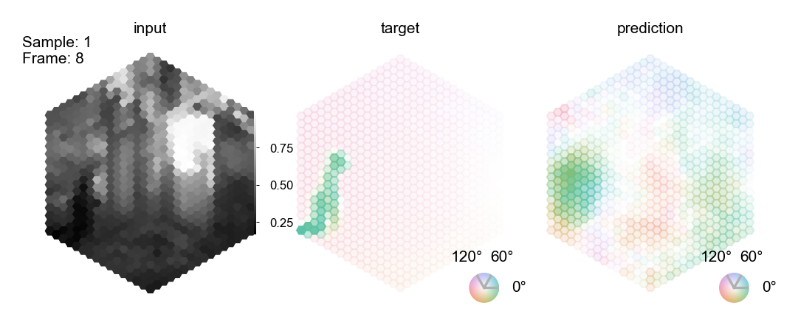

```python
%load_ext autoreload
%autoreload 2
```

# Optic flow task


This notebook illustrates the optic flow task and how to use it with our pretrained fly visual system model and decoder.

**Select GPU runtime**

To run the notebook on a GPU select Menu -> Runtime -> Change runtime type -> GPU.


```python
# @markdown **Check access to GPU**

try:
    import google.colab

    IN_COLAB = True
except ImportError:
    IN_COLAB = False

if IN_COLAB:
    import torch

    try:
        cuda_name = torch.cuda.get_device_name()
        print(f"Name of the assigned GPU / CUDA device: {cuda_name}")
    except RuntimeError:
        import warnings

        warnings.warn(
            "You have not selected Runtime Type: 'GPU' or Google could not assign you one. Please revisit the settings as described above or proceed on CPU (slow)."
        )
```

**Install Flyvis**

The notebook requires installing our package `flyvis`. You may need to restart your session after running the code block below with Menu -> Runtime -> Restart session. Then, imports from `flyvis` should succeed without issue.


```python
if IN_COLAB:
    #@markdown **Install Flyvis**
    %%capture
    !git clone https://github.com/flyvis/flyvis-dev.git
    %cd /content/flyvis-dev
    !pip install -e .
```


```python
# basic imports
import matplotlib.pyplot as plt
import numpy as np
import torch

plt.rcParams['figure.dpi'] = 200
```

# The Sintel dataset

We use the Sintel dataset to train out models as described in the paper. More infos about the Sintel dataset can be found on the official Sintel website: http://sintel.is.tue.mpg.de/.


```python
import matplotlib.pyplot as plt
import numpy as np
from flyvision.datasets.sintel import MultiTaskSintel
from flyvision.animations.sintel import SintelSample

%load_ext autoreload
%autoreload 2
```

    The autoreload extension is already loaded. To reload it, use:
      %reload_ext autoreload


The class `MultiTaskSintel` loads, preprocesses, renders, and augments the sintel data. It adheres to the pytorch dataset primitive. It provides the interface to the input data and the output data for the flyvision networks. Note: the fly-eye rendering we use here, we introduce in the notebook on creating custom stimuli already.

This is the full setting:


```python
dataset = MultiTaskSintel(tasks=["flow"],
        boxfilter=dict(extent=15, kernel_size=13),
        # Because the fly eye rendering is square 
        # and sintel is wide, we can crop sintel 
        # in width and render three sequences from one. 
        # This allows us to statically augment our dataset 
        # a bit already before we proceed with the random augmentations. 
        # We end up with 3 * 23 sequences. 
        vertical_splits=3,
        n_frames=19,
        center_crop_fraction=0.7,
        dt=1 / 50,
        augment=True,
        # From sequences with more than n_frames, we randomly sample the start frame.
        random_temporal_crop=True,
        all_frames=False,
        # We resample movie frames to the effective framerate given by 1/dt
        resampling=True,
        # We interpolate the flow arrows to 1/dt.
        interpolate=True,
        # We flip with equal probability (using one flip-axis).
        p_flip=0.5,
        # We rotate with equal probability (using five fold rotation symmetry of the hex-grid).
        p_rot=5 / 6,
        # We randomly adjust contrast and brightness.
        contrast_std=0.2,
        brightness_std=0.1,
        # We add random white noise pixelweise.
        gaussian_white_noise=0.08,
        gamma_std=None,
        _init_cache=True,
        unittest=False,
        flip_axes=[0, 1],
        task_weights=None,)
```


```python
# The `dataset.arg_df` tracks the sequence index, identity etc.
dataset.arg_df
```


<div>
<style scoped>
    .dataframe tbody tr th:only-of-type {
        vertical-align: middle;
    }

    .dataframe tbody tr th {
        vertical-align: top;
    }

    .dataframe thead th {
        text-align: right;
    }
</style>
<table border="1" class="dataframe">
  <thead>
    <tr style="text-align: right;">
      <th></th>
      <th>index</th>
      <th>original_index</th>
      <th>name</th>
      <th>original_n_frames</th>
    </tr>
  </thead>
  <tbody>
    <tr>
      <th>0</th>
      <td>0</td>
      <td>0</td>
      <td>sequence_00_alley_1_split_00</td>
      <td>50</td>
    </tr>
    <tr>
      <th>1</th>
      <td>1</td>
      <td>0</td>
      <td>sequence_00_alley_1_split_01</td>
      <td>50</td>
    </tr>
    <tr>
      <th>2</th>
      <td>2</td>
      <td>0</td>
      <td>sequence_00_alley_1_split_02</td>
      <td>50</td>
    </tr>
    <tr>
      <th>3</th>
      <td>3</td>
      <td>1</td>
      <td>sequence_01_alley_2_split_00</td>
      <td>50</td>
    </tr>
    <tr>
      <th>4</th>
      <td>4</td>
      <td>1</td>
      <td>sequence_01_alley_2_split_01</td>
      <td>50</td>
    </tr>
    <tr>
      <th>...</th>
      <td>...</td>
      <td>...</td>
      <td>...</td>
      <td>...</td>
    </tr>
    <tr>
      <th>64</th>
      <td>64</td>
      <td>21</td>
      <td>sequence_21_temple_2_split_01</td>
      <td>50</td>
    </tr>
    <tr>
      <th>65</th>
      <td>65</td>
      <td>21</td>
      <td>sequence_21_temple_2_split_02</td>
      <td>50</td>
    </tr>
    <tr>
      <th>66</th>
      <td>66</td>
      <td>22</td>
      <td>sequence_22_temple_3_split_00</td>
      <td>50</td>
    </tr>
    <tr>
      <th>67</th>
      <td>67</td>
      <td>22</td>
      <td>sequence_22_temple_3_split_01</td>
      <td>50</td>
    </tr>
    <tr>
      <th>68</th>
      <td>68</td>
      <td>22</td>
      <td>sequence_22_temple_3_split_02</td>
      <td>50</td>
    </tr>
  </tbody>
</table>
<p>69 rows × 4 columns</p>
</div>


## Single sample

First, let's chunk this into smaller digestable pieces.


```python
dataset = MultiTaskSintel(
    tasks=["flow"],
    boxfilter=dict(extent=15, kernel_size=13),
    vertical_splits=1,
    dt=1 / 24,
    augment=False,
)
```

The first sample. For the target, the pixel-accurate motion vectors, the color indicates the direction of motion of the respective input pixel. The saturation indicates the magnitude of motion.


```python
lum = dataset[0]["lum"]
flow = dataset[0]["flow"]

animation = SintelSample(lum[None], flow[None])
animation.animate_in_notebook()
```


    

    


Sintel has more groundtruth annotations. We support depth and flow because we know with certainty that these are relevant for the fly.


```python
dataset = MultiTaskSintel(
    tasks=["depth"],
    boxfilter=dict(extent=15, kernel_size=13),
    vertical_splits=1,
    dt=1 / 24,
    augment=False,
)
```


```python
lum1 = dataset[0]["lum"]
depth1 = dataset[0]["depth"]

animation = SintelSample(lum1[None], depth1[None])
animation.animate_in_notebook()
```


    

    


# Augmenting the dataset step-by-step

We apply rich augmentations to the dataset of naturalistic sequences because the dataset is otherwise relatively small. This might lead to overfitting to, e.g., predicting motion mostly into well-represented directons or of objects of specific contrasts etc. Using rich augmentations, we 'ask' the network to generalize better and invariantly compute motion regardless of direction, contrast, brightness, pixel noise, temporal appearance etc.

## Vertical splits

First, we split each sequence into three sequences vertically to leverage a wider extent of the video than if we would only render the center. We precompute these renderings.


```python
from flyvision.plots.plots import quick_hex_scatter
```


```python
dataset = MultiTaskSintel(
    tasks=["flow"],
    boxfilter=dict(extent=15, kernel_size=13),
    vertical_splits=3,
    dt=1 / 24,
    augment=False,
)
```

Sintel has 23 movie sequences originally.


```python
len(np.unique(dataset.arg_df.original_index))
```


    23


Each original sequence is 436 pixel in height times 1024 pixel in width in cartesian coordinates.


```python
sequence = dataset.cartesian_sequence(0, vertical_splits=1, center_crop_fraction=1.0)
print(sequence.shape)
```

    (1, 49, 436, 1024)


With the vertical crops, we end up with 3 * 23 sequences. The `dataset.arg_df` tracks the sequence index, identity etc.


```python
dataset.arg_df
```


<div>
<style scoped>
    .dataframe tbody tr th:only-of-type {
        vertical-align: middle;
    }

    .dataframe tbody tr th {
        vertical-align: top;
    }

    .dataframe thead th {
        text-align: right;
    }
</style>
<table border="1" class="dataframe">
  <thead>
    <tr style="text-align: right;">
      <th></th>
      <th>index</th>
      <th>original_index</th>
      <th>name</th>
      <th>original_n_frames</th>
    </tr>
  </thead>
  <tbody>
    <tr>
      <th>0</th>
      <td>0</td>
      <td>0</td>
      <td>sequence_00_alley_1_split_00</td>
      <td>50</td>
    </tr>
    <tr>
      <th>1</th>
      <td>1</td>
      <td>0</td>
      <td>sequence_00_alley_1_split_01</td>
      <td>50</td>
    </tr>
    <tr>
      <th>2</th>
      <td>2</td>
      <td>0</td>
      <td>sequence_00_alley_1_split_02</td>
      <td>50</td>
    </tr>
    <tr>
      <th>3</th>
      <td>3</td>
      <td>1</td>
      <td>sequence_01_alley_2_split_00</td>
      <td>50</td>
    </tr>
    <tr>
      <th>4</th>
      <td>4</td>
      <td>1</td>
      <td>sequence_01_alley_2_split_01</td>
      <td>50</td>
    </tr>
    <tr>
      <th>...</th>
      <td>...</td>
      <td>...</td>
      <td>...</td>
      <td>...</td>
    </tr>
    <tr>
      <th>64</th>
      <td>64</td>
      <td>21</td>
      <td>sequence_21_temple_2_split_01</td>
      <td>50</td>
    </tr>
    <tr>
      <th>65</th>
      <td>65</td>
      <td>21</td>
      <td>sequence_21_temple_2_split_02</td>
      <td>50</td>
    </tr>
    <tr>
      <th>66</th>
      <td>66</td>
      <td>22</td>
      <td>sequence_22_temple_3_split_00</td>
      <td>50</td>
    </tr>
    <tr>
      <th>67</th>
      <td>67</td>
      <td>22</td>
      <td>sequence_22_temple_3_split_01</td>
      <td>50</td>
    </tr>
    <tr>
      <th>68</th>
      <td>68</td>
      <td>22</td>
      <td>sequence_22_temple_3_split_02</td>
      <td>50</td>
    </tr>
  </tbody>
</table>
<p>69 rows × 4 columns</p>
</div>


```python
_ = plt.imshow(sequence[0, 0], cmap=plt.cm.binary_r)
```


    

    


```python
fig, axes = plt.subplots(1, 3)
_ = quick_hex_scatter(dataset[0]['lum'][0].flatten(), fig=fig, ax=axes[0], cbar=False)
_ = quick_hex_scatter(dataset[1]['lum'][0].flatten(), fig=fig, ax=axes[1], cbar=False)
_ = quick_hex_scatter(dataset[2]['lum'][0].flatten(), fig=fig, ax=axes[2], cbar=False)
```


    

    


## Random temporal crops

We train on 19 frames ~ 792ms movie. Most sequences have 49 frames. To use the whole temporal content, we stochastically sample start and end frame ~ ((1, 19), (2, 20), ..., (31, 49)).


```python
dataset = MultiTaskSintel(
    tasks=["flow"],
    boxfilter=dict(extent=15, kernel_size=13),
    vertical_splits=3,
    n_frames=19,
    dt=1 / 24,
    augment=True,
    random_temporal_crop=True,
    all_frames=False,
    resampling=False,
    interpolate=False,
    p_flip=0,
    p_rot=0,
    contrast_std=None,
    brightness_std=None,
    gaussian_white_noise=None,
)
```


```python
# These two samples from the same original sequence should have stochastically different start and end frames.
lum1 = dataset[0]['lum']
lum2 = dataset[0]['lum']
```


```python
animation = SintelSample(lum1[None], lum2[None], title2="input")
animation.animate_in_notebook()
```


    

    


## Flips and rotations

Next, we flip stochastically across 2 axes and or rotate a random number of times around the center. We implement this to be fast to do so at runtime.


```python
dataset = MultiTaskSintel(
    tasks=["flow"],
    boxfilter=dict(extent=15, kernel_size=13),
    vertical_splits=3,
    n_frames=19,
    dt=1 / 24,
    augment=True,
    random_temporal_crop=False,
    all_frames=False,
    resampling=False,
    interpolate=False,
    p_flip=1/2,
    p_rot=5/6,
    contrast_std=None,
    brightness_std=None,
    gaussian_white_noise=None,
)
```


```python
# These two samples from the same original sequence should have stochastically different orientation.
lum1 = dataset[0]['lum']
lum2 = dataset[0]['lum']
```


```python
animation = SintelSample(lum1[None], lum2[None], title2="input")
animation.animate_in_notebook()
```


    

    


Flow vectors need to be flipped and rotated accordingly.


```python
# These two samples from the same original sequence should have stochastically different orientation.
data = dataset[0]
lum1 = data['lum']
flow1 = data['flow']
```


```python
animation = SintelSample(lum1[None], flow1[None])
animation.animate_in_notebook()
```


    

    


## Further augmentations

Besides that, we also augment the input with random contrasts and brightnesses and random gaussian pixel noise, while the motion stays the same. This pretends that the same motion takes place under different illumination conditions and signal to noise ratios.  


```python
dataset = MultiTaskSintel(
    tasks=["flow"],
    boxfilter=dict(extent=15, kernel_size=13),
    vertical_splits=3,
    n_frames=19,
    dt=1 / 24,
    augment=True,
    random_temporal_crop=False,
    all_frames=False,
    resampling=False,
    interpolate=False,
    p_flip=0,
    p_rot=0,
    contrast_std=0.2,
    brightness_std=0.1,
    gaussian_white_noise=0.08,
)
```


```python
# These two samples from the same original sequence have 
# stochastically different contrast, brightness and pixel-wise noise.
lum1 = dataset[0]['lum']
lum2 = dataset[0]['lum']
```


```python
animation = SintelSample(lum1[None], lum2[None], title2="input")
animation.animate_in_notebook()
```


    

    


# Framerate of the dataset and integration time step

The Sintel dataset is originally rendered at 24 frames per second, i.e., one frame every 42ms. The fruit fly neurons are able to respond to temporal differences as fast as 5-20ms. Therefore, we resample every frame multiple times to pretend that the movie was originally sampled at such a faster framerate. For the motion fields, we interpolate flow vectors in time instead of resampling them, which hopefully gives a better learning signal to the network. We have to trade-off speed of the numerical integration and memory consumption during optimization with the simulation accuracy by choosing time steps between 5-20ms. We chose to train networks at the upper bount of 20ms and evaluate them more accurately at 5-10ms.


```python
dataset = MultiTaskSintel(
    tasks=["flow"],
    boxfilter=dict(extent=15, kernel_size=13),
    vertical_splits=3,
    n_frames=19,
    dt=1 / 50,
    augment=False,
    resampling=True,
    interpolate=True,
)
```


```python
# Now, every input frame appears twice and target frames are interpolated.
data = dataset[0]
lum1 = data['lum']
flow1 = data['flow']
```


```python
animation = SintelSample(lum1[None], flow1[None])
animation.animate_in_notebook()
```


    

    


# Computing responses to the Sintel data

Before we get to training a network, we look at a few responses to these type of sequences of individual neurons.


```python
from flyvision.network import NetworkView, Network
from flyvision.utils.activity_utils import LayerActivity

from flyvision.datasets.sintel import MultiTaskSintel
```


```python
# new network instance
network = Network()

# Alternative: uncomment to use a pretrained network
# network_view = NetworkView(results_dir / "flow/0000/000")
# network = network_view.init_network(network)
```

    [2024-09-23 15:50:20] network:252 Initialized network with NumberOfParams(free=734, fixed=2959) parameters.


```python
layer_activity = LayerActivity(None, network.connectome, keepref=True)
```


```python
dataset = MultiTaskSintel(
    tasks=["flow"],
    boxfilter=dict(extent=15, kernel_size=13),
    vertical_splits=1,
    n_frames=19,
    dt=1/50,
    augment=False,
    resampling=True,
    interpolate=True,
)
```


```python
stationary_state = network.fade_in_state(1.0, dataset.dt, dataset[0]["lum"][[0]])
responses = network.simulate(dataset[0]["lum"][None], dataset.dt, initial_state=stationary_state).cpu()
```


```python
plt.figure(figsize=[3, 2])
layer_activity.update(responses)
r = layer_activity.central.T4c.squeeze().numpy()
time = np.arange(0, r.shape[0], 1) * dataset.dt
plt.plot(time, r)
plt.xlabel("time in s")
plt.ylabel("voltage (a.u.)")
plt.title("response of central T4c cell")
```


    Text(0.5, 1.0, 'response of central T4c cell')


    

    


# Decoding the task from neural activity

We need to predict the pixel-accurate flow field that Sintel gives us. For that we decode the voltages of a bunch of cell types. The decoder and the network are trained end-to-end. Here an example of a forward pass through the whole pipeline in code.


```python
from flyvision.network import NetworkView
from flyvision.utils.activity_utils import LayerActivity

from flyvision.datasets.sintel import MultiTaskSintel
from flyvision.decoder import DecoderGAVP
```


```python
network = Network()
```

    [2024-09-23 15:50:36] network:252 Initialized network with NumberOfParams(free=734, fixed=2959) parameters.


```python
decoder = DecoderGAVP(network.connectome, shape=[8, 2], kernel_size=5)
```

    [2024-09-23 15:50:40] decoder:213 Initialized decoder with NumberOfParams(free=7427, fixed=0) parameters.
    [2024-09-23 15:50:40] decoder:214 DecoderGAVP(
      (base): Sequential(
        (0): Conv2dHexSpace(34, 8, kernel_size=(5, 5), stride=(1, 1), padding=(2, 2))
        (1): BatchNorm2d(8, eps=1e-05, momentum=0.1, affine=True, track_running_stats=True)
        (2): Softplus(beta=1, threshold=20)
        (3): Dropout(p=0.5, inplace=False)
      )
      (decoder): Sequential(
        (0): Conv2dHexSpace(8, 3, kernel_size=(5, 5), stride=(1, 1), padding=(2, 2))
      )
      (head): Sequential()
    )


```python
dataset = MultiTaskSintel(
    tasks=["flow"],
    boxfilter=dict(extent=15, kernel_size=13),
    vertical_splits=1,
    all_frames=True,
    dt=1/50,
    augment=False,
    resampling=True,
    interpolate=True,
)
```


```python
data = dataset[0]
lum = data["lum"]
flow = data["flow"]

stationary_state = network.fade_in_state(1.0, dataset.dt, lum[[0]])
responses = network.simulate(lum[None], dataset.dt, initial_state=stationary_state)
```


```python
y_pred = decoder(responses)
```

We predict motion with an untrained decoder from an untrained network with randomly initialized parameters. 
We do not expect this to work.


```python
animation = SintelSample(lum[None], flow[None], prediction=y_pred.detach().cpu())
animation.animate_in_notebook(frames=np.arange(lum.shape[0])[::10])
```


    

    


```python
((y_pred - flow) ** 2).sqrt().mean()
```


    tensor(1.0214, device='cuda:0', grad_fn=<MeanBackward0>)


# Training network and decoder on a single batch

We now train the network on a single batch to validate that the pipeline works. We do not expect these networks to generalize their function.


```python
from tqdm.notebook import tqdm
from torch.optim import Adam
from torch.utils.data import DataLoader

from flyvision.network import NetworkView, Network
from flyvision.decoder import DecoderGAVP
from flyvision.utils.activity_utils import LayerActivity

from flyvision.datasets.sintel import MultiTaskSintel
from flyvision.objectives import l2norm, epe
```


```python
network = Network()
```

    [2024-09-23 15:51:17] network:252 Initialized network with NumberOfParams(free=734, fixed=2959) parameters.


```python
decoder = DecoderGAVP(network.connectome, shape=[8, 2], kernel_size=5)
```

    [2024-09-23 15:51:21] decoder:213 Initialized decoder with NumberOfParams(free=7427, fixed=0) parameters.
    [2024-09-23 15:51:21] decoder:214 DecoderGAVP(
      (base): Sequential(
        (0): Conv2dHexSpace(34, 8, kernel_size=(5, 5), stride=(1, 1), padding=(2, 2))
        (1): BatchNorm2d(8, eps=1e-05, momentum=0.1, affine=True, track_running_stats=True)
        (2): Softplus(beta=1, threshold=20)
        (3): Dropout(p=0.5, inplace=False)
      )
      (decoder): Sequential(
        (0): Conv2dHexSpace(8, 3, kernel_size=(5, 5), stride=(1, 1), padding=(2, 2))
      )
      (head): Sequential()
    )


```python
dataset = MultiTaskSintel(
    tasks=["flow"],
    boxfilter=dict(extent=15, kernel_size=13),
    vertical_splits=1,
    n_frames=19,
    dt=1/50,
    augment=False,
    resampling=True,
    interpolate=True,
)
```


```python
t_pre=0.5
dt = 1/50
batch_size=4
train_loader = DataLoader(dataset, batch_size=batch_size)
```


```python
optimizer = Adam((*network.parameters(), *decoder.parameters()), lr=1e-5)
```


```python
batch = next(iter(train_loader))
```


```python
loss_fn = epe
```


```python
epochs = 1000

errors = []

initial_state = network.steady_state(t_pre, dt, batch_size)

for e in tqdm(range(epochs)):
    lum = batch["lum"]
    flow = batch["flow"]
    
    
    optimizer.zero_grad()
    network.stimulus.zero()
    network.stimulus.add_input(lum)
    
    activity = network(network.stimulus(), dt=1/50, state=initial_state)
    y_pred = decoder(activity)

    batch_error = loss_fn(y_pred, flow)
    errors.append(batch_error.cpu().item())
    batch_error.backward()
    optimizer.step()
```


      0%|          | 0/1000 [00:00<?, ?it/s]


```python
plt.plot(errors)
```


    [<matplotlib.lines.Line2D at 0x7f7f5467f580>]


    

    


We expect that the prediction from this overfitted network on the sample it was trained on is ok.


```python
data = dataset[0]
lum = data["lum"]
flow = data["flow"]

stationary_state = network.fade_in_state(1.0, dataset.dt, lum[[0]])
responses = network.simulate(lum[None], dataset.dt, initial_state=stationary_state)
```


```python
y_pred = decoder(responses)
```


```python
animation = SintelSample(lum[None], flow[None], prediction=y_pred.detach().cpu())
animation.animate_in_notebook()
```


    

    


```python
((y_pred - flow) ** 2).sqrt().mean()
```


    tensor(0.8250, device='cuda:0', grad_fn=<MeanBackward0>)


# Evaluating trained networks


```python
from flyvision import results_dir
from flyvision.network import NetworkView
from flyvision.utils.activity_utils import LayerActivity

from flyvision.datasets.sintel import MultiTaskSintel
from flyvision.decoder import DecoderGAVP
```


```python
# we load the best task-performing model from the presorted ensemble
network_view = NetworkView(results_dir / "flow/0000/000")
```

    [2024-09-23 15:54:46] network:1005 Initialized network view at /groups/turaga/home/lappalainenj/FlyVis/private/flyvision/data/results/flow/0000/000.


```python
network = network_view.init_network()
```

    [2024-09-23 15:54:55] network:252 Initialized network with NumberOfParams(free=734, fixed=2959) parameters.
    [2024-09-23 15:54:55] chkpt_utils:72 Recovered network state.


```python
decoder = network_view.init_decoder()["flow"]
```

    [2024-09-23 15:54:56] chkpt_utils:72 Recovered network state.
    [2024-09-23 15:55:00] decoder:213 Initialized decoder with NumberOfParams(free=7427, fixed=0) parameters.
    [2024-09-23 15:55:00] decoder:214 DecoderGAVP(
      (base): Sequential(
        (0): Conv2dHexSpace(34, 8, kernel_size=(5, 5), stride=(1, 1), padding=(2, 2))
        (1): BatchNorm2d(8, eps=1e-05, momentum=0.1, affine=True, track_running_stats=True)
        (2): Softplus(beta=1, threshold=20)
        (3): Dropout(p=0.5, inplace=False)
      )
      (decoder): Sequential(
        (0): Conv2dHexSpace(8, 3, kernel_size=(5, 5), stride=(1, 1), padding=(2, 2))
      )
      (head): Sequential()
    )
    [2024-09-23 15:55:00] chkpt_utils:91 Recovered flow decoder state.


```python
dataset = MultiTaskSintel(
    tasks=["flow"],
    boxfilter=dict(extent=15, kernel_size=13),
    vertical_splits=1,
    all_frames=False,
    n_frames=19,
    dt=1/50,
    augment=False,
    resampling=True,
    interpolate=True,
)
```


```python
data = [dataset[i] for i in range(4)]
lum = torch.stack([d["lum"] for d in data])
flow = torch.stack([d["flow"] for d in data])

stationary_state = network.fade_in_state(1.0, dataset.dt, lum[:, 0])
responses = network.simulate(lum, dataset.dt, initial_state=stationary_state)
```


```python
y_pred = decoder(responses)
```

We expect this network to generalize across sequences. This network sees motion into all directions.


```python
animation = SintelSample(lum, flow, prediction=y_pred.detach().cpu())
animation.animate_in_notebook()
```


    

    


We expect the accuracy is not as good as the overfitted example because this network generalized across the whole-dataset.


```python
((y_pred - flow) ** 2).sqrt().mean()
```


    tensor(6.4063, device='cuda:0', grad_fn=<MeanBackward0>)


# Evaluating ensembles

Last, we evaluated the task error of the 50 trained networks on a held out set of sequences. We evaluated the task error across all checkpoints during training and show the minimal one in the histrogram below. This checkpoint we analyse with respect to it's tuning predictions as shown in the next notebooks.


```python
from flyvision import EnsembleView
```


```python
ensemble = EnsembleView(results_dir / "flow/0000")
```


    Loading ensemble:   0%|          | 0/50 [00:00<?, ?it/s]


    [2024-09-23 15:57:24] ensemble:138 Loaded 50 networks.


```python
ensemble.task_error_histogram()
```


    (<Figure size 300x300 with 1 Axes>,
     <Axes: xlabel='task error', ylabel='number models'>)


    

    

