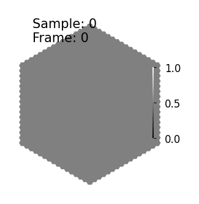
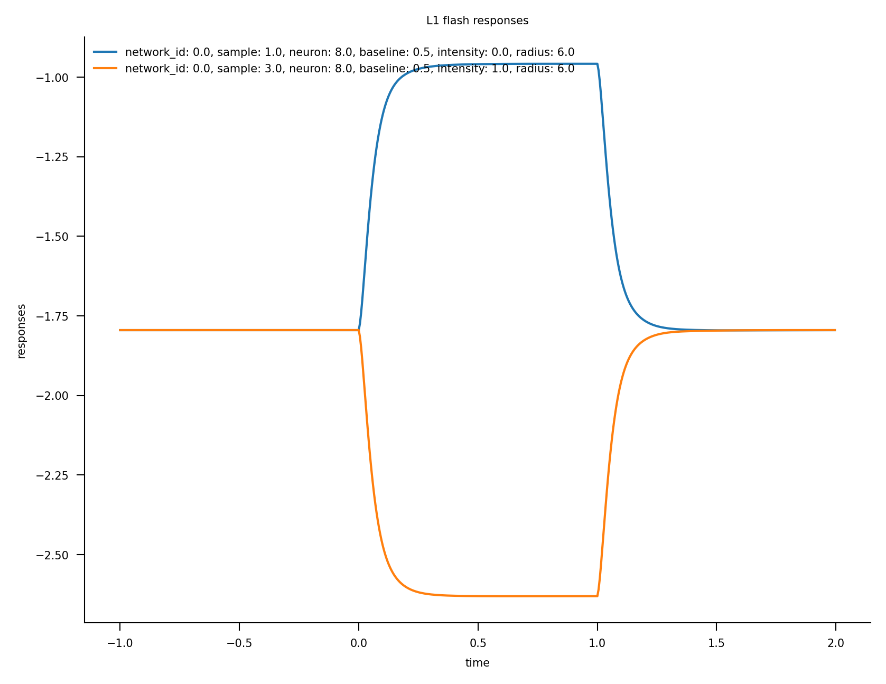
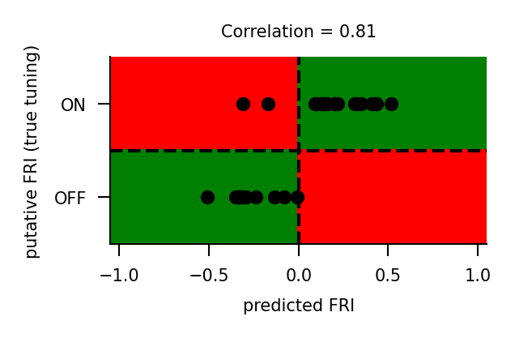
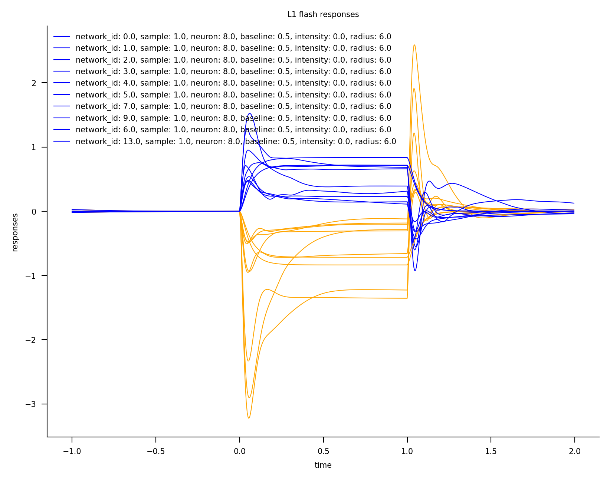
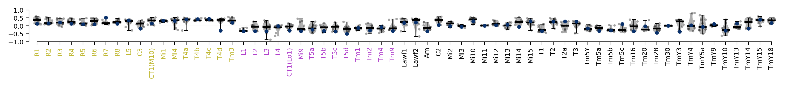
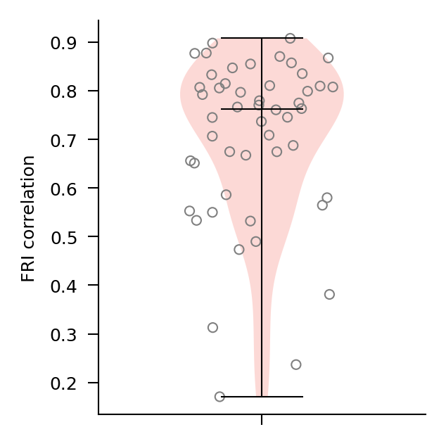

# Flash responses

This notebook introduces flash responses and the flash response index (FRI).

The FRI measures whether a cell depolarizes to bright or to dark increments in a visual input.

## Flash stimuli

To elicit flash responses, experimenters show a flashing dot to the subject in the center of their field of view. We generate and render these stimuli with the `Flashes` dataset.


```python
import matplotlib.pyplot as plt
import numpy as np
import torch


from flyvis.analysis.animations.hexscatter import HexScatter
from flyvis.datasets.flashes import Flashes
```


```python
# initialize dataset
dataset = Flashes(
    dynamic_range=[0, 1],  # min and max pixel intensity values, must be in range [0, 1]
    t_stim=1.0,  # duration of flash
    t_pre=1.0,  # duration of period between flashes
    dt=1 / 200,  # temporal resolution of rendered video
    radius=[-1, 6],  # radius of flashing dot. -1 fills entire field of view
    alternations=(0, 1, 0),  # flashing pattern, off - on - off
)
```


```python
# view stimulus parameters
dataset.arg_df
# the dataset has four samples, one corresponding to each row
```


<div>
<style scoped>
    .dataframe tbody tr th:only-of-type {
        vertical-align: middle;
    }

    .dataframe tbody tr th {
        vertical-align: top;
    }

    .dataframe thead th {
        text-align: right;
    }
</style>
<table border="1" class="dataframe">
  <thead>
    <tr style="text-align: right;">
      <th></th>
      <th>baseline</th>
      <th>intensity</th>
      <th>radius</th>
    </tr>
  </thead>
  <tbody>
    <tr>
      <th>0</th>
      <td>0.5</td>
      <td>0</td>
      <td>-1</td>
    </tr>
    <tr>
      <th>1</th>
      <td>0.5</td>
      <td>0</td>
      <td>6</td>
    </tr>
    <tr>
      <th>2</th>
      <td>0.5</td>
      <td>1</td>
      <td>-1</td>
    </tr>
    <tr>
      <th>3</th>
      <td>0.5</td>
      <td>1</td>
      <td>6</td>
    </tr>
  </tbody>
</table>
</div>


```python
# visualize single sample
animation = HexScatter(
    dataset[3][None, ::50, None], vmin=0, vmax=1
)  # intensity=1, radius=6
animation.animate_in_notebook()
```





## Network flash response

Now that we have generated the stimulus, we can use it to drive a trained connectome-constrained network.


```python
from flyvis import results_dir
from flyvis import NetworkView

# model are already sorted by task error
# we take the best task-performing model from the pre-sorted ensemble
network_view = NetworkView(results_dir / "flow/0000/000")
```

    [2024-12-08 19:35:35] network_view:122 Initialized network view at ../flyvis/data/results/flow/0000/000


```python
stims_and_resps = network_view.flash_responses(dataset=dataset)
```

    ../flyvis/data/results/flow/0000/000/__cache__/flyvis/analysis/stimulus_responses/compute_responses/577e21fdb69e8a7bf543369fa02dc2aa/output.h5


```python
stims_and_resps['responses'].custom.where(cell_type="L1", radius=6).custom.plot_traces(
    x='time'
)
fig = plt.gcf()
fig.axes[-1].set_title("L1 flash responses")
```


    Text(0.5, 1.0, 'L1 flash responses')





### Flash response index (FRI)

The flash response index (FRI) is a measure of the strength of contrast tuning of a particular cell. It is computed as the difference between the cell's peak voltage in response to on-flashes (intensity = 1) and off-flashes (intensity = 0), divided by the sum of those peak values.

That is, given a single neuron's response to on-flashes `r_on` and off-flashes `r_off` (both of `shape=(T,)`), we can compute the flash response index with

```
r_on_max = max(r_on)
r_off_max = max(r_off)
fri = (r_on_max - r_off_max) / (r_on_max + r_off_max + 1e-16)
```

with the additional `1e-16` simply for numerical stability. Before this calculation, the response traces are shifted to be non-negative.

The flash response index can take on values between $-1$, when the off response is much stronger (or more positive) than the on response, to $1$, when the on response is much stronger (or more positive) than the off response.

For the L1 cell plotted before, we can see that it displays a positive response to off flashes and a negative response to on flashes, so we expect a negative flash response index.


```python
from flyvis.analysis.flash_responses import flash_response_index
```


```python
fris = flash_response_index(stims_and_resps, radius=6)
```


```python
fris.custom.where(cell_type="L1")
```


<div><svg style="position: absolute; width: 0; height: 0; overflow: hidden">
<defs>
<symbol id="icon-database" viewBox="0 0 32 32">
<path d="M16 0c-8.837 0-16 2.239-16 5v4c0 2.761 7.163 5 16 5s16-2.239 16-5v-4c0-2.761-7.163-5-16-5z"></path>
<path d="M16 17c-8.837 0-16-2.239-16-5v6c0 2.761 7.163 5 16 5s16-2.239 16-5v-6c0 2.761-7.163 5-16 5z"></path>
<path d="M16 26c-8.837 0-16-2.239-16-5v6c0 2.761 7.163 5 16 5s16-2.239 16-5v-6c0 2.761-7.163 5-16 5z"></path>
</symbol>
<symbol id="icon-file-text2" viewBox="0 0 32 32">
<path d="M28.681 7.159c-0.694-0.947-1.662-2.053-2.724-3.116s-2.169-2.030-3.116-2.724c-1.612-1.182-2.393-1.319-2.841-1.319h-15.5c-1.378 0-2.5 1.121-2.5 2.5v27c0 1.378 1.122 2.5 2.5 2.5h23c1.378 0 2.5-1.122 2.5-2.5v-19.5c0-0.448-0.137-1.23-1.319-2.841zM24.543 5.457c0.959 0.959 1.712 1.825 2.268 2.543h-4.811v-4.811c0.718 0.556 1.584 1.309 2.543 2.268zM28 29.5c0 0.271-0.229 0.5-0.5 0.5h-23c-0.271 0-0.5-0.229-0.5-0.5v-27c0-0.271 0.229-0.5 0.5-0.5 0 0 15.499-0 15.5 0v7c0 0.552 0.448 1 1 1h7v19.5z"></path>
<path d="M23 26h-14c-0.552 0-1-0.448-1-1s0.448-1 1-1h14c0.552 0 1 0.448 1 1s-0.448 1-1 1z"></path>
<path d="M23 22h-14c-0.552 0-1-0.448-1-1s0.448-1 1-1h14c0.552 0 1 0.448 1 1s-0.448 1-1 1z"></path>
<path d="M23 18h-14c-0.552 0-1-0.448-1-1s0.448-1 1-1h14c0.552 0 1 0.448 1 1s-0.448 1-1 1z"></path>
</symbol>
</defs>
</svg>
<style>/* CSS stylesheet for displaying xarray objects in jupyterlab.
 *
 */

:root {
  --xr-font-color0: var(--jp-content-font-color0, rgba(0, 0, 0, 1));
  --xr-font-color2: var(--jp-content-font-color2, rgba(0, 0, 0, 0.54));
  --xr-font-color3: var(--jp-content-font-color3, rgba(0, 0, 0, 0.38));
  --xr-border-color: var(--jp-border-color2, #e0e0e0);
  --xr-disabled-color: var(--jp-layout-color3, #bdbdbd);
  --xr-background-color: var(--jp-layout-color0, white);
  --xr-background-color-row-even: var(--jp-layout-color1, white);
  --xr-background-color-row-odd: var(--jp-layout-color2, #eeeeee);
}

html[theme=dark],
body[data-theme=dark],
body.vscode-dark {
  --xr-font-color0: rgba(255, 255, 255, 1);
  --xr-font-color2: rgba(255, 255, 255, 0.54);
  --xr-font-color3: rgba(255, 255, 255, 0.38);
  --xr-border-color: #1F1F1F;
  --xr-disabled-color: #515151;
  --xr-background-color: #111111;
  --xr-background-color-row-even: #111111;
  --xr-background-color-row-odd: #313131;
}

.xr-wrap {
  display: block !important;
  min-width: 300px;
  max-width: 700px;
}

.xr-text-repr-fallback {
  /* fallback to plain text repr when CSS is not injected (untrusted notebook) */
  display: none;
}

.xr-header {
  padding-top: 6px;
  padding-bottom: 6px;
  margin-bottom: 4px;
  border-bottom: solid 1px var(--xr-border-color);
}

.xr-header > div,
.xr-header > ul {
  display: inline;
  margin-top: 0;
  margin-bottom: 0;
}

.xr-obj-type,
.xr-array-name {
  margin-left: 2px;
  margin-right: 10px;
}

.xr-obj-type {
  color: var(--xr-font-color2);
}

.xr-sections {
  padding-left: 0 !important;
  display: grid;
  grid-template-columns: 150px auto auto 1fr 20px 20px;
}

.xr-section-item {
  display: contents;
}

.xr-section-item input {
  display: none;
}

.xr-section-item input + label {
  color: var(--xr-disabled-color);
}

.xr-section-item input:enabled + label {
  cursor: pointer;
  color: var(--xr-font-color2);
}

.xr-section-item input:enabled + label:hover {
  color: var(--xr-font-color0);
}

.xr-section-summary {
  grid-column: 1;
  color: var(--xr-font-color2);
  font-weight: 500;
}

.xr-section-summary > span {
  display: inline-block;
  padding-left: 0.5em;
}

.xr-section-summary-in:disabled + label {
  color: var(--xr-font-color2);
}

.xr-section-summary-in + label:before {
  display: inline-block;
  content: '►';
  font-size: 11px;
  width: 15px;
  text-align: center;
}

.xr-section-summary-in:disabled + label:before {
  color: var(--xr-disabled-color);
}

.xr-section-summary-in:checked + label:before {
  content: '▼';
}

.xr-section-summary-in:checked + label > span {
  display: none;
}

.xr-section-summary,
.xr-section-inline-details {
  padding-top: 4px;
  padding-bottom: 4px;
}

.xr-section-inline-details {
  grid-column: 2 / -1;
}

.xr-section-details {
  display: none;
  grid-column: 1 / -1;
  margin-bottom: 5px;
}

.xr-section-summary-in:checked ~ .xr-section-details {
  display: contents;
}

.xr-array-wrap {
  grid-column: 1 / -1;
  display: grid;
  grid-template-columns: 20px auto;
}

.xr-array-wrap > label {
  grid-column: 1;
  vertical-align: top;
}

.xr-preview {
  color: var(--xr-font-color3);
}

.xr-array-preview,
.xr-array-data {
  padding: 0 5px !important;
  grid-column: 2;
}

.xr-array-data,
.xr-array-in:checked ~ .xr-array-preview {
  display: none;
}

.xr-array-in:checked ~ .xr-array-data,
.xr-array-preview {
  display: inline-block;
}

.xr-dim-list {
  display: inline-block !important;
  list-style: none;
  padding: 0 !important;
  margin: 0;
}

.xr-dim-list li {
  display: inline-block;
  padding: 0;
  margin: 0;
}

.xr-dim-list:before {
  content: '(';
}

.xr-dim-list:after {
  content: ')';
}

.xr-dim-list li:not(:last-child):after {
  content: ',';
  padding-right: 5px;
}

.xr-has-index {
  font-weight: bold;
}

.xr-var-list,
.xr-var-item {
  display: contents;
}

.xr-var-item > div,
.xr-var-item label,
.xr-var-item > .xr-var-name span {
  background-color: var(--xr-background-color-row-even);
  margin-bottom: 0;
}

.xr-var-item > .xr-var-name:hover span {
  padding-right: 5px;
}

.xr-var-list > li:nth-child(odd) > div,
.xr-var-list > li:nth-child(odd) > label,
.xr-var-list > li:nth-child(odd) > .xr-var-name span {
  background-color: var(--xr-background-color-row-odd);
}

.xr-var-name {
  grid-column: 1;
}

.xr-var-dims {
  grid-column: 2;
}

.xr-var-dtype {
  grid-column: 3;
  text-align: right;
  color: var(--xr-font-color2);
}

.xr-var-preview {
  grid-column: 4;
}

.xr-index-preview {
  grid-column: 2 / 5;
  color: var(--xr-font-color2);
}

.xr-var-name,
.xr-var-dims,
.xr-var-dtype,
.xr-preview,
.xr-attrs dt {
  white-space: nowrap;
  overflow: hidden;
  text-overflow: ellipsis;
  padding-right: 10px;
}

.xr-var-name:hover,
.xr-var-dims:hover,
.xr-var-dtype:hover,
.xr-attrs dt:hover {
  overflow: visible;
  width: auto;
  z-index: 1;
}

.xr-var-attrs,
.xr-var-data,
.xr-index-data {
  display: none;
  background-color: var(--xr-background-color) !important;
  padding-bottom: 5px !important;
}

.xr-var-attrs-in:checked ~ .xr-var-attrs,
.xr-var-data-in:checked ~ .xr-var-data,
.xr-index-data-in:checked ~ .xr-index-data {
  display: block;
}

.xr-var-data > table {
  float: right;
}

.xr-var-name span,
.xr-var-data,
.xr-index-name div,
.xr-index-data,
.xr-attrs {
  padding-left: 25px !important;
}

.xr-attrs,
.xr-var-attrs,
.xr-var-data,
.xr-index-data {
  grid-column: 1 / -1;
}

dl.xr-attrs {
  padding: 0;
  margin: 0;
  display: grid;
  grid-template-columns: 125px auto;
}

.xr-attrs dt,
.xr-attrs dd {
  padding: 0;
  margin: 0;
  float: left;
  padding-right: 10px;
  width: auto;
}

.xr-attrs dt {
  font-weight: normal;
  grid-column: 1;
}

.xr-attrs dt:hover span {
  display: inline-block;
  background: var(--xr-background-color);
  padding-right: 10px;
}

.xr-attrs dd {
  grid-column: 2;
  white-space: pre-wrap;
  word-break: break-all;
}

.xr-icon-database,
.xr-icon-file-text2,
.xr-no-icon {
  display: inline-block;
  vertical-align: middle;
  width: 1em;
  height: 1.5em !important;
  stroke-width: 0;
  stroke: currentColor;
  fill: currentColor;
}
</style><pre class='xr-text-repr-fallback'>&lt;xarray.DataArray &#x27;responses&#x27; (network_id: 1, sample: 1, neuron: 1)&gt;
array([[[-0.33354023]]], dtype=float32)
Coordinates:
    baseline      (sample) float64 0.5
    radius        (sample) int32 6
  * neuron        (neuron) int64 8
    cell_type     (neuron) &lt;U8 &#x27;L1&#x27;
    u             (neuron) int32 0
    v             (neuron) int32 0
  * network_id    (network_id) int64 0
    network_name  (network_id) &lt;U13 &#x27;flow/0000/000&#x27;
    checkpoints   (network_id) object /groups/turaga/home/lappalainenj/FlyVis...
Dimensions without coordinates: sample</pre><div class='xr-wrap' style='display:none'><div class='xr-header'><div class='xr-obj-type'>xarray.DataArray</div><div class='xr-array-name'>'responses'</div><ul class='xr-dim-list'><li><span class='xr-has-index'>network_id</span>: 1</li><li><span>sample</span>: 1</li><li><span class='xr-has-index'>neuron</span>: 1</li></ul></div><ul class='xr-sections'><li class='xr-section-item'><div class='xr-array-wrap'><input id='section-6b290d7a-e213-44cd-989b-fa1907b3a54c' class='xr-array-in' type='checkbox' checked><label for='section-6b290d7a-e213-44cd-989b-fa1907b3a54c' title='Show/hide data repr'><svg class='icon xr-icon-database'><use xlink:href='#icon-database'></use></svg></label><div class='xr-array-preview xr-preview'><span>-0.3335</span></div><div class='xr-array-data'><pre>array([[[-0.33354023]]], dtype=float32)</pre></div></div></li><li class='xr-section-item'><input id='section-8f274d86-6374-4132-932d-3b0048cb0a34' class='xr-section-summary-in' type='checkbox'  checked><label for='section-8f274d86-6374-4132-932d-3b0048cb0a34' class='xr-section-summary' >Coordinates: <span>(9)</span></label><div class='xr-section-inline-details'></div><div class='xr-section-details'><ul class='xr-var-list'><li class='xr-var-item'><div class='xr-var-name'><span>baseline</span></div><div class='xr-var-dims'>(sample)</div><div class='xr-var-dtype'>float64</div><div class='xr-var-preview xr-preview'>0.5</div><input id='attrs-16ad9b4c-3a20-4f82-afd7-f3b9622ba7c4' class='xr-var-attrs-in' type='checkbox' disabled><label for='attrs-16ad9b4c-3a20-4f82-afd7-f3b9622ba7c4' title='Show/Hide attributes'><svg class='icon xr-icon-file-text2'><use xlink:href='#icon-file-text2'></use></svg></label><input id='data-95f36a32-37b1-41fb-ae94-bf3f8ddfe8c7' class='xr-var-data-in' type='checkbox'><label for='data-95f36a32-37b1-41fb-ae94-bf3f8ddfe8c7' title='Show/Hide data repr'><svg class='icon xr-icon-database'><use xlink:href='#icon-database'></use></svg></label><div class='xr-var-attrs'><dl class='xr-attrs'></dl></div><div class='xr-var-data'><pre>array([0.5])</pre></div></li><li class='xr-var-item'><div class='xr-var-name'><span>radius</span></div><div class='xr-var-dims'>(sample)</div><div class='xr-var-dtype'>int32</div><div class='xr-var-preview xr-preview'>6</div><input id='attrs-054a0dc7-a5ee-4ded-bbb2-b15105d8fb81' class='xr-var-attrs-in' type='checkbox' disabled><label for='attrs-054a0dc7-a5ee-4ded-bbb2-b15105d8fb81' title='Show/Hide attributes'><svg class='icon xr-icon-file-text2'><use xlink:href='#icon-file-text2'></use></svg></label><input id='data-9298cc03-7a75-44c3-9f50-fa41ca698694' class='xr-var-data-in' type='checkbox'><label for='data-9298cc03-7a75-44c3-9f50-fa41ca698694' title='Show/Hide data repr'><svg class='icon xr-icon-database'><use xlink:href='#icon-database'></use></svg></label><div class='xr-var-attrs'><dl class='xr-attrs'></dl></div><div class='xr-var-data'><pre>array([6], dtype=int32)</pre></div></li><li class='xr-var-item'><div class='xr-var-name'><span class='xr-has-index'>neuron</span></div><div class='xr-var-dims'>(neuron)</div><div class='xr-var-dtype'>int64</div><div class='xr-var-preview xr-preview'>8</div><input id='attrs-aa817290-fe59-4559-a4ce-be1c353017ac' class='xr-var-attrs-in' type='checkbox' disabled><label for='attrs-aa817290-fe59-4559-a4ce-be1c353017ac' title='Show/Hide attributes'><svg class='icon xr-icon-file-text2'><use xlink:href='#icon-file-text2'></use></svg></label><input id='data-e870ac02-d6ec-4d3d-b2cb-eafa215d8897' class='xr-var-data-in' type='checkbox'><label for='data-e870ac02-d6ec-4d3d-b2cb-eafa215d8897' title='Show/Hide data repr'><svg class='icon xr-icon-database'><use xlink:href='#icon-database'></use></svg></label><div class='xr-var-attrs'><dl class='xr-attrs'></dl></div><div class='xr-var-data'><pre>array([8])</pre></div></li><li class='xr-var-item'><div class='xr-var-name'><span>cell_type</span></div><div class='xr-var-dims'>(neuron)</div><div class='xr-var-dtype'>&lt;U8</div><div class='xr-var-preview xr-preview'>&#x27;L1&#x27;</div><input id='attrs-41c415fe-2680-4529-bf8a-91a8a53b68a4' class='xr-var-attrs-in' type='checkbox' disabled><label for='attrs-41c415fe-2680-4529-bf8a-91a8a53b68a4' title='Show/Hide attributes'><svg class='icon xr-icon-file-text2'><use xlink:href='#icon-file-text2'></use></svg></label><input id='data-441f7285-0356-44a4-b52f-c657e72534d1' class='xr-var-data-in' type='checkbox'><label for='data-441f7285-0356-44a4-b52f-c657e72534d1' title='Show/Hide data repr'><svg class='icon xr-icon-database'><use xlink:href='#icon-database'></use></svg></label><div class='xr-var-attrs'><dl class='xr-attrs'></dl></div><div class='xr-var-data'><pre>array([&#x27;L1&#x27;], dtype=&#x27;&lt;U8&#x27;)</pre></div></li><li class='xr-var-item'><div class='xr-var-name'><span>u</span></div><div class='xr-var-dims'>(neuron)</div><div class='xr-var-dtype'>int32</div><div class='xr-var-preview xr-preview'>0</div><input id='attrs-039f9702-13a1-4370-b266-6b354de3afd0' class='xr-var-attrs-in' type='checkbox' disabled><label for='attrs-039f9702-13a1-4370-b266-6b354de3afd0' title='Show/Hide attributes'><svg class='icon xr-icon-file-text2'><use xlink:href='#icon-file-text2'></use></svg></label><input id='data-d49cb075-17b5-4bd2-a703-2e7149a68e1e' class='xr-var-data-in' type='checkbox'><label for='data-d49cb075-17b5-4bd2-a703-2e7149a68e1e' title='Show/Hide data repr'><svg class='icon xr-icon-database'><use xlink:href='#icon-database'></use></svg></label><div class='xr-var-attrs'><dl class='xr-attrs'></dl></div><div class='xr-var-data'><pre>array([0], dtype=int32)</pre></div></li><li class='xr-var-item'><div class='xr-var-name'><span>v</span></div><div class='xr-var-dims'>(neuron)</div><div class='xr-var-dtype'>int32</div><div class='xr-var-preview xr-preview'>0</div><input id='attrs-5193fc3e-2165-436d-990f-e8f05dd4107d' class='xr-var-attrs-in' type='checkbox' disabled><label for='attrs-5193fc3e-2165-436d-990f-e8f05dd4107d' title='Show/Hide attributes'><svg class='icon xr-icon-file-text2'><use xlink:href='#icon-file-text2'></use></svg></label><input id='data-d5dd27ab-a2ed-4963-91ca-571604bf6a90' class='xr-var-data-in' type='checkbox'><label for='data-d5dd27ab-a2ed-4963-91ca-571604bf6a90' title='Show/Hide data repr'><svg class='icon xr-icon-database'><use xlink:href='#icon-database'></use></svg></label><div class='xr-var-attrs'><dl class='xr-attrs'></dl></div><div class='xr-var-data'><pre>array([0], dtype=int32)</pre></div></li><li class='xr-var-item'><div class='xr-var-name'><span class='xr-has-index'>network_id</span></div><div class='xr-var-dims'>(network_id)</div><div class='xr-var-dtype'>int64</div><div class='xr-var-preview xr-preview'>0</div><input id='attrs-77a4f503-68e2-4ec1-aef8-797f393e06a9' class='xr-var-attrs-in' type='checkbox' disabled><label for='attrs-77a4f503-68e2-4ec1-aef8-797f393e06a9' title='Show/Hide attributes'><svg class='icon xr-icon-file-text2'><use xlink:href='#icon-file-text2'></use></svg></label><input id='data-75f3a616-0648-40ee-9130-7b87bf161d8b' class='xr-var-data-in' type='checkbox'><label for='data-75f3a616-0648-40ee-9130-7b87bf161d8b' title='Show/Hide data repr'><svg class='icon xr-icon-database'><use xlink:href='#icon-database'></use></svg></label><div class='xr-var-attrs'><dl class='xr-attrs'></dl></div><div class='xr-var-data'><pre>array([0])</pre></div></li><li class='xr-var-item'><div class='xr-var-name'><span>network_name</span></div><div class='xr-var-dims'>(network_id)</div><div class='xr-var-dtype'>&lt;U13</div><div class='xr-var-preview xr-preview'>&#x27;flow/0000/000&#x27;</div><input id='attrs-51b55301-4bde-4ef9-89a7-631351cc8eca' class='xr-var-attrs-in' type='checkbox' disabled><label for='attrs-51b55301-4bde-4ef9-89a7-631351cc8eca' title='Show/Hide attributes'><svg class='icon xr-icon-file-text2'><use xlink:href='#icon-file-text2'></use></svg></label><input id='data-1d1e7591-8ec3-4ac1-82cb-4f35982e9afc' class='xr-var-data-in' type='checkbox'><label for='data-1d1e7591-8ec3-4ac1-82cb-4f35982e9afc' title='Show/Hide data repr'><svg class='icon xr-icon-database'><use xlink:href='#icon-database'></use></svg></label><div class='xr-var-attrs'><dl class='xr-attrs'></dl></div><div class='xr-var-data'><pre>array([&#x27;flow/0000/000&#x27;], dtype=&#x27;&lt;U13&#x27;)</pre></div></li><li class='xr-var-item'><div class='xr-var-name'><span>checkpoints</span></div><div class='xr-var-dims'>(network_id)</div><div class='xr-var-dtype'>object</div><div class='xr-var-preview xr-preview'>/groups/turaga/home/lappalainenj...</div><input id='attrs-ff2322b8-4361-4b18-a8a8-903e62570617' class='xr-var-attrs-in' type='checkbox' disabled><label for='attrs-ff2322b8-4361-4b18-a8a8-903e62570617' title='Show/Hide attributes'><svg class='icon xr-icon-file-text2'><use xlink:href='#icon-file-text2'></use></svg></label><input id='data-69b57e4a-1b39-4f97-8145-4f16803d30da' class='xr-var-data-in' type='checkbox'><label for='data-69b57e4a-1b39-4f97-8145-4f16803d30da' title='Show/Hide data repr'><svg class='icon xr-icon-database'><use xlink:href='#icon-database'></use></svg></label><div class='xr-var-attrs'><dl class='xr-attrs'></dl></div><div class='xr-var-data'><pre>array([PosixPath(&#x27;../flyvis/data/results/flow/0000/000/chkpts/chkpt_00000&#x27;)],
      dtype=object)</pre></div></li></ul></div></li><li class='xr-section-item'><input id='section-46575a13-002b-451e-ae2a-6c32b18db299' class='xr-section-summary-in' type='checkbox'  ><label for='section-46575a13-002b-451e-ae2a-6c32b18db299' class='xr-section-summary' >Indexes: <span>(2)</span></label><div class='xr-section-inline-details'></div><div class='xr-section-details'><ul class='xr-var-list'><li class='xr-var-item'><div class='xr-index-name'><div>neuron</div></div><div class='xr-index-preview'>PandasIndex</div><div></div><input id='index-de83c7ad-aeeb-4740-8314-8311963f8367' class='xr-index-data-in' type='checkbox'/><label for='index-de83c7ad-aeeb-4740-8314-8311963f8367' title='Show/Hide index repr'><svg class='icon xr-icon-database'><use xlink:href='#icon-database'></use></svg></label><div class='xr-index-data'><pre>PandasIndex(Index([8], dtype=&#x27;int64&#x27;, name=&#x27;neuron&#x27;))</pre></div></li><li class='xr-var-item'><div class='xr-index-name'><div>network_id</div></div><div class='xr-index-preview'>PandasIndex</div><div></div><input id='index-df6bfdf1-ab88-4cf9-80e6-ad71e9de5df1' class='xr-index-data-in' type='checkbox'/><label for='index-df6bfdf1-ab88-4cf9-80e6-ad71e9de5df1' title='Show/Hide index repr'><svg class='icon xr-icon-database'><use xlink:href='#icon-database'></use></svg></label><div class='xr-index-data'><pre>PandasIndex(Index([0], dtype=&#x27;int64&#x27;, name=&#x27;network_id&#x27;))</pre></div></li></ul></div></li><li class='xr-section-item'><input id='section-5074c367-9009-41cc-b424-950bbe66f903' class='xr-section-summary-in' type='checkbox' disabled ><label for='section-5074c367-9009-41cc-b424-950bbe66f903' class='xr-section-summary'  title='Expand/collapse section'>Attributes: <span>(0)</span></label><div class='xr-section-inline-details'></div><div class='xr-section-details'><dl class='xr-attrs'></dl></div></li></ul></div></div>


### FRI correlation

Since the tuning of some cell types have been determined experimentally, we can then compare our model to experimental findings by computing the correlation between the model FRIs for known cell types with their expected tuning.


```python
from flyvis.analysis.flash_responses import fri_correlation_to_known
from flyvis.utils.groundtruth_utils import polarity
```


```python
fri_corr = fri_correlation_to_known(fris)
```


```python
# manually extract model and true FRIs for plotting
known_cell_types = [k for k, v in polarity.items() if v != 0]
model_fris = [fris.custom.where(cell_type=k).item() for k in known_cell_types]
true_fris = [polarity[k] for k in known_cell_types]
# plot
plt.figure(figsize=[2, 1])
plt.scatter(model_fris, true_fris, color="k", s=10)
plt.xlabel("predicted FRI")
plt.ylabel("putative FRI (true tuning)")
plt.axvline(0, linestyle="--", color="black")
plt.axhline(0, linestyle="--", color="black")

plt.axhspan(0, 2, 0, 0.5, color="red", zorder=-10)
plt.axhspan(0, 2, 0.5, 1.0, color="green", zorder=-10)
plt.axhspan(-2, 0, 0, 0.5, color="green", zorder=-10)
plt.axhspan(-2, 0, 0.5, 1.0, color="red", zorder=-10)

plt.xlim(-1.05, 1.05)
plt.ylim(-2, 2)
plt.title(f"Correlation = {fri_corr[0].item():.2g}")
plt.yticks([-1, 1], ["OFF", "ON"])
plt.show()
```





As we can see, for all except two cell types, the model correctly predicts the cell's tuning (positive or negative).

## Ensemble responses

Now we can compare tuning properties across an ensemble of trained models. First we need to again simulate the network responses.


```python
from flyvis import EnsembleView

ensemble = EnsembleView("flow/0000")
```


    Loading ensemble:   0%|          | 0/50 [00:00<?, ?it/s]


    [2024-12-08 19:35:48] ensemble:166 Loaded 50 networks.


```python
stims_and_resps = ensemble.flash_responses(dataset=dataset)
```

    ../flyvis/data/results/flow/0000/000/__cache__/flyvis/analysis/stimulus_responses/compute_responses/577e21fdb69e8a7bf543369fa02dc2aa/output.h5
    ../flyvis/data/results/flow/0000/001/__cache__/flyvis/analysis/stimulus_responses/compute_responses/8178c987bed4870114f3fff7641e7fae/output.h5
    ../flyvis/data/results/flow/0000/002/__cache__/flyvis/analysis/stimulus_responses/compute_responses/6acc3ac28e719cae7b1941fdbf745ab6/output.h5
    ../flyvis/data/results/flow/0000/003/__cache__/flyvis/analysis/stimulus_responses/compute_responses/b412c4c9ca2a95b27e65a2e50d42467d/output.h5
    ../flyvis/data/results/flow/0000/004/__cache__/flyvis/analysis/stimulus_responses/compute_responses/ac57e619046e24281f445a44d7971446/output.h5
    ../flyvis/data/results/flow/0000/005/__cache__/flyvis/analysis/stimulus_responses/compute_responses/e4650b12c1890800d286ae37d82e990c/output.h5
    ../flyvis/data/results/flow/0000/006/__cache__/flyvis/analysis/stimulus_responses/compute_responses/3580bbda204c6a944ab487961449980a/output.h5
    ../flyvis/data/results/flow/0000/007/__cache__/flyvis/analysis/stimulus_responses/compute_responses/5bd06309206c3af6ea63081c6620dd7f/output.h5
    ../flyvis/data/results/flow/0000/008/__cache__/flyvis/analysis/stimulus_responses/compute_responses/2ca6d7dd6fac47ce1d9c20622aa9baa0/output.h5
    ../flyvis/data/results/flow/0000/009/__cache__/flyvis/analysis/stimulus_responses/compute_responses/621b6b656522cf71a08cd90c6c0c22a6/output.h5
    ../flyvis/data/results/flow/0000/010/__cache__/flyvis/analysis/stimulus_responses/compute_responses/c56af9a9cb35884a5e8a9d57860e10a5/output.h5
    ../flyvis/data/results/flow/0000/011/__cache__/flyvis/analysis/stimulus_responses/compute_responses/a9a351801f031be69ad21337bc59491d/output.h5
    ../flyvis/data/results/flow/0000/012/__cache__/flyvis/analysis/stimulus_responses/compute_responses/dc90a0ed6d3c079759d3dca82a500f8b/output.h5
    ../flyvis/data/results/flow/0000/013/__cache__/flyvis/analysis/stimulus_responses/compute_responses/6bff6ea67b238e22c033d1c9107da4a6/output.h5
    ../flyvis/data/results/flow/0000/014/__cache__/flyvis/analysis/stimulus_responses/compute_responses/714cf5fb6547c174a9cf12dd0c4d9c4a/output.h5
    ../flyvis/data/results/flow/0000/015/__cache__/flyvis/analysis/stimulus_responses/compute_responses/87f91506377402b143bca71242338878/output.h5
    ../flyvis/data/results/flow/0000/016/__cache__/flyvis/analysis/stimulus_responses/compute_responses/6dbcfa5a1500fe2215f8c372f7965f9d/output.h5
    ../flyvis/data/results/flow/0000/017/__cache__/flyvis/analysis/stimulus_responses/compute_responses/c8a3e01e182e95afb8086ce8312c3aae/output.h5
    ../flyvis/data/results/flow/0000/018/__cache__/flyvis/analysis/stimulus_responses/compute_responses/3df0054a9e6288e7ceebc44ca0cc150c/output.h5
    ../flyvis/data/results/flow/0000/019/__cache__/flyvis/analysis/stimulus_responses/compute_responses/b8267dc6a04c5b6452a8bb4f16e5f864/output.h5
    ../flyvis/data/results/flow/0000/020/__cache__/flyvis/analysis/stimulus_responses/compute_responses/b05580c4a06f52ca68750ae48243bdcf/output.h5
    ../flyvis/data/results/flow/0000/021/__cache__/flyvis/analysis/stimulus_responses/compute_responses/4fdad6dccb95c52283be2e6f3552160a/output.h5
    ../flyvis/data/results/flow/0000/022/__cache__/flyvis/analysis/stimulus_responses/compute_responses/01a78b0fc40d1bbb5b97cf53acc4d79f/output.h5
    ../flyvis/data/results/flow/0000/023/__cache__/flyvis/analysis/stimulus_responses/compute_responses/35960eff6595e3cd689342be976b55b1/output.h5
    ../flyvis/data/results/flow/0000/024/__cache__/flyvis/analysis/stimulus_responses/compute_responses/e4b37991b40bceb01e52716e3e7430ec/output.h5
    ../flyvis/data/results/flow/0000/025/__cache__/flyvis/analysis/stimulus_responses/compute_responses/73a817d9ad0b43111958b5a47a33b4db/output.h5
    ../flyvis/data/results/flow/0000/026/__cache__/flyvis/analysis/stimulus_responses/compute_responses/43e8f4160ce5e34dc66de0d0e2189c75/output.h5
    ../flyvis/data/results/flow/0000/027/__cache__/flyvis/analysis/stimulus_responses/compute_responses/7dd89e45192fc0f9009d517b26181a34/output.h5
    ../flyvis/data/results/flow/0000/028/__cache__/flyvis/analysis/stimulus_responses/compute_responses/993b1c46dcab73a9a69db97df9b15b58/output.h5
    ../flyvis/data/results/flow/0000/029/__cache__/flyvis/analysis/stimulus_responses/compute_responses/7baf1b5e44cc288bf0eec9fd2bef0914/output.h5
    ../flyvis/data/results/flow/0000/030/__cache__/flyvis/analysis/stimulus_responses/compute_responses/ca2cc9cda33bafe20d299585a1bb9250/output.h5
    ../flyvis/data/results/flow/0000/031/__cache__/flyvis/analysis/stimulus_responses/compute_responses/27ef293e91e426b4ea4863c4af96c84e/output.h5
    ../flyvis/data/results/flow/0000/032/__cache__/flyvis/analysis/stimulus_responses/compute_responses/ef722b88b9c552a24723b239c40cb32e/output.h5
    ../flyvis/data/results/flow/0000/033/__cache__/flyvis/analysis/stimulus_responses/compute_responses/73c8806a81790837b8e9f4e1fdf3ed8f/output.h5
    ../flyvis/data/results/flow/0000/034/__cache__/flyvis/analysis/stimulus_responses/compute_responses/8a29da576a51ed5019f254d70ef31191/output.h5
    ../flyvis/data/results/flow/0000/035/__cache__/flyvis/analysis/stimulus_responses/compute_responses/4df04fd638d8ddb225827f6b8e6800cd/output.h5
    ../flyvis/data/results/flow/0000/036/__cache__/flyvis/analysis/stimulus_responses/compute_responses/d62909642e8c53dbe844254159f11cb8/output.h5
    ../flyvis/data/results/flow/0000/037/__cache__/flyvis/analysis/stimulus_responses/compute_responses/130e30d134c22b2ff5fcff2f5cc483a4/output.h5
    ../flyvis/data/results/flow/0000/038/__cache__/flyvis/analysis/stimulus_responses/compute_responses/19751f014bb6724279b3f1fb5781d5b5/output.h5
    ../flyvis/data/results/flow/0000/039/__cache__/flyvis/analysis/stimulus_responses/compute_responses/6cd2f96e5432702b88b035974712b112/output.h5
    ../flyvis/data/results/flow/0000/040/__cache__/flyvis/analysis/stimulus_responses/compute_responses/2a84305bd8a3200b9de9afa7307584ea/output.h5
    ../flyvis/data/results/flow/0000/041/__cache__/flyvis/analysis/stimulus_responses/compute_responses/15db34e9f4ffa60d0640331f3d4d8901/output.h5
    ../flyvis/data/results/flow/0000/042/__cache__/flyvis/analysis/stimulus_responses/compute_responses/8142be9881dc59b8d2da22cfda494945/output.h5
    ../flyvis/data/results/flow/0000/043/__cache__/flyvis/analysis/stimulus_responses/compute_responses/4f229a718e9645f7dcd9881ffc5b2cb4/output.h5
    ../flyvis/data/results/flow/0000/044/__cache__/flyvis/analysis/stimulus_responses/compute_responses/987c2e4d0491717628df778a90d9136d/output.h5
    ../flyvis/data/results/flow/0000/045/__cache__/flyvis/analysis/stimulus_responses/compute_responses/3d65a4eb48ee4aca0e63cf9aa6f91e67/output.h5
    ../flyvis/data/results/flow/0000/046/__cache__/flyvis/analysis/stimulus_responses/compute_responses/bdf3f3ff96e3072ff583208161f96954/output.h5
    ../flyvis/data/results/flow/0000/047/__cache__/flyvis/analysis/stimulus_responses/compute_responses/2b12d12f049d298f61af1eadfdf47759/output.h5
    ../flyvis/data/results/flow/0000/048/__cache__/flyvis/analysis/stimulus_responses/compute_responses/3868fd82450e9075e2a42d5bde8256e0/output.h5
    ../flyvis/data/results/flow/0000/049/__cache__/flyvis/analysis/stimulus_responses/compute_responses/b63cff33f9f4d9d61adc6e2920d237f5/output.h5


### Response traces

We can once again plot response traces for a single cell type. We subtract the initial value of each trace to center the data before plotting, as the network neuron activities are in arbitrary units.


```python
centered = (
    stims_and_resps['responses']
    - stims_and_resps['responses'].custom.where(time=0.0).values
)
```


```python
centered.sel(network_id=ensemble.argsort()[:10]).custom.where(
    cell_type="L1", radius=6, intensity=1
).custom.plot_traces(x='time', plot_kwargs=dict(color='orange', linewidth=0.5))
ax = plt.gca()
centered.sel(network_id=ensemble.argsort()[:10]).custom.where(
    cell_type="L1", radius=6, intensity=0
).custom.plot_traces(x='time', plot_kwargs=dict(ax=ax, color='blue', linewidth=0.5))
ax.set_title("L1 flash responses")
```


    Text(0.5, 1.0, 'L1 flash responses')





Though the scaling varies, all networks predict depolarization to OFF-flashes for L1.

### Flash response index (FRI)

We can also compute flash response indices for each network in the ensemble.


```python
# get FRI for L1 cell

fri_l1 = (
    flash_response_index(stims_and_resps, radius=6)
    .sel(network_id=ensemble.argsort()[:10])
    .custom.where(cell_type="L1")
)
print(fri_l1.squeeze().values)
```

    [-0.33354023 -0.28763247 -0.32586816 -0.20794408 -0.3334335  -0.32148358
     -0.3565678  -0.33286062 -0.1327389  -0.16595899]


All models recover similar flash response indices for this cell type. We can also plot the distribution of FRIs per cell type across the ensemble.


```python
with ensemble.select_items(ensemble.argsort()[:10]):
    ensemble.flash_response_index()
```

    ../flyvis/data/results/flow/0000/000/__cache__/flyvis/analysis/stimulus_responses/compute_responses/d9d302eebb41d955bb76dcf9d6ce623a/output.h5
    ../flyvis/data/results/flow/0000/001/__cache__/flyvis/analysis/stimulus_responses/compute_responses/13f5d9136003d68fa860867f0ed89c64/output.h5
    ../flyvis/data/results/flow/0000/002/__cache__/flyvis/analysis/stimulus_responses/compute_responses/6ec38263ed72b3a302f55bd519d68643/output.h5
    ../flyvis/data/results/flow/0000/003/__cache__/flyvis/analysis/stimulus_responses/compute_responses/048c1466b844b8be367b875fab782256/output.h5
    ../flyvis/data/results/flow/0000/004/__cache__/flyvis/analysis/stimulus_responses/compute_responses/ca0abb0d8af62ceb2b9ad8b3d991eb06/output.h5
    ../flyvis/data/results/flow/0000/005/__cache__/flyvis/analysis/stimulus_responses/compute_responses/ecc4b64ad753e775719a388d36fec0d5/output.h5
    ../flyvis/data/results/flow/0000/007/__cache__/flyvis/analysis/stimulus_responses/compute_responses/c8420baf27ddfbc229fec85b8f120585/output.h5
    ../flyvis/data/results/flow/0000/009/__cache__/flyvis/analysis/stimulus_responses/compute_responses/cdc3f7c2ec749662cacbbdcfab68b20c/output.h5
    ../flyvis/data/results/flow/0000/006/__cache__/flyvis/analysis/stimulus_responses/compute_responses/561c8275f604bf5964ebd8efa2ab0838/output.h5
    ../flyvis/data/results/flow/0000/013/__cache__/flyvis/analysis/stimulus_responses/compute_responses/da9d8f4c595528a025e132eafd136811/output.h5





### FRI correlation

Lastly, we look at the correlations to ground-truth tuning across the ensemble.


```python
from flyvis.analysis.flash_responses import flash_response_index
```


```python
fris = flash_response_index(stims_and_resps, radius=6)
```


```python
from flyvis.analysis.visualization.plots import violin_groups

# compute correlation
fri_corr = fri_correlation_to_known(fris)

fig, ax, *_ = violin_groups(
    np.array(fri_corr)[None, None, :].squeeze(-1),
    ylabel="FRI correlation",
    figsize=(2, 2),
    xlim=(0, 1),
    xticklabels=[],
    colors=[plt.get_cmap("Pastel1")(0.0)],
    scatter_edge_color="gray",
    scatter_radius=10,
)
```





Models in general have very good match to known single-neuron tuning properties, with median correlation around 0.8.
