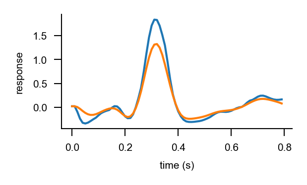

```python
%load_ext autoreload
%autoreload 2
```

    The autoreload extension is already loaded. To reload it, use:
      %reload_ext autoreload


# Maximally excitatory stimuli from trained models

This notebook illustrates how to compute the stimuli that maximally excite a specific neuron.

**Select GPU runtime**

To run the notebook on a GPU select Menu -> Runtime -> Change runtime type -> GPU.


```python
# @markdown **Check access to GPU**

try:
    import google.colab

    IN_COLAB = True
except ImportError:
    IN_COLAB = False

if IN_COLAB:
    import torch

    try:
        cuda_name = torch.cuda.get_device_name()
        print(f"Name of the assigned GPU / CUDA device: {cuda_name}")
    except RuntimeError:
        import warnings

        warnings.warn(
            "You have not selected Runtime Type: 'GPU' or Google could not assign you one. Please revisit the settings as described above or proceed on CPU (slow)."
        )
```

**Install Flyvis**

The notebook requires installing our package `flyvis`. You may need to restart your session after running the code block below with Menu -> Runtime -> Restart session. Then, imports from `flyvis` should succeed without issue.


```python
if IN_COLAB:
    # @markdown **Install Flyvis**
    %%capture
    !git clone https://github.com/flyvis/flyvis-dev.git
    %cd /content/flyvis-dev
    !pip install -e .
```


```python
# basic imports
import matplotlib.pyplot as plt
import numpy as np
import torch

plt.rcParams['figure.dpi'] = 200
```

# Optimal naturalistic stimuli

We first find the optimal naturalistic stimuli. To do that, we simulate the responses of
the network (including the neuron of interest) to all stimuli from a fixed dataset of stimuli.
The optimal, or here maximally exctitatory naturalistic stimulus to be precise, is the stimulus
for which the response of the chosen neuron is maximal. Finding this is simple and does not require numerical optimization with gradients.
We find the stimulus per cell type based on its cell in the central column. At least in our coarse model,
the offset version of this stimulus would also maximally excite the equivalently offset neighboring cells of the same type.


```python
from flyvision import NetworkView, results_dir
from flyvision.datasets.sintel import AugmentedSintel
from flyvision.analysis.optimal_stimuli import (
    FindOptimalStimuli,
    GenerateOptimalStimuli,
    plot_stim_response,
)
```


```python
# let's load the dataset and the pretrained network
dataset = AugmentedSintel(tasks=["lum"], temporal_split=True)
network_view = NetworkView(results_dir / "flow/0000/000")
```

    [2024-10-04 22:52:04] network:1008 Initialized network view at /groups/turaga/home/lappalainenj/FlyVis/private/flyvision/data/results/flow/0000/000.


```python
findoptstim = FindOptimalStimuli(network_view, dataset)
```

    [2024-10-04 22:52:13] network:258 Initialized network with NumberOfParams(free=734, fixed=2959) parameters.
    [2024-10-04 22:52:13] chkpt_utils:72 Recovered network state.


For the T4c neuron, we would expect that the maximally excitatory stimulus is an ON-edge
moving upward.


```python
optstim = network_view.optimal_stimulus_responses("T4c")
```


```python
stim_resp_plot = plot_stim_response(
    optstim.stimulus.stimulus,
    optstim.stimulus.response,
    1 / 100,
    *network_view.connectome_view.get_uv("T4c"),
    figsize=[5, 1.6],
    ylabel=None,
    label_peak_response=False,
)
```


We see that the the stimulus indeed contains an ON-edge component moving upward and this is the portion of the stimulus that T4c cells respond most to.
What's unclear is whether the other parts of the stimulus have an influence on the response.

# Regularized optimal stimuli

We can regularize the optimal stimuli with the objective to keep the response of the
cell intact while bringing the stimulus pixels to a neutral grey value.


```python
stim_resp_plot = plot_stim_response(
    optstim.regularized_stimulus,
    optstim.response,
    1 / 100,
    *network_view.connectome_view.get_uv("T4c"),
    figsize=[5, 1.6],
    ylabel=None,
    label_peak_response=False,
)
```


This looks remarkably different! Now only a central black portion follow by the ON-edge
moving upward remains in the stimulus. Let's make sure that the central cell response is
really the same as before! This is the entire time trace.


```python
fig = plt.figure(figsize=[2, 1])
time = np.arange(len(optstim.central_target_response)) / 100
plt.plot(time, optstim.central_target_response)
plt.plot(time, optstim.central_predicted_response)
plt.xlabel("time (s)")
plt.ylabel("response")
```


    Text(0, 0.5, 'response')





This looks quite similar! One can play with the regularization parameters of the function `regularized_optimal_stimuli` to tune this.

# Generate artificial optimal stimuli from scratch
If one is able to optimize the naturalistic stimulus with the gradient, why don't we
use the gradient to generate an optimal stimulus from scratch (or rather random noise).
We do that in the following. Again for T4c, we would expect that it would have some sort
of ON-edge moving upwards.


```python
genoptstim = GenerateOptimalStimuli(network_view)
```

    [2024-10-04 22:52:27] chkpt_utils:72 Recovered network state.


```python
artoptstim = genoptstim.artificial_optimal_stimuli("T4c", t_stim=0.8)
```


```python
stim_resp_plot = plot_stim_response(
    artoptstim.stimulus,
    artoptstim.response,
    1 / 100,
    *network_view.connectome_view.get_uv("T4c"),
    figsize=[5, 1.6],
    ylabel=None,
    label_peak_response=False,
)
```


Wow! This stimulus is contains very similar components to the one before and is much more
saturated! It also contains new ON-components already from the beginning!

Last, let's compare which stimulus excited the neuron the most.


```python
fig = plt.figure(figsize=[2, 1])
time = np.arange(len(optstim.central_target_response)) / 100
plt.plot(time, optstim.central_target_response, label='naturalistic')
plt.plot(time, optstim.central_predicted_response, label='regularized naturalistic')
plt.plot(
    time,
    artoptstim.response[:, :, artoptstim.response.shape[-1] // 2].flatten(),
    label='artificial',
)
plt.xlabel("time (s)")
plt.ylabel("response")
plt.legend()
```


    <matplotlib.legend.Legend at 0x7f9a60ea4e80>


```python

```
