# Providing custom stimuli

Follow this notebook to learn how to use our models for generating hypothesis about neural computations with custom stimuli.

## Example dataset

We take the public [Moving MNIST](https://www.cs.toronto.edu/~nitish/unsupervised_video/) sequence dataset as an example for a custom stimulus dataset.
Moving MNIST consists of short grey-scale videos of numbers from 1-10 which move in arbitrary directions. The dataset entails 10,000 sequences of 20 frames each. Individual frames are 64x64 pixels in height and width.


```python
import torch
import numpy as np

np.random.seed(42)
import matplotlib.pyplot as plt

import flyvis
from flyvis.utils.dataset_utils import load_moving_mnist
from flyvis.analysis import animations
```


```python
sequences = load_moving_mnist()
```


```python
# the whole dataset has dims (n_sequences, n_frames, height, width)
sequences.shape
```


    (10000, 20, 64, 64)


```python
animation = animations.Imshow(sequences, cmap=plt.cm.binary_r)
animation.animate_in_notebook(samples=[0, 1, 2])
```


Alternative: for an alternative dataset that is generated at runtime and does not require a download try `random_walk_of_blocks`. As a simple drop-in replacement, this requires to replace `load_moving_mnist` with `random_walk_of_blocks` across the notebook.


```python
from flyvis.utils.dataset_utils import random_walk_of_blocks
```


```python
sequences = random_walk_of_blocks()
```


```python
animation = animations.Imshow(sequences, cmap=plt.cm.binary_r)
animation.animate_in_notebook(samples=[0, 1, 2])
```


## BoxEye rendering

##### Rendering cartesian images to hexagonal lattice

We translate cartesian frames into receptor activations by placing simulated photoreceptors in a two-dimensional hexagonal array in pixel space (blue dots below), 31 columns across resulting in 721 columns in total, spaced 13 pixels apart. The transduced luminance at each photoreceptor is the greyscale mean value in the 13×13-pixel region surrounding it (black boxes).


```python
import flyvis
from flyvis.datasets.rendering import BoxEye
```


```python
receptors = BoxEye(extent=15, kernel_size=13)
```


```python
fig = receptors.illustrate()
```


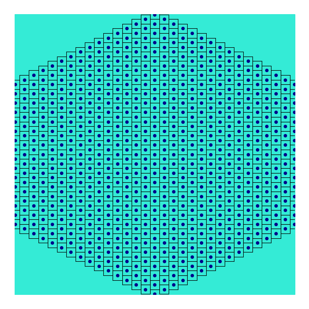


### Render a single frame

To illustrate, this is what rendering a single frame looks like.


```python
import torch
import numpy as np

np.random.seed(42)
import matplotlib.pyplot as plt

plt.rcParams['figure.dpi'] = 200

import flyvis
from flyvis.utils.dataset_utils import load_moving_mnist
from flyvis.analysis.visualization import plt_utils, plots
```


```python
sequences = load_moving_mnist()
```


```python
fig, ax = plt_utils.init_plot(figsize=[1, 1], fontsize=5)
ax = plt_utils.rm_spines(ax)
ax.imshow(sequences[0, 0], cmap=plt.cm.binary_r)
_ = ax.set_title('example frame', fontsize=5)
```


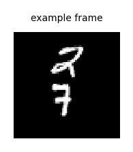


```python
single_frame = sequences[0, 0]

# the rendering uses pytorch native Conv2d module so it can be executed on GPU and fast
# we first move the frame to GPU
single_frame = torch.tensor(single_frame, device=flyvis.device).float()

# because the inputs to the receptors instance must have four dimensions (samples, frames, height, width),
# we create two empty dimensions for samples and frames
single_frame = single_frame[None, None]
```


```python
# to render the single frame we simply call the instance
# this automatically rescales the frame to match the receptor layout as illustrated above
# and then places the average pixel value of the 13x13 boxes at the receptor positions
receptors = BoxEye()
rendered = receptors(single_frame)
```

    /home/lappalainenj@hhmi.org/miniconda3/envs/flyvision/lib/python3.9/site-packages/torchvision/transforms/functional.py:1603: UserWarning: The default value of the antialias parameter of all the resizing transforms (Resize(), RandomResizedCrop(), etc.) will change from None to True in v0.17, in order to be consistent across the PIL and Tensor backends. To suppress this warning, directly pass antialias=True (recommended, future default), antialias=None (current default, which means False for Tensors and True for PIL), or antialias=False (only works on Tensors - PIL will still use antialiasing). This also applies if you are using the inference transforms from the models weights: update the call to weights.transforms(antialias=True).
      warnings.warn(


```python
# the 721 receptor coordinates are implicitly given in the last dimension
# they correspond to sorted hexagonal coordinates (u-coordinate, v-coordinate, value)
rendered.shape
```


    torch.Size([1, 1, 1, 721])


```python
# the rendered frame is a slightly blurred version of the example
fig, ax, _ = plots.quick_hex_scatter(
    rendered.squeeze(), vmin=0, vmax=1, cbar_x_offset=0, fontsize=5
)
_ = ax.set_title("example frame rendered", fontsize=5)
```


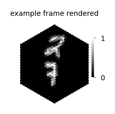


```python
# Disclaimer: thinking in hex coordinates can be unfamiliar.
# Therefore, we circumvent dealing with them explicitly.
# Still - to understand how the above plot infers the pixel-plane coordinates
# from the implicit hexagonal coordinates, you can inspect the following code.
```


```python
# # we can explicitly create sorted hex-coordinates from the integer radius of the hexagonal grid
# # for a regular hexagonal lattice, the radius is uniquely determined from the number of hexagons

# radius = flyvis.utils.hex_utils.get_hextent(rendered.shape[-1])

# # here we create integer u, v coordinates, and we stick to the same function and convention
# # everywhere in the code
# u, v = flyvis.utils.hex_utils.get_hex_coords(radius)

# # we transform them to pixel coordinates using our convention
# x, y = flyvis.utils.hex_utils.hex_to_pixel(u, v)

# # and can just scatter them to be back at the photoreceptor layout
# fig, ax = plt_utils.init_plot(figsize=[2, 2], fontsize=5)
# ax.scatter(x, y, s=0.5)
```

## Render a whole dataset to disk

We save rendered sequences to disk to retrieve them faster at runtime.

We will use our library datamate here because it provides a powerful interface for writing and reading arrayfiles.


```python
from typing import List
from tqdm import tqdm
import torch
import numpy as np

np.random.seed(42)
import matplotlib.pyplot as plt

plt.rcParams['figure.dpi'] = 200

from pathlib import Path
from datamate import root, Directory

import flyvis
from flyvis.utils.dataset_utils import load_moving_mnist
```


```python
# the Directory class is a smart pointer to a specific directory
# on the filesystem

# directory to store the rendered stimuli
from flyvis import renderings_dir


# root tells where the Directory-tree starts
@root(renderings_dir)
class RenderedData(Directory):
    class Config(dict):
        extent: int  # radius, in number of receptors of the hexagonal array.
        kernel_size: int  # photon collection radius, in pixels.
        subset_idx: List[int]  # if specified, subset of sequences to render

    def __init__(self, config: Config):
        # here comes the preprocessing and rendering as above or similar -- depending on the dataset etc.
        # this code will be executed automatically once for each unique configuration to store preprocessed
        # data on disk and later simply provide a reference to it.
        sequences = load_moving_mnist()

        # we use the configuration to control the settings under which we render the stimuli
        receptors = BoxEye(extent=config.extent, kernel_size=config.kernel_size)

        # for memory-friendly rendering we can loop over individual sequences
        # and subsets of the dataset
        rendered_sequences = []
        subset_idx = getattr(config, "subset_idx", []) or list(range(sequences.shape[0]))
        with tqdm(total=len(subset_idx)) as pbar:
            for index in subset_idx:
                rendered_sequences.append(receptors(sequences[[index]]).cpu().numpy())
                pbar.update()

        # to join individual sequences along their first dimension
        # to obtain (n_sequences, n_frames, 1, receptors.hexals)
        rendered_sequences = np.concatenate(rendered_sequences, axis=0)

        # the __setattr__ method of the Directory class saves sequences to self.path/"sequences.h5"
        # that can be later retrieved using self.sequences[:]
        self.sequences = rendered_sequences
```


```python
# note, to render the whole dataset provide an empty list for `subset_idx` or delete the key word argument
moving_mnist_rendered = RenderedData(
    dict(extent=15, kernel_size=13, subset_idx=[0, 1, 2, 3])
)
```


```python
# this is how we can retrieve the sequences from the disk into memory
rendered_sequences = moving_mnist_rendered.sequences[:]
```


```python
rendered_sequences.shape
```


    (4, 20, 1, 721)


```python
animation = animations.HexScatter(rendered_sequences, vmin=0, vmax=1)
animation.animate_in_notebook()
```


```python
# Note, to delete a Directory, e.g. to change the __init__ and reinstantiate,
# run moving_mnist_rendered.rmtree("y").
```

## Create a sequence dataset

Next we create a Pytorch dataset for loading the sequences.


```python
from typing import List
from tqdm import tqdm
import torch
import numpy as np

np.random.seed(42)
import matplotlib.pyplot as plt

plt.rcParams['figure.dpi'] = 200

from pathlib import Path
from datamate import root, Directory

import flyvis
from flyvis.utils.dataset_utils import load_moving_mnist
from flyvis.datasets.datasets import SequenceDataset
from flyvis.analysis import animations
```


```python
# the Directory class is a smart pointer to a specific directory
# on the filesystem

# directory to store the rendered stimuli
from flyvis import renderings_dir


# root tells where the Directory-tree starts
@root(renderings_dir)
class RenderedData(Directory):
    class Config(dict):
        extent: int  # radius, in number of receptors of the hexagonal array.
        kernel_size: int  # photon collection radius, in pixels.
        subset_idx: List[int]  # if specified, subset of sequences to render

    def __init__(self, config: Config):
        # here comes the preprocessing and rendering as above or similar -- depending on the dataset etc.
        # this code will be executed automatically once for each unique configuration to store preprocessed
        # data on disk and later simply provide a reference to it.
        sequences = load_moving_mnist()

        # we use the configuration to control the settings under which we render the stimuli
        receptors = BoxEye(extent=config.extent, kernel_size=config.kernel_size)

        # for memory-friendly rendering we can loop over individual sequences
        # and subsets of the dataset
        rendered_sequences = []
        subset_idx = getattr(config, "subset_idx", []) or list(range(sequences.shape[0]))
        with tqdm(total=len(subset_idx)) as pbar:
            for index in subset_idx:
                rendered_sequences.append(receptors(sequences[[index]]).cpu().numpy())
                pbar.update()

        # to join individual sequences along their first dimension
        # to obtain (n_sequences, n_frames, 1, receptors.hexals)
        rendered_sequences = np.concatenate(rendered_sequences, axis=0)

        # the __setattr__ method of the Directory class saves sequences to self.path/"sequences.h5"
        # that can be later retrieved using self.sequences[:]
        self.sequences = rendered_sequences
```

##### Create a custom dataset
We create a generic interface for custom datasets to make dataloading consistent---this interface can tell the sampler what the framerate, the integration time steps, durations for pre-, and post grey-scale stimulation, and the number of sequences are.

In this case, we inherit a SequenceDataset, that also obeys (and extends) the interface of Pytorch's Dataset.


```python
import pandas as pd
```


```python
class CustomStimuli(SequenceDataset):
    # implementing the SequenceDataset interface
    dt = 1 / 100
    original_framerate = 24
    t_pre = 0.5
    t_post = 0.5
    n_sequences = None
    augment = False

    def __init__(self, rendered_data_config: dict):
        self.dir = RenderedData(rendered_data_config)
        self.sequences = torch.tensor(self.dir.sequences[:])
        self.n_sequences = self.sequences.shape[0]
        self.arg_df = pd.DataFrame({"sequence_idx": np.arange(self.n_sequences)})

    def get_item(self, key):
        sequence = self.sequences[key]
        # to match the framerate to the integration time dt, we can resample frames
        # from these indices. note, when dt = 1/framerate, this will return the exact sequence
        resample = self.get_temporal_sample_indices(sequence.shape[0], sequence.shape[0])
        return sequence[resample]
```


```python
# note, to render the whole dataset provide an empty list for `subset_idx` or delete the key word argument
data = CustomStimuli(dict(extent=15, kernel_size=13, subset_idx=[0, 1, 2, 3]))
```


```python
animation = animations.HexScatter(data[0][None], vmin=0, vmax=1)
animation.animate_in_notebook()
```


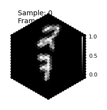


## Compute model responses to custom stimuli

Now, we can compute model responses across individual models or the whole ensemble to our custom stimulus.


```python
from typing import List
from tqdm import tqdm
import torch
import numpy as np

np.random.seed(42)
import matplotlib.pyplot as plt

plt.rcParams['figure.dpi'] = 200

from pathlib import Path
from datamate import root, Directory

import flyvis
from flyvis.utils.dataset_utils import load_moving_mnist
from flyvis.datasets.datasets import SequenceDataset
from flyvis.utils.activity_utils import LayerActivity
```


```python
# the Directory class is a smart pointer to a specific directory
# on the filesystem

# directory to store the rendered stimuli
from flyvis import renderings_dir


# root tells where the Directory-tree starts
@root(renderings_dir)
class RenderedData(Directory):
    class Config(dict):
        extent: int  # radius, in number of receptors of the hexagonal array.
        kernel_size: int  # photon collection radius, in pixels.
        subset_idx: List[int]  # if specified, subset of sequences to render

    def __init__(self, config: Config):
        # here comes the preprocessing and rendering as above or similar -- depending on the dataset etc.
        # this code will be executed automatically once for each unique configuration to store preprocessed
        # data on disk and later simply provide a reference to it.
        sequences = load_moving_mnist()

        # we use the configuration to control the settings under which we render the stimuli
        receptors = BoxEye(extent=config.extent, kernel_size=config.kernel_size)

        # for memory-friendly rendering we can loop over individual sequences
        # and subsets of the dataset
        rendered_sequences = []
        subset_idx = getattr(config, "subset_idx", []) or list(range(sequences.shape[0]))
        with tqdm(total=len(subset_idx)) as pbar:
            for index in subset_idx:
                rendered_sequences.append(receptors(sequences[[index]]).cpu().numpy())
                pbar.update()

        # to join individual sequences along their first dimension
        # to obtain (n_sequences, n_frames, 1, receptors.hexals)
        rendered_sequences = np.concatenate(rendered_sequences, axis=0)

        # the __setattr__ method of the Directory class saves sequences to self.path/"sequences.h5"
        # that can be later retrieved using self.sequences[:]
        self.sequences = rendered_sequences
```


```python
class CustomStimuli(SequenceDataset):
    # implementing the SequenceDataset interface
    dt = 1 / 100
    framerate = 24
    t_pre = 0.5
    t_post = 0.5
    n_sequences = None
    augment = False

    def __init__(self, rendered_data_config: dict):
        self.dir = RenderedData(rendered_data_config)
        self.sequences = torch.tensor(self.dir.sequences[:])
        self.n_sequences = self.sequences.shape[0]
        self.arg_df = pd.DataFrame({"sequence_idx": np.arange(self.n_sequences)})

    def get_item(self, key):
        sequence = self.sequences[key]
        # to match the framerate to the integration time dt, we can resample frames
        # from these indices. note, when dt = 1/framerate, this will return the exact sequence
        resample = self.get_temporal_sample_indices(sequence.shape[0], sequence.shape[0])
        return sequence[resample]
```


```python
# note, to render the whole dataset provide an empty list for `subset_idx` or delete the key word argument
data = CustomStimuli(dict(extent=15, kernel_size=13, subset_idx=[0, 1, 2, 3]))
```

##### Select a pretrained network

To select a network from the ensemble of 50 pretrained networks, let's see what our options are.

Paths to pretrained models from the ensemble end with four digit numbers which are sorted by task error (0-49 from best to worst).


```python
sorted([
    p.relative_to(flyvis.results_dir)
    for p in (flyvis.results_dir / "flow/0000").iterdir()
    if p.name.isnumeric()
])
```


    [PosixPath('flow/0000/000'),
     PosixPath('flow/0000/001'),
     PosixPath('flow/0000/002'),
     PosixPath('flow/0000/003'),
     PosixPath('flow/0000/004'),
     PosixPath('flow/0000/005'),
     PosixPath('flow/0000/006'),
     PosixPath('flow/0000/007'),
     PosixPath('flow/0000/008'),
     PosixPath('flow/0000/009'),
     PosixPath('flow/0000/010'),
     PosixPath('flow/0000/011'),
     PosixPath('flow/0000/012'),
     PosixPath('flow/0000/013'),
     PosixPath('flow/0000/014'),
     PosixPath('flow/0000/015'),
     PosixPath('flow/0000/016'),
     PosixPath('flow/0000/017'),
     PosixPath('flow/0000/018'),
     PosixPath('flow/0000/019'),
     PosixPath('flow/0000/020'),
     PosixPath('flow/0000/021'),
     PosixPath('flow/0000/022'),
     PosixPath('flow/0000/023'),
     PosixPath('flow/0000/024'),
     PosixPath('flow/0000/025'),
     PosixPath('flow/0000/026'),
     PosixPath('flow/0000/027'),
     PosixPath('flow/0000/028'),
     PosixPath('flow/0000/029'),
     PosixPath('flow/0000/030'),
     PosixPath('flow/0000/031'),
     PosixPath('flow/0000/032'),
     PosixPath('flow/0000/033'),
     PosixPath('flow/0000/034'),
     PosixPath('flow/0000/035'),
     PosixPath('flow/0000/036'),
     PosixPath('flow/0000/037'),
     PosixPath('flow/0000/038'),
     PosixPath('flow/0000/039'),
     PosixPath('flow/0000/040'),
     PosixPath('flow/0000/041'),
     PosixPath('flow/0000/042'),
     PosixPath('flow/0000/043'),
     PosixPath('flow/0000/044'),
     PosixPath('flow/0000/045'),
     PosixPath('flow/0000/046'),
     PosixPath('flow/0000/047'),
     PosixPath('flow/0000/048'),
     PosixPath('flow/0000/049')]


We use the `NetworkView` class to point to a model. This object can implement plots plus methods to initialize network, stimuli etc.


```python
network_view = flyvis.NetworkView(flyvis.results_dir / "flow/0000/000")
```

    [2024-12-08 19:40:21] network_view:122 Initialized network view at ../flyvis/data/results/flow/0000/000


```python
# to load the Pytorch module with pretrained parameters
network = network_view.init_network()
```

    [2024-12-08 19:40:30] network:222 Initialized network with NumberOfParams(free=734, fixed=2959) parameters.
    [2024-12-08 19:40:30] chkpt_utils:36 Recovered network state.


```python
movie_input = data[0]
```


```python
movie_input.shape
```


    torch.Size([20, 1, 721])


##### Compute a stationary state

We initialize the network at a stationary state, to remove transient responses due to stimulus onset from functional stimulus responses like motion detection. The network provides two methods for stationary state computation `network.fade_in_state` and `network.steady_state`. We use `fade_in_state` here, which slowly ramps up
the intensity of the first frame in the sequence to compute a stationary state that minimizes the transient response. The method `steady_state` computes a sequence-independent stationary state by providing a whole-field grey-scale stimulus at medium intensity (but it does not get rid of a transient response).


```python
stationary_state = network.fade_in_state(1.0, data.dt, movie_input[[0]])
```

##### Obtain network responses

A convenient way to obtain network responses is to call `network.simulate`
which calls the forward function of the Pytorch module without tracking gradients
(plus it provides a simpler interface than `network.forward` because it already maps stimulus to receptors using the `network.stimulus` attribute).


```python
# For analysis, we move the returned tensor to cpu.
responses = network.simulate(
    movie_input[None], data.dt, initial_state=stationary_state
).cpu()
```


```python
responses.shape
```


    torch.Size([1, 20, 45669])


##### Visualize responses of specific cells

`LayerActivity` is an interface to the response tensor of 45k cells that allows dict- and attribute-style access to the responses of individual cell types and to the responses of their central cells.


```python
responses = LayerActivity(responses, network.connectome, keepref=True)
```


```python
cell_type = "T4c"
```

The stimulus on the left, and the response on the right described by passive point neuron voltage dynamics. Cells depolarize (red) and hyperpolarize (blue) in response to the stimulus. A single "hexal" corresponds to one neuron of the cell type.


```python
anim = animations.StimulusResponse(movie_input[None], responses[cell_type][:, :, None])
anim.animate_in_notebook(frames=np.arange(anim.frames)[::2])
```


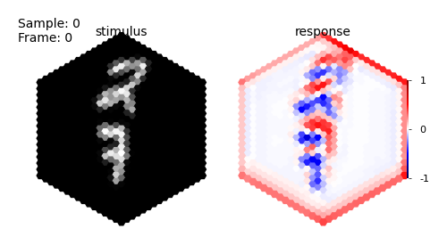


Often, we are interested in a canonical response of a specific cell type to a specific stimulus to generate hypotheses for their role in a computation. In our model, we can take the central cell as a proxy for all cells of the given type, because cells share their parameters and in- and output connections. I.e. the responses of all cells of a given type would be the same (not taking boundary effects into account) when the same stimulus would cross their identical but spatially offset receptive field in the same way.


```python
n_frames = movie_input.shape[0]
time = np.arange(0, n_frames * data.dt, data.dt)
```


```python
fig, ax = plt_utils.init_plot([2, 2], fontsize=5)
ax.plot(time, responses.central[cell_type].squeeze())
ax.set_xlabel("time in s", fontsize=5)
ax.set_ylabel("central response (a.u.)", fontsize=5)
```


    Text(0, 0.5, 'central response (a.u.)')


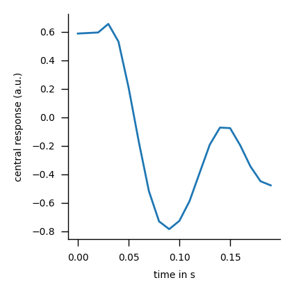


## Compute responses over the whole ensemble

In addition to looking at individual models, we next compute responses across the whole ensemble at once to look at them jointly.


```python
from typing import List
from tqdm import tqdm
import torch
import numpy as np

np.random.seed(42)
import matplotlib.pyplot as plt

plt.rcParams['figure.dpi'] = 200

from pathlib import Path
from datamate import root, Directory

import flyvis
from flyvis.utils.dataset_utils import load_moving_mnist
from flyvis.datasets.datasets import SequenceDataset
from flyvis.utils.activity_utils import LayerActivity
from flyvis import EnsembleView
```


```python
# the Directory class is a smart pointer to a specific directory
# on the filesystem

# directory to store the rendered stimuli
from flyvis import renderings_dir


# root tells where the Directory-tree starts
@root(renderings_dir)
class RenderedData(Directory):
    class Config(dict):
        extent: int  # radius, in number of receptors of the hexagonal array.
        kernel_size: int  # photon collection radius, in pixels.
        subset_idx: List[int]  # if specified, subset of sequences to render

    def __init__(self, config: Config):
        # here comes the preprocessing and rendering as above or similar -- depending on the dataset etc.
        # this code will be executed automatically once for each unique configuration to store preprocessed
        # data on disk and later simply provide a reference to it.
        sequences = load_moving_mnist()

        # we use the configuration to control the settings under which we render the stimuli
        receptors = BoxEye(extent=config.extent, kernel_size=config.kernel_size)

        # for memory-friendly rendering we can loop over individual sequences
        # and subsets of the dataset
        rendered_sequences = []
        subset_idx = getattr(config, "subset_idx", []) or list(range(sequences.shape[0]))
        with tqdm(total=len(subset_idx)) as pbar:
            for index in subset_idx:
                rendered_sequences.append(receptors(sequences[[index]]).cpu().numpy())
                pbar.update()

        # to join individual sequences along their first dimension
        # to obtain (n_sequences, n_frames, 1, receptors.hexals)
        rendered_sequences = np.concatenate(rendered_sequences, axis=0)

        # the __setattr__ method of the Directory class saves sequences to self.path/"sequences.h5"
        # that can be later retrieved using self.sequences[:]
        self.sequences = rendered_sequences
```


```python
class CustomStimuli(SequenceDataset):
    # implementing the SequenceDataset interface
    dt = 1 / 100
    framerate = 24
    t_pre = 0.5
    t_post = 0.5
    n_sequences = None
    augment = False

    def __init__(self, rendered_data_config: dict):
        self.dir = RenderedData(rendered_data_config)
        self.sequences = torch.tensor(self.dir.sequences[:])
        self.n_sequences = self.sequences.shape[0]
        self.arg_df = pd.DataFrame({"sequence_idx": np.arange(self.n_sequences)})

    def get_item(self, key):
        sequence = self.sequences[key]
        # to match the framerate to the integration time dt, we can resample frames
        # from these indices. note, when dt = 1/framerate, this will return the exact sequence
        resample = self.get_temporal_sample_indices(sequence.shape[0], sequence.shape[0])
        return sequence[resample]
```


```python
# note, to render the whole dataset provide an empty list for `subset_idx` or delete the key word argument
data = CustomStimuli(dict(extent=15, kernel_size=13, subset_idx=[0, 1, 2, 3]))
```

##### Select the pretrained ensemble

Similar to the `NetworkView` object, the `EnsembleView` object points to an ensemble and implements plots plus methods to initialize networks, stimuli etc. This object provides dict- and attribute-style access to individual `NetworkView` instances.


```python
ensemble = EnsembleView(flyvis.results_dir / "flow/0000")
```


    Loading ensemble:   0%|          | 0/50 [00:00<?, ?it/s]


    [2024-12-08 19:40:51] ensemble:166 Loaded 50 networks.


##### Simulate responses for each network


```python
movie_input = data[0]
```

`ensemble.simulate` provides an efficient method to return responses of all networks within the ensemble.


```python
# ensemble.simulate returns an iterator over `network.simulate` for each network.
# we exhaust it and stack responses from all models in the first dimension
responses = np.array(list(ensemble.simulate(movie_input[None], data.dt, fade_in=True)))
```


    Simulating network:   0%|          | 0/50 [00:00<?, ?it/s]


    [2024-12-08 19:40:59] network:222 Initialized network with NumberOfParams(free=734, fixed=2959) parameters.
    [2024-12-08 19:40:59] chkpt_utils:36 Recovered network state.
    [2024-12-08 19:41:00] chkpt_utils:36 Recovered network state.
    [2024-12-08 19:41:00] chkpt_utils:36 Recovered network state.
    [2024-12-08 19:41:00] chkpt_utils:36 Recovered network state.
    [2024-12-08 19:41:00] chkpt_utils:36 Recovered network state.
    [2024-12-08 19:41:00] chkpt_utils:36 Recovered network state.
    [2024-12-08 19:41:00] chkpt_utils:36 Recovered network state.
    [2024-12-08 19:41:01] chkpt_utils:36 Recovered network state.
    [2024-12-08 19:41:01] chkpt_utils:36 Recovered network state.
    [2024-12-08 19:41:01] chkpt_utils:36 Recovered network state.
    [2024-12-08 19:41:01] chkpt_utils:36 Recovered network state.
    [2024-12-08 19:41:01] chkpt_utils:36 Recovered network state.
    [2024-12-08 19:41:01] chkpt_utils:36 Recovered network state.
    [2024-12-08 19:41:02] chkpt_utils:36 Recovered network state.
    [2024-12-08 19:41:02] chkpt_utils:36 Recovered network state.
    [2024-12-08 19:41:02] chkpt_utils:36 Recovered network state.
    [2024-12-08 19:41:02] chkpt_utils:36 Recovered network state.
    [2024-12-08 19:41:02] chkpt_utils:36 Recovered network state.
    [2024-12-08 19:41:02] chkpt_utils:36 Recovered network state.
    [2024-12-08 19:41:03] chkpt_utils:36 Recovered network state.
    [2024-12-08 19:41:03] chkpt_utils:36 Recovered network state.
    [2024-12-08 19:41:03] chkpt_utils:36 Recovered network state.
    [2024-12-08 19:41:03] chkpt_utils:36 Recovered network state.
    [2024-12-08 19:41:03] chkpt_utils:36 Recovered network state.
    [2024-12-08 19:41:03] chkpt_utils:36 Recovered network state.
    [2024-12-08 19:41:04] chkpt_utils:36 Recovered network state.
    [2024-12-08 19:41:04] chkpt_utils:36 Recovered network state.
    [2024-12-08 19:41:04] chkpt_utils:36 Recovered network state.
    [2024-12-08 19:41:04] chkpt_utils:36 Recovered network state.
    [2024-12-08 19:41:04] chkpt_utils:36 Recovered network state.
    [2024-12-08 19:41:04] chkpt_utils:36 Recovered network state.
    [2024-12-08 19:41:05] chkpt_utils:36 Recovered network state.
    [2024-12-08 19:41:05] chkpt_utils:36 Recovered network state.
    [2024-12-08 19:41:05] chkpt_utils:36 Recovered network state.
    [2024-12-08 19:41:05] chkpt_utils:36 Recovered network state.
    [2024-12-08 19:41:05] chkpt_utils:36 Recovered network state.
    [2024-12-08 19:41:05] chkpt_utils:36 Recovered network state.
    [2024-12-08 19:41:06] chkpt_utils:36 Recovered network state.
    [2024-12-08 19:41:06] chkpt_utils:36 Recovered network state.
    [2024-12-08 19:41:06] chkpt_utils:36 Recovered network state.
    [2024-12-08 19:41:06] chkpt_utils:36 Recovered network state.
    [2024-12-08 19:41:06] chkpt_utils:36 Recovered network state.
    [2024-12-08 19:41:06] chkpt_utils:36 Recovered network state.
    [2024-12-08 19:41:07] chkpt_utils:36 Recovered network state.
    [2024-12-08 19:41:07] chkpt_utils:36 Recovered network state.
    [2024-12-08 19:41:07] chkpt_utils:36 Recovered network state.
    [2024-12-08 19:41:07] chkpt_utils:36 Recovered network state.
    [2024-12-08 19:41:07] chkpt_utils:36 Recovered network state.
    [2024-12-08 19:41:07] chkpt_utils:36 Recovered network state.
    [2024-12-08 19:41:08] chkpt_utils:36 Recovered network state.


```python
# dims are (n_models, n_sequences, n_frames, n_cells)
responses.shape
```


    (50, 1, 20, 45669)


##### Visualize responses of specific cells across the ensemble


```python
responses = LayerActivity(responses, ensemble[0].connectome, keepref=True)
```

We look at responses of all cells of a specific cell-type in the hexagonal lattice.


```python
cell_type = "T4c"

# (n_models, n_sequences, n_frames, n_hexals)
responses[cell_type].shape
```


    (50, 1, 20, 721)


We can look at all model responses in succession to see how the stimulus causes depolarization and hyperpolarization in the cells. To speed this up a bit, we specify `frames` to look at every tenth frame.


```python
anim = animations.StimulusResponse(movie_input[None], responses[cell_type][:, 0, :, None])
# these are now just the first 5 models for illustration
model_index = [0, 1, 2, 3, 4]
anim.animate_in_notebook(samples=model_index, frames=np.arange(anim.frames)[::10])
```


Or look at responses in multiple models jointly.
Disclaimer: including more axes slows down the animation.


```python
cell_type_responses = responses[cell_type]
model_idx = [0, 1, 2, 3, 4]
anim = animations.StimulusResponse(
    movie_input[None], [cell_type_responses[i][None, 0, :, None] for i in model_idx]
)
anim.animate_in_notebook(frames=np.arange(anim.frames)[::10])
```


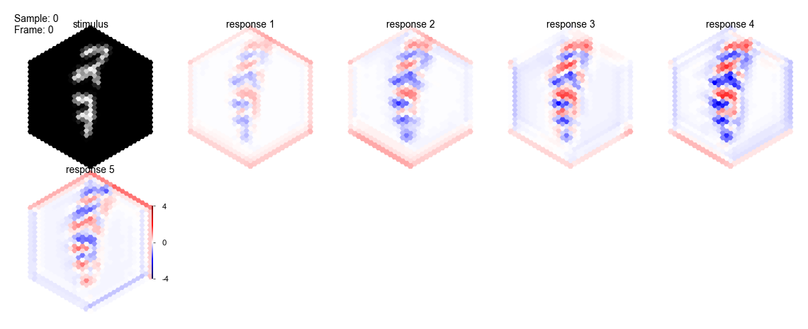


Let's look at how the whole ensemble characterizes the central cell responses.


```python
central_responses = responses.central
```


```python
n_frames = movie_input.shape[0]
time = np.arange(0, n_frames * data.dt, data.dt)
```


```python
colors = ensemble.task_error().colors
```


```python
fig, ax = plt_utils.init_plot([2, 2], fontsize=5)
for model_id, response in enumerate(central_responses[cell_type]):
    ax.plot(time, response.squeeze(), c=colors[model_id], zorder=len(ensemble) - model_id)
ax.set_xlabel("time in s", fontsize=5)
ax.set_ylabel("response (a.u.)", fontsize=5)
ax.set_title(f"{cell_type} responses across the ensemble", fontsize=5)
```


    Text(0.5, 1.0, 'T4c responses across the ensemble')


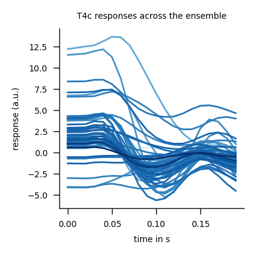


From the above plot it seems like different models generate different predictions for the cell type function and its hard to tell them apart. Therefore, we clustered the models such that we can separate the above responses by functional cluster for a specific cell type. Note, clusters are stored as dictionaries in which the key is the cluster identity and their values are the indices to the corresponding models.


```python
cluster_indices = ensemble.cluster_indices(cell_type)
```

    [2024-12-08 19:41:26] clustering:835 Loaded T4c embedding and clustering from ../flyvis/data/results/flow/0000/umap_and_clustering


```python
for cluster_id, model_idx in cluster_indices.items():
    fig, ax = plt_utils.init_plot([2, 2], fontsize=5)
    for model_id in model_idx:
        response = responses.central[cell_type][model_id]
        ax.plot(
            time, response.squeeze(), c=colors[model_id], zorder=len(ensemble) - model_id
        )
    ax.set_xlabel("time in s", fontsize=5)
    ax.set_ylabel("response (a.u.)", fontsize=5)
    ax.set_title(f"{cell_type} responses across cluster {cluster_id + 1}", fontsize=5)
    plt.show()
```


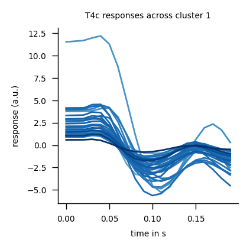


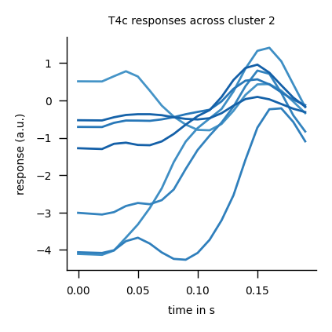


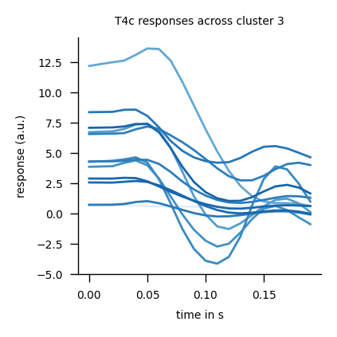


For T4c, we know that the first set of models is upwards tuning and the second is downwards tuning (Fig.4c) -- lets try to observe differences in their responses.

We choose the best upwards tuning model and the best downwards tuning model to compare.

We can notice that the spatial location of hyperpolarization and depolarization is switched vertically between both models.


```python
cell_type = "T4c"
```


```python
cluster_indices = ensemble.cluster_indices(cell_type)
```


```python
anim = animations.StimulusResponse(
    movie_input[None],
    [
        responses[cell_type][[cluster_indices[0][0]], 0][:, :, None],
        responses[cell_type][[cluster_indices[1][0]], 0][:, :, None],
    ],
)
anim.animate_in_notebook(frames=np.arange(anim.frames)[::5])
```


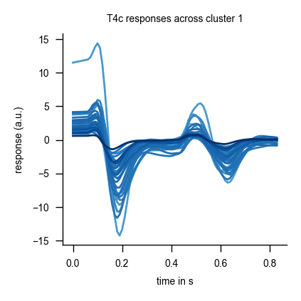
