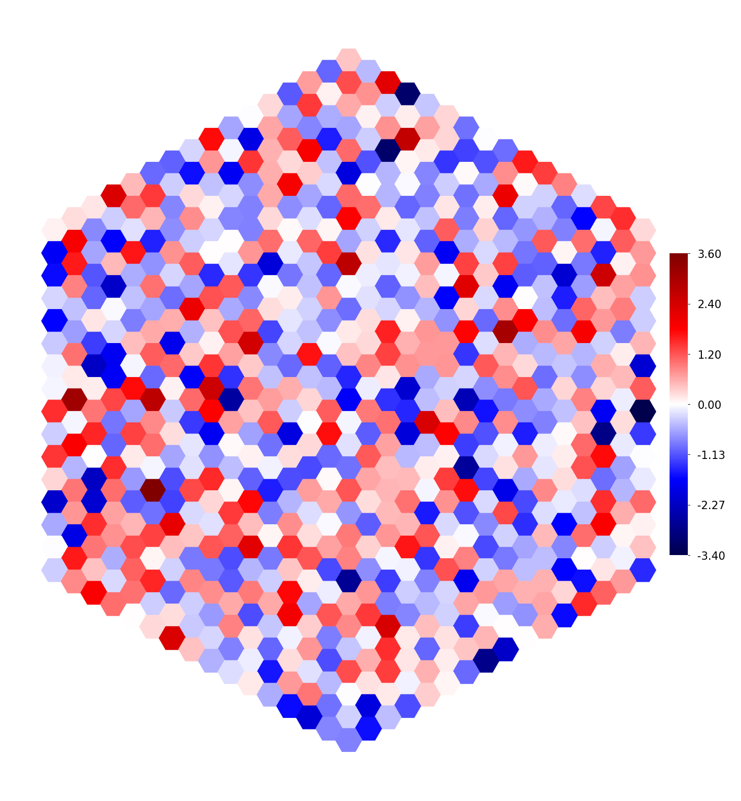

```python
from datamate import Namespace

import flyvision

from flyvision import Network

from flyvision.utils.tensor_utils import AutoDeref

%load_ext autoreload
%autoreload 2
```


```python
1
```


    1


```python
network = Network()
```


    ---------------------------------------------------------------------------

    NameError                                 Traceback (most recent call last)

    Input In [1], in <cell line: 1>()
    ----> 1 network = Network()


    NameError: name 'Network' is not defined


```python
steady_state = network.steady_state(1, 1/50, 2, 0.5, None, False)

assert isinstance(steady_state, AutoDeref)

assert list(steady_state.keys()) == ["nodes", "edges", "sources", "targets"]

assert steady_state["nodes"]["activity"].shape == (2, network.n_nodes)

assert steady_state["sources"]["activity"].shape == (2, network.n_edges)

assert steady_state["targets"]["activity"].shape == (2, network.n_edges)
```


```python
import torch
```


```python
initial_frames = torch.Tensor(2, 1, 721).uniform_()

network.fade_in_state(1, 1/20, initial_frames, None, False)
```


```python
len(slice(0, 10, 1))
```


    ---------------------------------------------------------------------------

    TypeError                                 Traceback (most recent call last)

    Input In [44], in <cell line: 1>()
    ----> 1 len(slice(0, 10, 1))


    TypeError: object of type 'slice' has no len()


```python
type(slice(None))
```


    slice


```python
x = torch.zeros((4, 40, 1, 45000))
```


```python
%%timeit
x = torch.zeros((4, 40, 1, 45000))
```

    4.01 ms ± 108 µs per loop (mean ± std. dev. of 7 runs, 100 loops each)


```python
%%timeit
x.zero_()
```

    1.54 ms ± 81.1 µs per loop (mean ± std. dev. of 7 runs, 1,000 loops each)


```python
shape = x.shape
```


    torch.Size([4, 40, 1, 45000])


```python
%time x *= 0
```

    CPU times: user 13.9 ms, sys: 1.73 ms, total: 15.6 ms
    Wall time: 2.09 ms


```python
%%timeit
x.any()
```

    3.27 ms ± 203 µs per loop (mean ± std. dev. of 7 runs, 100 loops each)


```python
x = torch.arange(10)
```


```python
x.ndim
```


    1


```python
from flyvision.ensemble import EnsembleView
```


```python
ensemble = EnsembleView(flyvision.results_dir / "opticflow/000")
```


```python
cluster = ensemble.cluster_indices("T4a")
```


```python
ensemble[cluster[0]]
```


    {'opticflow/000/0000': <flyvision.network.NetworkView at 0x121e90b50>,
     'opticflow/000/0001': <flyvision.network.NetworkView at 0x121e51f10>,
     'opticflow/000/0002': <flyvision.network.NetworkView at 0x121e57520>,
     'opticflow/000/0003': <flyvision.network.NetworkView at 0x121e902b0>,
     'opticflow/000/0006': <flyvision.network.NetworkView at 0x1215670a0>,
     'opticflow/000/0008': <flyvision.network.NetworkView at 0x121439640>,
     'opticflow/000/0009': <flyvision.network.NetworkView at 0x121e57910>,
     'opticflow/000/0010': <flyvision.network.NetworkView at 0x121f800a0>,
     'opticflow/000/0011': <flyvision.network.NetworkView at 0x1220190a0>,
     'opticflow/000/0012': <flyvision.network.NetworkView at 0x121f42430>,
     'opticflow/000/0014': <flyvision.network.NetworkView at 0x121f80190>,
     'opticflow/000/0021': <flyvision.network.NetworkView at 0x121e57040>,
     'opticflow/000/0022': <flyvision.network.NetworkView at 0x121e51c70>,
     'opticflow/000/0023': <flyvision.network.NetworkView at 0x121f42100>,
     'opticflow/000/0024': <flyvision.network.NetworkView at 0x121f428b0>,
     'opticflow/000/0034': <flyvision.network.NetworkView at 0x121f808b0>}


```python
ensemble.validation_losses()
```

    [autoreload of flyvision.network failed: Traceback (most recent call last):
      File "/Users/lappalainenj/mambaforge-pypy3/envs/flyvision/lib/python3.9/site-packages/IPython/extensions/autoreload.py", line 257, in check
        superreload(m, reload, self.old_objects)
      File "/Users/lappalainenj/mambaforge-pypy3/envs/flyvision/lib/python3.9/site-packages/IPython/extensions/autoreload.py", line 455, in superreload
        module = reload(module)
      File "/Users/lappalainenj/mambaforge-pypy3/envs/flyvision/lib/python3.9/importlib/__init__.py", line 169, in reload
        _bootstrap._exec(spec, module)
      File "<frozen importlib._bootstrap>", line 613, in _exec
      File "<frozen importlib._bootstrap_external>", line 846, in exec_module
      File "<frozen importlib._bootstrap_external>", line 983, in get_code
      File "<frozen importlib._bootstrap_external>", line 913, in source_to_code
      File "<frozen importlib._bootstrap>", line 228, in _call_with_frames_removed
      File "/Users/lappalainenj/projects/flyvision/flyvision/network.py", line 930
        raise NotImplementedError("Decoder initialization not implemented yet."")
                                                                                 ^
    SyntaxError: EOL while scanning string literal
    ]


    [5.136557112137477,
     5.1910432005922,
     5.220126719938384,
     5.247156371672948,
     5.251272610492176,
     5.259885032143858,
     5.260432395670149,
     5.262506494919459,
     5.26999799741639,
     5.270350070463286,
     5.271915781829092,
     5.277487408783701,
     5.277920800778601,
     5.281195688578817,
     5.283142616351445,
     5.285234338707394,
     5.289696128831969,
     5.291882056328985,
     5.292151802115971,
     5.295515714420213,
     5.295636435349782,
     5.296880326337284,
     5.298010385698742,
     5.2988701777325735,
     5.299407997065121,
     5.300875236590703,
     5.303517184323734,
     5.306977924373415,
     5.308157583077748,
     5.318766646915012,
     5.319535469015439,
     5.319623884227541,
     5.324388653039932,
     5.328959693511327,
     5.330954361293051,
     5.331605119837655,
     5.33213666246997,
     5.332739176021682,
     5.335818343692356,
     5.355444823702176,
     5.3596575657526655,
     5.359666532940334,
     5.36637066801389,
     5.371573102143076,
     5.378605955176884,
     5.383891744746102,
     5.417977929115295,
     5.418262870775329,
     5.427841289175881,
     5.677851686875026]


```python
import numpy as np
from flyvision import results_dir
from flyvision import Ensemble
```


```python
models = [results_dir / "opticflow/000" / f"{i:04}" for i in np.random.choice(np.arange(50), replace=False, size=50)]
ensemble = Ensemble(models)
```


```python
np.random.shuffle(ensemble.names)
```


```python
ensemble.names
```


    ['opticflow/000/0036',
     'opticflow/000/0029',
     'opticflow/000/0047',
     'opticflow/000/0015',
     'opticflow/000/0000',
     'opticflow/000/0019',
     'opticflow/000/0003',
     'opticflow/000/0008',
     'opticflow/000/0014',
     'opticflow/000/0013',
     'opticflow/000/0004',
     'opticflow/000/0045',
     'opticflow/000/0010',
     'opticflow/000/0042',
     'opticflow/000/0017',
     'opticflow/000/0046',
     'opticflow/000/0041',
     'opticflow/000/0023',
     'opticflow/000/0026',
     'opticflow/000/0011',
     'opticflow/000/0031',
     'opticflow/000/0044',
     'opticflow/000/0030',
     'opticflow/000/0035',
     'opticflow/000/0001',
     'opticflow/000/0018',
     'opticflow/000/0020',
     'opticflow/000/0016',
     'opticflow/000/0012',
     'opticflow/000/0021',
     'opticflow/000/0006',
     'opticflow/000/0034',
     'opticflow/000/0007',
     'opticflow/000/0038',
     'opticflow/000/0009',
     'opticflow/000/0039',
     'opticflow/000/0022',
     'opticflow/000/0040',
     'opticflow/000/0033',
     'opticflow/000/0028',
     'opticflow/000/0043',
     'opticflow/000/0037',
     'opticflow/000/0002',
     'opticflow/000/0027',
     'opticflow/000/0048',
     'opticflow/000/0024',
     'opticflow/000/0025',
     'opticflow/000/0005',
     'opticflow/000/0032',
     'opticflow/000/0049']


```python
sorted(ensemble.names)
```


    ['opticflow/000/0000',
     'opticflow/000/0001',
     'opticflow/000/0002',
     'opticflow/000/0003',
     'opticflow/000/0004',
     'opticflow/000/0005',
     'opticflow/000/0006',
     'opticflow/000/0007',
     'opticflow/000/0008',
     'opticflow/000/0009',
     'opticflow/000/0010',
     'opticflow/000/0011',
     'opticflow/000/0012',
     'opticflow/000/0013',
     'opticflow/000/0014',
     'opticflow/000/0015',
     'opticflow/000/0016',
     'opticflow/000/0017',
     'opticflow/000/0018',
     'opticflow/000/0019',
     'opticflow/000/0020',
     'opticflow/000/0021',
     'opticflow/000/0022',
     'opticflow/000/0023',
     'opticflow/000/0024',
     'opticflow/000/0025',
     'opticflow/000/0026',
     'opticflow/000/0027',
     'opticflow/000/0028',
     'opticflow/000/0029',
     'opticflow/000/0030',
     'opticflow/000/0031',
     'opticflow/000/0032',
     'opticflow/000/0033',
     'opticflow/000/0034',
     'opticflow/000/0035',
     'opticflow/000/0036',
     'opticflow/000/0037',
     'opticflow/000/0038',
     'opticflow/000/0039',
     'opticflow/000/0040',
     'opticflow/000/0041',
     'opticflow/000/0042',
     'opticflow/000/0043',
     'opticflow/000/0044',
     'opticflow/000/0045',
     'opticflow/000/0046',
     'opticflow/000/0047',
     'opticflow/000/0048',
     'opticflow/000/0049']


```python
type(ensemble[45:49])
```


    flyvision.ensemble.Ensemble


```python
ensemble[45:49]
```


    Ensemble(/Users/lappalainenj/projects/flyvision/data/results/opticflow/000)


```python
ensemble.viewitems()
```


    ---------------------------------------------------------------------------

    AttributeError                            Traceback (most recent call last)

    Input In [40], in <cell line: 1>()
    ----> 1 ensemble.viewitems()


    AttributeError: 'Ensemble' object has no attribute 'viewitems'


```python
list(ensemble.dir.clustering.keys())
```


    ['Lawf2',
     'Tm5a',
     'T4b',
     'Am',
     'TmY3',
     'TmY4',
     'TmY5a',
     'T2a',
     'T4c',
     'CT1(Lo1)',
     'T4d',
     'TmY18',
     'L3',
     'Tm28',
     'L4',
     'T5a',
     'TmY10',
     'Tm20',
     'Tm16',
     'L5',
     'L2',
     'R7',
     'Mi10',
     'T2',
     'Mi3',
     'Tm1',
     'Mi4',
     'R8',
     'R1',
     'R6',
     'Mi2',
     'Tm9',
     'T3',
     'Mi11',
     'Lawf1',
     'T4a',
     'TmY9',
     'Tm5Y',
     'Tm5b',
     'Tm30',
     'Tm5c',
     'C3',
     'TmY15',
     'T5c',
     'T5d',
     'TmY14',
     'TmY13',
     'L1',
     'C2',
     'T5b',
     'CT1(M10)',
     'Mi14',
     'T1',
     'Mi9',
     'Mi13',
     'Tm2',
     'R3',
     'R4',
     'Mi1',
     'Tm3',
     'Tm4',
     'Mi12',
     'Mi15',
     'R5',
     'R2']


```python
a = {1: [1.2, 2.3], 2: [2.3, 4.3]}
```


```python
from typing import Dict, List
```


```python
type(a)
```


    dict


```python
isinstance(a, Dict[int, List[float]])
```


    ---------------------------------------------------------------------------

    TypeError                                 Traceback (most recent call last)

    Input In [48], in <cell line: 1>()
    ----> 1 isinstance(a, Dict[int, List[float]])


    File ~/mambaforge-pypy3/envs/flyvision/lib/python3.9/typing.py:720, in _BaseGenericAlias.__instancecheck__(self, obj)
        719 def __instancecheck__(self, obj):
    --> 720     return self.__subclasscheck__(type(obj))


    File ~/mambaforge-pypy3/envs/flyvision/lib/python3.9/typing.py:723, in _BaseGenericAlias.__subclasscheck__(self, cls)
        722 def __subclasscheck__(self, cls):
    --> 723     raise TypeError("Subscripted generics cannot be used with"
        724                     " class and instance checks")


    TypeError: Subscripted generics cannot be used with class and instance checks


```python
cluster_indices
```

    [autoreload of flyvision.network failed: Traceback (most recent call last):
      File "/Users/lappalainenj/mambaforge-pypy3/envs/flyvision/lib/python3.9/site-packages/IPython/extensions/autoreload.py", line 257, in check
        superreload(m, reload, self.old_objects)
      File "/Users/lappalainenj/mambaforge-pypy3/envs/flyvision/lib/python3.9/site-packages/IPython/extensions/autoreload.py", line 455, in superreload
        module = reload(module)
      File "/Users/lappalainenj/mambaforge-pypy3/envs/flyvision/lib/python3.9/importlib/__init__.py", line 169, in reload
        _bootstrap._exec(spec, module)
      File "<frozen importlib._bootstrap>", line 613, in _exec
      File "<frozen importlib._bootstrap_external>", line 846, in exec_module
      File "<frozen importlib._bootstrap_external>", line 983, in get_code
      File "<frozen importlib._bootstrap_external>", line 913, in source_to_code
      File "<frozen importlib._bootstrap>", line 228, in _call_with_frames_removed
      File "/Users/lappalainenj/projects/flyvision/flyvision/network.py", line 930
        raise NotImplementedError("Decoder initialization not implemented yet."")
                                                                                 ^
    SyntaxError: EOL while scanning string literal
    ]


    ---------------------------------------------------------------------------

    NameError                                 Traceback (most recent call last)

    Input In [49], in <cell line: 1>()
    ----> 1 cluster_indices


    NameError: name 'cluster_indices' is not defined


```python
x = set((ensemble.dir.clustering.T4c / "0")[:])
```


```python
y = set(list(range(50)))
```


```python
y.issubset(y)
```


    True


```python
from matplotlib import colormaps as cm
```


```python
cm.get_cmap("binary")
```


<div style="vertical-align: middle;"><strong>binary</strong> </div><div class="cmap"></div><div style="vertical-align: middle; max-width: 514px; display: flex; justify-content: space-between;"><div style="float: left;"><div title="#ffffffff" style="display: inline-block; width: 1em; height: 1em; margin: 0; vertical-align: middle; border: 1px solid #555; background-color: #ffffffff;"></div> under</div><div style="margin: 0 auto; display: inline-block;">bad <div title="#00000000" style="display: inline-block; width: 1em; height: 1em; margin: 0; vertical-align: middle; border: 1px solid #555; background-color: #00000000;"></div></div><div style="float: right;">over <div title="#000000ff" style="display: inline-block; width: 1em; height: 1em; margin: 0; vertical-align: middle; border: 1px solid #555; background-color: #000000ff;"></div></div>


```python
from matplotlib.cm import ScalarMappable
```


```python
x = np.arange(6)
```


```python
x[:2]
```


    array([0, 1])


```python
[*x[:2], *x[len(x) - 2:]]
```


    [0, 1, 4, 5]


```python
x
```


    array([0, 1, 2, 3, 4, 5])


```python
models = [results_dir / f"opticflow/000/{i:04}" for i in range(6)]
ensemble = Ensemble(models)
```


```python
from copy import deepcopy
```


```python
names = deepcopy(ensemble.names)
```


```python
with ensemble.ratio(best=1 / 3, worst=1 / 3):
    assert len(ensemble) == int(2 / 3 * len(names))
    print(ensemble.names)
    assert ensemble.names == [
        *names[: int(len(names) * 1 / 3)],
        *names[len(names) - int(len(names) * 1 / 3) :],
    ]
```

    ['opticflow/000/0000', 'opticflow/000/0001', 'opticflow/000/0004', 'opticflow/000/0005']


```python
names
```


    ['opticflow/000/0000',
     'opticflow/000/0001',
     'opticflow/000/0002',
     'opticflow/000/0003',
     'opticflow/000/0004',
     'opticflow/000/0005']


```python
[
        *names[: int(len(ensemble) * 1 / 3)],
        *names[len(ensemble) - int(len(ensemble) * 1 / 3) :],
    ]
```


    ['opticflow/000/0000',
     'opticflow/000/0001',
     'opticflow/000/0004',
     'opticflow/000/0005']


```python
ensemble.cluster_indices("T4c")
```


    {0: array([ 0,  1,  2,  3,  6,  9, 23, 24, 13, 12, 21, 22, 37, 19, 35, 30, 27,
            17, 29, 16, 36, 14, 20,  7, 18, 31, 42, 11, 47, 44, 48]),
     1: array([ 5, 26,  4, 33, 38, 40, 43]),
     2: array([ 8, 25, 10, 32, 34, 28, 45, 15, 39, 41, 46, 49])}


```python
ensemble = Ensemble(ensemble.dir)
```


```python
network = next(ensemble.yield_networks())
```


```python
x = set(np.arange(len(ensemble)))
```


```python
for cell_type in network.cell_types:
    _dir = ensemble.dir.clustering[cell_type]
    mask = _dir.masked[()]
    print(mask)
    _dir.masked = mask.astype(int)
#     clustering = np.concatenate(list(ensemble.dir.clustering[cell_type].to_dict().values()))
#     mask = np.array(list(x.difference(clustering)), dtype=np.int)
#     _dir.masked = mask
#     print(_dir)
#     print(mask)
```

    []
    []
    []
    []
    []
    []
    []
    []
    []
    []
    []
    []
    []
    []
    []
    []
    [16]
    []
    []
    []
    []
    []
    []
    []
    []
    []
    []
    []
    []
    []
    []
    []
    []
    []
    []
    []
    []
    []
    []
    []
    []
    []
    []
    []
    []
    []
    []
    []
    []
    []
    []
    []
    []
    []
    []
    []
    []
    []
    []
    []
    []
    []
    []
    []
    []


```python
ensemble.dir.clustering[cell_type].to_dict()
```


    {'2': array([ 0,  5, 26, 25,  4, 16,  7, 32, 42, 45, 15, 44, 48, 49]),
     '1': array([ 2,  6,  8,  9, 23, 24, 10, 13, 12, 21, 22, 37, 33, 35, 30, 27, 17,
            38, 14, 20, 18, 31, 34, 28, 40, 39, 47, 43, 46]),
     '0': array([ 1,  3, 19, 29, 36, 11, 41]),
     'masked': array([], dtype=int64)}


```python
np.array(list(set(clustering)), dt)
```


    array([ 0,  1,  2,  3,  4,  5,  6,  7,  8,  9, 10, 11, 12, 13, 14, 15, 16,
           17, 18, 19, 20, 21, 22, 23, 24, 25, 26, 27, 28, 29, 30, 31, 32, 33,
           34, 35, 36, 37, 38, 39, 40, 41, 42, 43, 44, 45, 46, 47, 48, 49])


```python
np.concatenate(list(ensemble.dir.clustering[cell_type].to_dict().values()))
```


    array([ 0,  5, 26, 25,  4, 16,  7, 32, 42, 45, 15, 44, 48, 49,  2,  6,  8,
            9, 23, 24, 10, 13, 12, 21, 22, 37, 33, 35, 30, 27, 17, 38, 14, 20,
           18, 31, 34, 28, 40, 39, 47, 43, 46,  1,  3, 19, 29, 36, 11, 41])


```python
ensemble = Ensemble(ensemble.dir)
```


```python
ensemble
```


    Ensemble(/Users/lappalainenj/projects/flyvision/data/results/opticflow/000)


```python
ensemble.cluster_indices("C3")
```


    {0: array([ 1,  6,  5,  9, 23, 12, 37, 33, 29, 14, 32, 42, 45, 11, 15, 39, 48]),
     1: array([24, 10, 22,  4, 35, 30, 27, 16, 38, 20,  7, 18, 31, 34, 28, 47, 44,
            43]),
     2: array([ 0,  2,  3,  8, 26, 25, 13, 21, 19, 17, 36, 40, 41, 46, 49])}


```python
from flyvision.plots.plots import hex_scatter
```


```python
import flyvision

u, v = flyvision.utils.hex_utils.get_hex_coords(15)
values = np.random.normal(size=len(u))
```


```python
import matplotlib as mpl
```


```python
mpl.rcParams['figure.dpi'] = 300
```


```python
fig, ax, _ = hex_scatter(u, v, values, figsize=[5, 5], midpoint=0)
```


    

    


```python
import torch
torch.Tensor
```


    torch.Tensor


```python
torch.Tensor == torch.FloatTensor
```


    False


```python
from dataclasses import dataclass
```

    [autoreload of flyvision.utils.df_utils failed: Traceback (most recent call last):
      File "/Users/lappalainenj/mambaforge-pypy3/envs/flyvision/lib/python3.9/site-packages/IPython/extensions/autoreload.py", line 257, in check
        superreload(m, reload, self.old_objects)
      File "/Users/lappalainenj/mambaforge-pypy3/envs/flyvision/lib/python3.9/site-packages/IPython/extensions/autoreload.py", line 455, in superreload
        module = reload(module)
      File "/Users/lappalainenj/mambaforge-pypy3/envs/flyvision/lib/python3.9/importlib/__init__.py", line 169, in reload
        _bootstrap._exec(spec, module)
      File "<frozen importlib._bootstrap>", line 613, in _exec
      File "<frozen importlib._bootstrap_external>", line 846, in exec_module
      File "<frozen importlib._bootstrap_external>", line 983, in get_code
      File "<frozen importlib._bootstrap_external>", line 913, in source_to_code
      File "<frozen importlib._bootstrap>", line 228, in _call_with_frames_removed
      File "/Users/lappalainenj/projects/flyvision/flyvision/utils/df_utils.py", line 8
        ) -> DataFrame:
        ^
    SyntaxError: non-default argument follows default argument
    ]
    [autoreload of flyvision.connectome failed: Traceback (most recent call last):
      File "/Users/lappalainenj/mambaforge-pypy3/envs/flyvision/lib/python3.9/site-packages/IPython/extensions/autoreload.py", line 257, in check
        superreload(m, reload, self.old_objects)
      File "/Users/lappalainenj/mambaforge-pypy3/envs/flyvision/lib/python3.9/site-packages/IPython/extensions/autoreload.py", line 455, in superreload
        module = reload(module)
      File "/Users/lappalainenj/mambaforge-pypy3/envs/flyvision/lib/python3.9/importlib/__init__.py", line 169, in reload
        _bootstrap._exec(spec, module)
      File "<frozen importlib._bootstrap>", line 613, in _exec
      File "<frozen importlib._bootstrap_external>", line 846, in exec_module
      File "<frozen importlib._bootstrap_external>", line 983, in get_code
      File "<frozen importlib._bootstrap_external>", line 913, in source_to_code
      File "<frozen importlib._bootstrap>", line 228, in _call_with_frames_removed
      File "/Users/lappalainenj/projects/flyvision/flyvision/connectome.py", line 506
        df_utils.filter_df_by_list(edges, column="source_type", cell_types),
                                                                          ^
    SyntaxError: positional argument follows keyword argument
    ]


```python
@dataclass
class D:
    a: int
    b: int
```


```python
d= D(2, 1)
```


```python
d
```


    D(a=2, b=1)


```python
flyvision.utils.nodes_edges_utils.layout
```


```python
"1" > 1
```


    ---------------------------------------------------------------------------

    TypeError                                 Traceback (most recent call last)

    Input In [10], in <cell line: 1>()
    ----> 1 "1" > 1


    TypeError: '>' not supported between instances of 'str' and 'int'


```python
from numpy.typing import NDArray
import numpy as np
```


```python
img = np.arange(10)
```


```python
type(img) == NDArray
```


    False


```python
isinstance(img, np.ndarray)
```


    True


```python
import flyvision
import numpy as np
```


```python

```


    'module://matplotlib_inline.backend_inline'


```python

```


```python
%matplotlib inline
import matplotlib.pyplot as plt
import matplotlib
matplotlib.get_backend()
```


    'module://matplotlib_inline.backend_inline'


```python
%matplotlib --list
```

    Available matplotlib backends: ['tk', 'gtk', 'gtk3', 'gtk4', 'wx', 'qt4', 'qt5', 'qt6', 'qt', 'osx', 'nbagg', 'notebook', 'agg', 'svg', 'pdf', 'ps', 'inline', 'ipympl', 'widget']


```python
matplotlib.pyplot.switch_backend("nbagg")
```


```python
def wrapper(f):
    
    def wrap(*args, **kwargs):
        current_backend = matplotlib.get_backend()
        matplotlib.pyplot.switch_backend('nbagg')
        f(*args, **kwargs)
        
```


```python
from contextlib import contextmanager
from time import sleep
```


```python
@contextmanager
def matplotlib_backend(backend='nbagg'):
    try:
        current_backend = matplotlib.get_backend()
        matplotlib.pyplot.switch_backend(backend)
        yield
    except:
        yield
    finally:
        plt.gcf().canvas.draw()
        sleep(0.1)
        matplotlib.pyplot.switch_backend(current_backend)
```


```python
import numpy as np
def plot():
    plt.plot(np.arange(10))
    plt.show()
```


```python
matplotlib.pyplot.switch_backend("abc")
```


    ---------------------------------------------------------------------------

    ModuleNotFoundError                       Traceback (most recent call last)

    Input In [2], in <cell line: 1>()
    ----> 1 matplotlib.pyplot.switch_backend("abc")


    File ~/mambaforge-pypy3/envs/flyvision/lib/python3.9/site-packages/matplotlib/pyplot.py:271, in switch_backend(newbackend)
        268 # have to escape the switch on access logic
        269 old_backend = dict.__getitem__(rcParams, 'backend')
    --> 271 backend_mod = importlib.import_module(
        272     cbook._backend_module_name(newbackend))
        274 required_framework = _get_required_interactive_framework(backend_mod)
        275 if required_framework is not None:


    File ~/mambaforge-pypy3/envs/flyvision/lib/python3.9/importlib/__init__.py:127, in import_module(name, package)
        125             break
        126         level += 1
    --> 127 return _bootstrap._gcd_import(name[level:], package, level)


    File <frozen importlib._bootstrap>:1030, in _gcd_import(name, package, level)


    File <frozen importlib._bootstrap>:1007, in _find_and_load(name, import_)


    File <frozen importlib._bootstrap>:984, in _find_and_load_unlocked(name, import_)


    ModuleNotFoundError: No module named 'matplotlib.backends.backend_abc'


```python
with matplotlib_backend('nbagg'):
    plot()
```


```python
matplotlib.get_backend()
```


```python
matplotlib.pyplot.switch_backend('module://matplotlib_inline.backend_inline')
```


```python
import numpy as np
```


```python
matplotlib.set_logle()
```


```python
plt.plot(np.arange(100))
```


```python
%matplotlib widget
```


```python
anim = flyvision.animations.HexScatter(np.random.normal(size=[2, 10, 1, 721]))
anim.animate_in_notebook()
```


```python
!pip install --upgrade ipympl
```

    Requirement already satisfied: ipympl in /Users/lappalainenj/mambaforge-pypy3/envs/flyvision/lib/python3.9/site-packages (0.9.3)
    Requirement already satisfied: matplotlib<4,>=3.4.0 in /Users/lappalainenj/mambaforge-pypy3/envs/flyvision/lib/python3.9/site-packages (from ipympl) (3.7.1)
    Requirement already satisfied: ipython<9 in /Users/lappalainenj/mambaforge-pypy3/envs/flyvision/lib/python3.9/site-packages (from ipympl) (8.4.0)
    Requirement already satisfied: traitlets<6 in /Users/lappalainenj/mambaforge-pypy3/envs/flyvision/lib/python3.9/site-packages (from ipympl) (5.9.0)
    Requirement already satisfied: pillow in /Users/lappalainenj/mambaforge-pypy3/envs/flyvision/lib/python3.9/site-packages (from ipympl) (9.4.0)
    Requirement already satisfied: ipython-genutils in /Users/lappalainenj/mambaforge-pypy3/envs/flyvision/lib/python3.9/site-packages (from ipympl) (0.2.0)
    Requirement already satisfied: ipywidgets<9,>=7.6.0 in /Users/lappalainenj/mambaforge-pypy3/envs/flyvision/lib/python3.9/site-packages (from ipympl) (8.0.5)
    Requirement already satisfied: numpy in /Users/lappalainenj/mambaforge-pypy3/envs/flyvision/lib/python3.9/site-packages (from ipympl) (1.24.2)
    Requirement already satisfied: pygments>=2.4.0 in /Users/lappalainenj/mambaforge-pypy3/envs/flyvision/lib/python3.9/site-packages (from ipython<9->ipympl) (2.14.0)
    Requirement already satisfied: pickleshare in /Users/lappalainenj/mambaforge-pypy3/envs/flyvision/lib/python3.9/site-packages (from ipython<9->ipympl) (0.7.5)
    Requirement already satisfied: backcall in /Users/lappalainenj/mambaforge-pypy3/envs/flyvision/lib/python3.9/site-packages (from ipython<9->ipympl) (0.2.0)
    Requirement already satisfied: decorator in /Users/lappalainenj/mambaforge-pypy3/envs/flyvision/lib/python3.9/site-packages (from ipython<9->ipympl) (5.1.1)
    Requirement already satisfied: jedi>=0.16 in /Users/lappalainenj/mambaforge-pypy3/envs/flyvision/lib/python3.9/site-packages (from ipython<9->ipympl) (0.18.2)
    Requirement already satisfied: appnope in /Users/lappalainenj/mambaforge-pypy3/envs/flyvision/lib/python3.9/site-packages (from ipython<9->ipympl) (0.1.3)
    Requirement already satisfied: prompt-toolkit!=3.0.0,!=3.0.1,<3.1.0,>=2.0.0 in /Users/lappalainenj/mambaforge-pypy3/envs/flyvision/lib/python3.9/site-packages (from ipython<9->ipympl) (3.0.38)
    Requirement already satisfied: pexpect>4.3 in /Users/lappalainenj/mambaforge-pypy3/envs/flyvision/lib/python3.9/site-packages (from ipython<9->ipympl) (4.8.0)
    Requirement already satisfied: stack-data in /Users/lappalainenj/mambaforge-pypy3/envs/flyvision/lib/python3.9/site-packages (from ipython<9->ipympl) (0.6.2)
    Requirement already satisfied: matplotlib-inline in /Users/lappalainenj/mambaforge-pypy3/envs/flyvision/lib/python3.9/site-packages (from ipython<9->ipympl) (0.1.6)
    Requirement already satisfied: setuptools>=18.5 in /Users/lappalainenj/mambaforge-pypy3/envs/flyvision/lib/python3.9/site-packages (from ipython<9->ipympl) (67.6.0)
    Requirement already satisfied: jupyterlab-widgets~=3.0 in /Users/lappalainenj/mambaforge-pypy3/envs/flyvision/lib/python3.9/site-packages (from ipywidgets<9,>=7.6.0->ipympl) (3.0.6)
    Requirement already satisfied: widgetsnbextension~=4.0 in /Users/lappalainenj/mambaforge-pypy3/envs/flyvision/lib/python3.9/site-packages (from ipywidgets<9,>=7.6.0->ipympl) (4.0.6)
    Requirement already satisfied: python-dateutil>=2.7 in /Users/lappalainenj/mambaforge-pypy3/envs/flyvision/lib/python3.9/site-packages (from matplotlib<4,>=3.4.0->ipympl) (2.8.2)
    Requirement already satisfied: cycler>=0.10 in /Users/lappalainenj/mambaforge-pypy3/envs/flyvision/lib/python3.9/site-packages (from matplotlib<4,>=3.4.0->ipympl) (0.11.0)
    Requirement already satisfied: fonttools>=4.22.0 in /Users/lappalainenj/mambaforge-pypy3/envs/flyvision/lib/python3.9/site-packages (from matplotlib<4,>=3.4.0->ipympl) (4.39.2)
    Requirement already satisfied: kiwisolver>=1.0.1 in /Users/lappalainenj/mambaforge-pypy3/envs/flyvision/lib/python3.9/site-packages (from matplotlib<4,>=3.4.0->ipympl) (1.4.4)
    Requirement already satisfied: importlib-resources>=3.2.0 in /Users/lappalainenj/mambaforge-pypy3/envs/flyvision/lib/python3.9/site-packages (from matplotlib<4,>=3.4.0->ipympl) (5.12.0)
    Requirement already satisfied: pyparsing>=2.3.1 in /Users/lappalainenj/mambaforge-pypy3/envs/flyvision/lib/python3.9/site-packages (from matplotlib<4,>=3.4.0->ipympl) (3.0.9)
    Requirement already satisfied: packaging>=20.0 in /Users/lappalainenj/mambaforge-pypy3/envs/flyvision/lib/python3.9/site-packages (from matplotlib<4,>=3.4.0->ipympl) (23.0)
    Requirement already satisfied: contourpy>=1.0.1 in /Users/lappalainenj/mambaforge-pypy3/envs/flyvision/lib/python3.9/site-packages (from matplotlib<4,>=3.4.0->ipympl) (1.0.7)
    Requirement already satisfied: zipp>=3.1.0 in /Users/lappalainenj/mambaforge-pypy3/envs/flyvision/lib/python3.9/site-packages (from importlib-resources>=3.2.0->matplotlib<4,>=3.4.0->ipympl) (3.15.0)
    Requirement already satisfied: parso<0.9.0,>=0.8.0 in /Users/lappalainenj/mambaforge-pypy3/envs/flyvision/lib/python3.9/site-packages (from jedi>=0.16->ipython<9->ipympl) (0.8.3)
    Requirement already satisfied: ptyprocess>=0.5 in /Users/lappalainenj/mambaforge-pypy3/envs/flyvision/lib/python3.9/site-packages (from pexpect>4.3->ipython<9->ipympl) (0.7.0)
    Requirement already satisfied: wcwidth in /Users/lappalainenj/mambaforge-pypy3/envs/flyvision/lib/python3.9/site-packages (from prompt-toolkit!=3.0.0,!=3.0.1,<3.1.0,>=2.0.0->ipython<9->ipympl) (0.2.6)
    Requirement already satisfied: six>=1.5 in /Users/lappalainenj/mambaforge-pypy3/envs/flyvision/lib/python3.9/site-packages (from python-dateutil>=2.7->matplotlib<4,>=3.4.0->ipympl) (1.16.0)
    Requirement already satisfied: asttokens>=2.1.0 in /Users/lappalainenj/mambaforge-pypy3/envs/flyvision/lib/python3.9/site-packages (from stack-data->ipython<9->ipympl) (2.2.1)
    Requirement already satisfied: pure-eval in /Users/lappalainenj/mambaforge-pypy3/envs/flyvision/lib/python3.9/site-packages (from stack-data->ipython<9->ipympl) (0.2.2)
    Requirement already satisfied: executing>=1.2.0 in /Users/lappalainenj/mambaforge-pypy3/envs/flyvision/lib/python3.9/site-packages (from stack-data->ipython<9->ipympl) (1.2.0)


```python
!pip install ipympl
```

    Collecting ipympl
      Downloading ipympl-0.9.3-py2.py3-none-any.whl (511 kB)
         ━━━━━━━━━━━━━━━━━━━━━━━━━━━━━━━━━━━━━ 511.6/511.6 kB 663.6 kB/s eta 0:00:00[36m0:00:01[36m0:00:01:01
    [?25hRequirement already satisfied: ipywidgets<9,>=7.6.0 in /Users/lappalainenj/mambaforge-pypy3/envs/flyvision/lib/python3.9/site-packages (from ipympl) (8.0.5)
    Requirement already satisfied: numpy in /Users/lappalainenj/mambaforge-pypy3/envs/flyvision/lib/python3.9/site-packages (from ipympl) (1.24.2)
    Requirement already satisfied: pillow in /Users/lappalainenj/mambaforge-pypy3/envs/flyvision/lib/python3.9/site-packages (from ipympl) (9.4.0)
    Requirement already satisfied: matplotlib<4,>=3.4.0 in /Users/lappalainenj/mambaforge-pypy3/envs/flyvision/lib/python3.9/site-packages (from ipympl) (3.7.1)
    Requirement already satisfied: traitlets<6 in /Users/lappalainenj/mambaforge-pypy3/envs/flyvision/lib/python3.9/site-packages (from ipympl) (5.9.0)
    Requirement already satisfied: ipython<9 in /Users/lappalainenj/mambaforge-pypy3/envs/flyvision/lib/python3.9/site-packages (from ipympl) (8.4.0)
    Requirement already satisfied: ipython-genutils in /Users/lappalainenj/mambaforge-pypy3/envs/flyvision/lib/python3.9/site-packages (from ipympl) (0.2.0)
    Requirement already satisfied: prompt-toolkit!=3.0.0,!=3.0.1,<3.1.0,>=2.0.0 in /Users/lappalainenj/mambaforge-pypy3/envs/flyvision/lib/python3.9/site-packages (from ipython<9->ipympl) (3.0.38)
    Requirement already satisfied: stack-data in /Users/lappalainenj/mambaforge-pypy3/envs/flyvision/lib/python3.9/site-packages (from ipython<9->ipympl) (0.6.2)
    Requirement already satisfied: setuptools>=18.5 in /Users/lappalainenj/mambaforge-pypy3/envs/flyvision/lib/python3.9/site-packages (from ipython<9->ipympl) (67.6.0)
    Requirement already satisfied: appnope in /Users/lappalainenj/mambaforge-pypy3/envs/flyvision/lib/python3.9/site-packages (from ipython<9->ipympl) (0.1.3)
    Requirement already satisfied: pickleshare in /Users/lappalainenj/mambaforge-pypy3/envs/flyvision/lib/python3.9/site-packages (from ipython<9->ipympl) (0.7.5)
    Requirement already satisfied: matplotlib-inline in /Users/lappalainenj/mambaforge-pypy3/envs/flyvision/lib/python3.9/site-packages (from ipython<9->ipympl) (0.1.6)
    Requirement already satisfied: decorator in /Users/lappalainenj/mambaforge-pypy3/envs/flyvision/lib/python3.9/site-packages (from ipython<9->ipympl) (5.1.1)
    Requirement already satisfied: pexpect>4.3 in /Users/lappalainenj/mambaforge-pypy3/envs/flyvision/lib/python3.9/site-packages (from ipython<9->ipympl) (4.8.0)
    Requirement already satisfied: backcall in /Users/lappalainenj/mambaforge-pypy3/envs/flyvision/lib/python3.9/site-packages (from ipython<9->ipympl) (0.2.0)
    Requirement already satisfied: pygments>=2.4.0 in /Users/lappalainenj/mambaforge-pypy3/envs/flyvision/lib/python3.9/site-packages (from ipython<9->ipympl) (2.14.0)
    Requirement already satisfied: jedi>=0.16 in /Users/lappalainenj/mambaforge-pypy3/envs/flyvision/lib/python3.9/site-packages (from ipython<9->ipympl) (0.18.2)
    Requirement already satisfied: jupyterlab-widgets~=3.0 in /Users/lappalainenj/mambaforge-pypy3/envs/flyvision/lib/python3.9/site-packages (from ipywidgets<9,>=7.6.0->ipympl) (3.0.6)
    Requirement already satisfied: widgetsnbextension~=4.0 in /Users/lappalainenj/mambaforge-pypy3/envs/flyvision/lib/python3.9/site-packages (from ipywidgets<9,>=7.6.0->ipympl) (4.0.6)
    Requirement already satisfied: pyparsing>=2.3.1 in /Users/lappalainenj/mambaforge-pypy3/envs/flyvision/lib/python3.9/site-packages (from matplotlib<4,>=3.4.0->ipympl) (3.0.9)
    Requirement already satisfied: contourpy>=1.0.1 in /Users/lappalainenj/mambaforge-pypy3/envs/flyvision/lib/python3.9/site-packages (from matplotlib<4,>=3.4.0->ipympl) (1.0.7)
    Requirement already satisfied: packaging>=20.0 in /Users/lappalainenj/mambaforge-pypy3/envs/flyvision/lib/python3.9/site-packages (from matplotlib<4,>=3.4.0->ipympl) (23.0)
    Requirement already satisfied: importlib-resources>=3.2.0 in /Users/lappalainenj/mambaforge-pypy3/envs/flyvision/lib/python3.9/site-packages (from matplotlib<4,>=3.4.0->ipympl) (5.12.0)
    Requirement already satisfied: kiwisolver>=1.0.1 in /Users/lappalainenj/mambaforge-pypy3/envs/flyvision/lib/python3.9/site-packages (from matplotlib<4,>=3.4.0->ipympl) (1.4.4)
    Requirement already satisfied: cycler>=0.10 in /Users/lappalainenj/mambaforge-pypy3/envs/flyvision/lib/python3.9/site-packages (from matplotlib<4,>=3.4.0->ipympl) (0.11.0)
    Requirement already satisfied: fonttools>=4.22.0 in /Users/lappalainenj/mambaforge-pypy3/envs/flyvision/lib/python3.9/site-packages (from matplotlib<4,>=3.4.0->ipympl) (4.39.2)
    Requirement already satisfied: python-dateutil>=2.7 in /Users/lappalainenj/mambaforge-pypy3/envs/flyvision/lib/python3.9/site-packages (from matplotlib<4,>=3.4.0->ipympl) (2.8.2)
    Requirement already satisfied: zipp>=3.1.0 in /Users/lappalainenj/mambaforge-pypy3/envs/flyvision/lib/python3.9/site-packages (from importlib-resources>=3.2.0->matplotlib<4,>=3.4.0->ipympl) (3.15.0)
    Requirement already satisfied: parso<0.9.0,>=0.8.0 in /Users/lappalainenj/mambaforge-pypy3/envs/flyvision/lib/python3.9/site-packages (from jedi>=0.16->ipython<9->ipympl) (0.8.3)
    Requirement already satisfied: ptyprocess>=0.5 in /Users/lappalainenj/mambaforge-pypy3/envs/flyvision/lib/python3.9/site-packages (from pexpect>4.3->ipython<9->ipympl) (0.7.0)
    Requirement already satisfied: wcwidth in /Users/lappalainenj/mambaforge-pypy3/envs/flyvision/lib/python3.9/site-packages (from prompt-toolkit!=3.0.0,!=3.0.1,<3.1.0,>=2.0.0->ipython<9->ipympl) (0.2.6)
    Requirement already satisfied: six>=1.5 in /Users/lappalainenj/mambaforge-pypy3/envs/flyvision/lib/python3.9/site-packages (from python-dateutil>=2.7->matplotlib<4,>=3.4.0->ipympl) (1.16.0)
    Requirement already satisfied: asttokens>=2.1.0 in /Users/lappalainenj/mambaforge-pypy3/envs/flyvision/lib/python3.9/site-packages (from stack-data->ipython<9->ipympl) (2.2.1)
    Requirement already satisfied: executing>=1.2.0 in /Users/lappalainenj/mambaforge-pypy3/envs/flyvision/lib/python3.9/site-packages (from stack-data->ipython<9->ipympl) (1.2.0)
    Requirement already satisfied: pure-eval in /Users/lappalainenj/mambaforge-pypy3/envs/flyvision/lib/python3.9/site-packages (from stack-data->ipython<9->ipympl) (0.2.2)
    Installing collected packages: ipympl
    Successfully installed ipympl-0.9.3


# explicit groupby init


```python
from datamate import Namespace

from flyvision.initialization import Parameter
from flyvision.connectome import ConnectomeDir
from flyvision import connectome_file

%load_ext autoreload
%autoreload 2
```


```python
edge_config = Namespace(
            sign=Namespace(
                type="SynapseSign",
                initial_dist="Value",
                requires_grad=False,
                groupby=["source_type", "target_type"],
            ),
            syn_count=Namespace(
                type="SynapseCount",
                initial_dist="Lognormal",
                mode="mean",
                requires_grad=False,
                std=1.0,
                groupby=["source_type", "target_type", "dv", "du"],
            ),
            syn_strength=Namespace(
                type="SynapseCountScaling",
                initial_dist="Value",
                requires_grad=True,
                scale_elec=0.01,
                scale_chem=0.01,
                clamp="non_negative",
                groupby=["source_type", "target_type"],
            ),
        )
```


```python
connectome = ConnectomeDir(Namespace(file=connectome_file, extent=15, n_syn_fill=1))
```


```python
param = Parameter(edge_config.sign, connectome)
```


```python
param.indices
```


    tensor([  0,   0,   0,  ..., 603, 603, 603])


```python
import flyvision
from datamate import Directory
```


```python
gather_indices_dir = Directory(flyvision.root_dir).gather_indices
```


```python
for name, config in edge_config.items():
    param = Parameter(config, connectome)

edge_config
```


    Namespace(
      sign = Namespace(
        type = 'SynapseSign',
        initial_dist = 'Value',
        requires_grad = False,
        groupby = ['source_type', 'target_type']
      ),
      syn_count = Namespace(
        type = 'SynapseCount',
        initial_dist = 'Lognormal',
        mode = 'mean',
        requires_grad = False,
        std = 1.0,
        groupby = ['source_type', 'target_type', 'dv', 'du']
      ),
      syn_strength = Namespace(
        type = 'SynapseCountScaling',
        initial_dist = 'Value',
        requires_grad = True,
        scale_elec = 0.01,
        scale_chem = 0.01,
        clamp = 'non_negative',
        groupby = ['source_type', 'target_type']
      )
    )


```python
gather_indices_dir
```


    gather_indices/ - Last modified: April 04, 2023 15:12:47
    ├── sign/
    │   ├── indices.h5
    │   └── raw_values.h5
    ├── syn_count/
    │   ├── indices.h5
    │   └── raw_values.h5
    └── syn_strength/
        ├── indices.h5
        └── raw_values.h5
    
    displaying: 4 directories, 6 files


```python
node_config = Namespace(
            bias=Namespace(
                type="RestingPotential",
                groupby=["type"],
                initial_dist="Normal",
                mode="sample",
                requires_grad=True,
                mean=0.5,
                std=0.05,
                penalize=Namespace(activity=True),
                seed=0,
            ),
            time_const=Namespace(
                type="TimeConstant",
                groupby=["type"],
                initial_dist="Value",
                value=0.05,
                requires_grad=True,
            ),
        )

nccopy = node_config.deepcopy()
```


```python
node_config
```


    Namespace(
      bias = Namespace(
        type = 'RestingPotential',
        groupby = ['type'],
        initial_dist = 'Normal',
        mode = 'sample',
        requires_grad = True,
        mean = 0.5,
        std = 0.05,
        penalize = Namespace(activity=True),
        seed = 0
      ),
      time_const = Namespace(
        type = 'TimeConstant',
        groupby = ['type'],
        initial_dist = 'Value',
        value = 0.05,
        requires_grad = True
      )
    )


```python
for name, config in node_config.items():
    param = Parameter(config, connectome)
    
node_config
```


    Namespace(
      bias = Namespace(
        type = 'RestingPotential',
        groupby = ['type'],
        initial_dist = 'Normal',
        mode = 'sample',
        requires_grad = True,
        mean = 0.5,
        std = 0.05,
        penalize = Namespace(activity=True),
        seed = 0
      ),
      time_const = Namespace(
        type = 'TimeConstant',
        groupby = ['type'],
        initial_dist = 'Value',
        value = 0.05,
        requires_grad = True
      )
    )


```python
import numpy as np
```


```python
ncc = node_config.deepcopy()
```


```python
ncc.bias.type = np.arange(1, 101)
```


```python
node_config.bias.type=np.arange(100)
```


```python
ncc
```


    Namespace(
      bias = Namespace(
        type = array([  1,   2,   3,   4,   5,   6,   7,   8,   9,  10,  11,  12,  13,
            14,  15,  16,  17,  18,  19,  20,  21,  22,  23,  24,  25,  26,
            27,  28,  29,  30,  31,  32,  33,  34,  35,  36,  37,  38,  39,
            40,  41,  42,  43,  44,  45,  46,  47,  48,  49,  50,  51,  52,
            53,  54,  55,  56,  57,  58,  59,  60,  61,  62,  63,  64,  65,
            66,  67,  68,  69,  70,  71,  72,  73,  74,  75,  76,  77,  78,
            79,  80,  81,  82,  83,  84,  85,  86,  87,  88,  89,  90,  91,
            92,  93,  94,  95,  96,  97,  98,  99, 100]),
        groupby = ['type'],
        initial_dist = 'Normal',
        mode = 'sample',
        requires_grad = True,
        mean = 0.5,
        std = 0.05,
        penalize = Namespace(activity=True),
        seed = 0
      ),
      time_const = Namespace(
        type = 'TimeConstant',
        groupby = ['type'],
        initial_dist = 'Value',
        value = 0.05,
        requires_grad = True
      )
    )


```python
node_config.bias.type == ncc.bias.type
```


    array([False, False, False, False, False, False, False, False, False,
           False, False, False, False, False, False, False, False, False,
           False, False, False, False, False, False, False, False, False,
           False, False, False, False, False, False, False, False, False,
           False, False, False, False, False, False, False, False, False,
           False, False, False, False, False, False, False, False, False,
           False, False, False, False, False, False, False, False, False,
           False, False, False, False, False, False, False, False, False,
           False, False, False, False, False, False, False, False, False,
           False, False, False, False, False, False, False, False, False,
           False, False, False, False, False, False, False, False, False,
           False])


```python
from datamate.namespaces import compare
```


```python
compare(node_config, ncc)
```


    Namespace(
      bias = Namespace(
        type = False,
        groupby = True,
        initial_dist = True,
        mode = True,
        requires_grad = True,
        mean = True,
        std = True,
        penalize = Namespace(activity=True),
        seed = True
      ),
      time_const = Namespace(
        type = True,
        groupby = True,
        initial_dist = True,
        value = True,
        requires_grad = True
      )
    )


```python
from typing import Mapping
from pathlib import Path
from numpy import ndarray
```


```python
all??
```


```python
def all_true(obj: object) -> bool:
    """
    
    """
    if isinstance(obj, (type(None), bool, int, float, str, type, bytes)):
        return bool(obj)
    elif isinstance(obj, Path):
        return bool(obj)
    elif isinstance(obj, (list, tuple)):
        return all([all_true(v) for v in obj])
    elif isinstance(obj, (ndarray)):
        return all([all_true(v.item()) for v in obj])
    elif isinstance(obj, Mapping):
        return all([all_true(obj[k]) for k in obj])
    else:
        try:
            return all_true(vars(obj))
        except TypeError as e:
            raise TypeError(f"all {obj} of type {type(obj)}: {e}.") from e
```


```python
all_true(node_config)
```


    True


```python
node_config.bias.type[0] = 10
```


```python
node_config.bias.seed = 1
```


```python
gather_indices_dir
```


    gather_indices/ - Last modified: April 04, 2023 15:13:22
    ├── bias/
    │   ├── indices.h5
    │   └── raw_values.h5
    ├── sign/
    │   ├── indices.h5
    │   └── raw_values.h5
    ├── syn_count/
    │   ├── indices.h5
    │   └── raw_values.h5
    ├── syn_strength/
    │   ├── indices.h5
    │   └── raw_values.h5
    └── time_const/
        ├── indices.h5
        └── raw_values.h5
    
    displaying: 6 directories, 10 files


```python
import pandas as pd
```


```python
attributes = ["type", "u", "v"]
groupby = ["type", "u"]
```


```python
def cast(x):
    if np.issubdtype(x.dtype, np.dtype("S")):
        return x.astype("U")
    return x
```


```python
df = pd.DataFrame({k: cast(connectome.nodes[k][:]) for k in attributes})
```


```python
gb = df.groupby(groupby, as_index=False, sort=False)
```


```python
gb.first??
```


```python
df.iloc[np.concatenate(list(gb.groups.values()))]
```


<div>
<style scoped>
    .dataframe tbody tr th:only-of-type {
        vertical-align: middle;
    }

    .dataframe tbody tr th {
        vertical-align: top;
    }

    .dataframe thead th {
        text-align: right;
    }
</style>
<table border="1" class="dataframe">
  <thead>
    <tr style="text-align: right;">
      <th></th>
      <th>type</th>
      <th>u</th>
    </tr>
  </thead>
  <tbody>
    <tr>
      <th>9619</th>
      <td>Am</td>
      <td>-15</td>
    </tr>
    <tr>
      <th>9620</th>
      <td>Am</td>
      <td>-15</td>
    </tr>
    <tr>
      <th>9621</th>
      <td>Am</td>
      <td>-15</td>
    </tr>
    <tr>
      <th>9622</th>
      <td>Am</td>
      <td>-15</td>
    </tr>
    <tr>
      <th>9623</th>
      <td>Am</td>
      <td>-15</td>
    </tr>
    <tr>
      <th>...</th>
      <td>...</td>
      <td>...</td>
    </tr>
    <tr>
      <th>42059</th>
      <td>TmY9</td>
      <td>15</td>
    </tr>
    <tr>
      <th>42060</th>
      <td>TmY9</td>
      <td>15</td>
    </tr>
    <tr>
      <th>42061</th>
      <td>TmY9</td>
      <td>15</td>
    </tr>
    <tr>
      <th>42062</th>
      <td>TmY9</td>
      <td>15</td>
    </tr>
    <tr>
      <th>42063</th>
      <td>TmY9</td>
      <td>15</td>
    </tr>
  </tbody>
</table>
<p>45669 rows × 2 columns</p>
</div>


```python
gb.index
```


    MultiIndex([(   b'R1', -15),
                (   b'R1', -14),
                (   b'R1', -13),
                (   b'R1', -12),
                (   b'R1', -11),
                (   b'R1', -10),
                (   b'R1',  -9),
                (   b'R1',  -8),
                (   b'R1',  -7),
                (   b'R1',  -6),
                ...
                (b'TmY18',   6),
                (b'TmY18',   7),
                (b'TmY18',   8),
                (b'TmY18',   9),
                (b'TmY18',  10),
                (b'TmY18',  11),
                (b'TmY18',  12),
                (b'TmY18',  13),
                (b'TmY18',  14),
                (b'TmY18',  15)],
               names=['type', 'u'], length=1975)


```python
param.raw_values
```


    Parameter containing:
    tensor([0.0500, 0.0500, 0.0500, 0.0500, 0.0500, 0.0500, 0.0500, 0.0500, 0.0500,
            0.0500, 0.0500, 0.0500, 0.0500, 0.0500, 0.0500, 0.0500, 0.0500, 0.0500,
            0.0500, 0.0500, 0.0500, 0.0500, 0.0500, 0.0500, 0.0500, 0.0500, 0.0500,
            0.0500, 0.0500, 0.0500, 0.0500, 0.0500, 0.0500, 0.0500, 0.0500, 0.0500,
            0.0500, 0.0500, 0.0500, 0.0500, 0.0500, 0.0500, 0.0500, 0.0500, 0.0500,
            0.0500, 0.0500, 0.0500, 0.0500, 0.0500, 0.0500, 0.0500, 0.0500, 0.0500,
            0.0500, 0.0500, 0.0500, 0.0500, 0.0500, 0.0500, 0.0500, 0.0500, 0.0500,
            0.0500, 0.0500], requires_grad=True)


```python
from flyvision.initialization_2 import Parameter
```


```python
for name, config in edge_config.items():
    param = Parameter(config, connectome)
    assert (gather_indices_dir[f"{name}"].raw_values[:] == param.raw_values.detach().numpy()).all()
    assert (gather_indices_dir[f"{name}"].indices[:] == param.indices.detach().numpy()).all()
```


```python
for name, config in node_config.items():
    param = Parameter(config, connectome)
    assert (gather_indices_dir[f"{name}"].raw_values[:] == param.raw_values.detach().numpy()).all()
    assert (gather_indices_dir[f"{name}"].indices[:] == param.indices.detach().numpy()).all()
```


```python

```


```python
class RestingPotential2(Parameter):
    """Initialize resting potentials a.k.a. biases for cell types."""

    @deepcopy_config
    def __init__(self, param_config: Namespace, connectome: ConnectomeDir):
        nodes_dir = connectome.nodes

        # equals order in connectome.unique_cell_types
        nodes = pd.DataFrame(dict(type=nodes_dir.type[:].astype(str))).drop_duplicates()

        param_config["type"] = nodes["type"].values
        param_config["mean"] = np.repeat(param_config["mean"], len(nodes))
        param_config["std"] = np.repeat(param_config["std"], len(nodes))

        self.symmetry_masks = symmetry_mask_for_nodes(
            param_config.get("symmetric", []), nodes
        )

        self.indices = get_scatter_indices(param_config, nodes_dir)
        self.parameter = InitialDistribution(param_config)
        self.keys = param_config["type"].tolist()
```
