Main notebook containing relevant analysis steps, run for each ensemble.

The script `notebook_per_ensemble.py' automatically copies this notebook to an ensemble directory and executes it for newly trained ensembles using papermill.

**Warning:** You can loose your work! Don't edit automatically created copies of this notebook within an ensemble directory. Those will be overwritten at a rerun. Create a copy instead.

**Warning:** This notebook is not intended for standalone use. It is automatically copied to an ensemble directory and executed for newly trained ensembles using papermill. Adapt mindfully.


```python
import logging

import matplotlib as mpl
import matplotlib.pyplot as plt

from flyvis import EnsembleView
from flyvis.analysis.moving_bar_responses import plot_angular_tuning
from flyvis.analysis.visualization.plt_utils import add_cluster_marker, get_marker

logging.disable()


mpl.rcParams["figure.dpi"] = 300

%load_ext autoreload
%autoreload 2
```


```python
ensemble_name = "flow/0001"  # type: str
```


```python
validation_subdir = "validation"
loss_file_name = "epe"
```


```python
ensemble = EnsembleView(
    ensemble_name,
    best_checkpoint_fn_kwargs={
        "validation_subdir": validation_subdir,
        "loss_file_name": loss_file_name,
    },
)
```


    Loading ensemble:   0%|          | 0/50 [00:00<?, ?it/s]


```python
print(f"Description of experiment: {getattr(ensemble[0].dir.config, 'description', '')}")
```

    Description of experiment: ???


# Task performance

## Training and validation losses


```python
fig, ax = ensemble.training_loss()
```


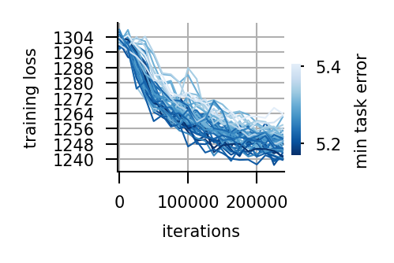


```python
fig, ax = ensemble.validation_loss()
```


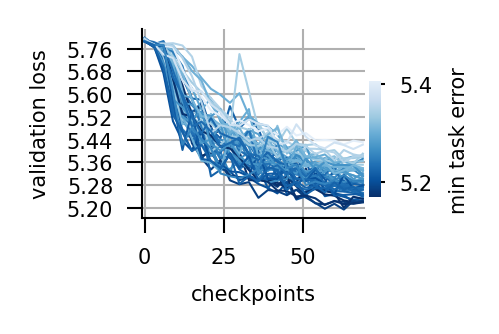


```python
fig, ax = ensemble.task_error_histogram()
```


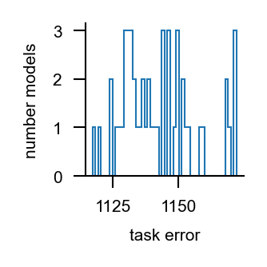


## Learned parameter marginals


```python
fig, axes = ensemble.node_parameters("bias")
```


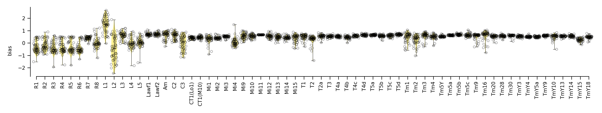


```python
fig, axes = ensemble.node_parameters("time_const")
```


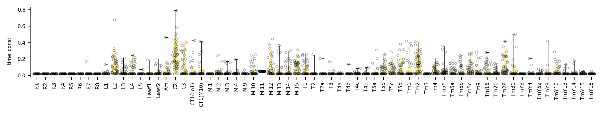


```python
fig, axes = ensemble.edge_parameters("syn_strength")
```


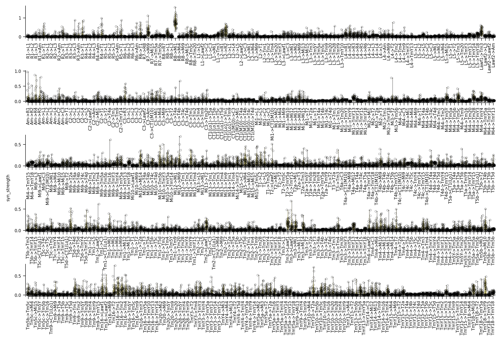


## Dead or alive


```python
fig, ax, cbar, matrix = ensemble.dead_or_alive()
```

    ../flyvis/data/results/flow/0001/000/__cache__/flyvis/analysis/stimulus_responses/compute_responses/c0441561bbbb0ee371d1a28cef8a9505/output.h5
    ../flyvis/data/results/flow/0001/001/__cache__/flyvis/analysis/stimulus_responses/compute_responses/3e8e02604549aa7ac2c8df17f4736770/output.h5
    ../flyvis/data/results/flow/0001/002/__cache__/flyvis/analysis/stimulus_responses/compute_responses/98f91049ef85d431968d03de9fcfbba9/output.h5
    ../flyvis/data/results/flow/0001/003/__cache__/flyvis/analysis/stimulus_responses/compute_responses/66cdfd526f6afe4bd5b7326cebfa3bd6/output.h5
    ../flyvis/data/results/flow/0001/004/__cache__/flyvis/analysis/stimulus_responses/compute_responses/6558fab1e383da5dc4b0ea33f2693a42/output.h5
    ../flyvis/data/results/flow/0001/005/__cache__/flyvis/analysis/stimulus_responses/compute_responses/b4429ce21a0c1a12b19fa17757e57137/output.h5
    ../flyvis/data/results/flow/0001/006/__cache__/flyvis/analysis/stimulus_responses/compute_responses/a2e9fc84d3d5a97a6893e6975a5ba335/output.h5
    ../flyvis/data/results/flow/0001/007/__cache__/flyvis/analysis/stimulus_responses/compute_responses/e5e9fbae703c6b372769c120e12988a8/output.h5
    ../flyvis/data/results/flow/0001/008/__cache__/flyvis/analysis/stimulus_responses/compute_responses/3cb42587f6883813dda4243f35a9073b/output.h5
    ../flyvis/data/results/flow/0001/009/__cache__/flyvis/analysis/stimulus_responses/compute_responses/f312a212e34dac86e0b15bc88bdb60a4/output.h5
    ../flyvis/data/results/flow/0001/010/__cache__/flyvis/analysis/stimulus_responses/compute_responses/00f2e1f02335a1acceca5d266994fee2/output.h5
    ../flyvis/data/results/flow/0001/011/__cache__/flyvis/analysis/stimulus_responses/compute_responses/7cd7d1816e75955785d49c3aefbcbb8f/output.h5
    ../flyvis/data/results/flow/0001/012/__cache__/flyvis/analysis/stimulus_responses/compute_responses/5677b21f148bfb90d466b18a93739783/output.h5
    ../flyvis/data/results/flow/0001/013/__cache__/flyvis/analysis/stimulus_responses/compute_responses/5682a51171b64f281bc2f771acb92527/output.h5
    ../flyvis/data/results/flow/0001/014/__cache__/flyvis/analysis/stimulus_responses/compute_responses/2d59c5edfa52c27d2c508d6dd5c968d7/output.h5
    ../flyvis/data/results/flow/0001/015/__cache__/flyvis/analysis/stimulus_responses/compute_responses/583017a23212926b4d633414a80aac22/output.h5
    ../flyvis/data/results/flow/0001/016/__cache__/flyvis/analysis/stimulus_responses/compute_responses/0d5bde0d357138a1a8c824d22b2b4815/output.h5
    ../flyvis/data/results/flow/0001/017/__cache__/flyvis/analysis/stimulus_responses/compute_responses/79643dad23598927268ec5da4006a9ae/output.h5
    ../flyvis/data/results/flow/0001/018/__cache__/flyvis/analysis/stimulus_responses/compute_responses/0e419a5cbe883b2a57c5e696ec75b93d/output.h5
    ../flyvis/data/results/flow/0001/019/__cache__/flyvis/analysis/stimulus_responses/compute_responses/aa404b0e4c76831d9c7b0095fcd31d9d/output.h5
    ../flyvis/data/results/flow/0001/020/__cache__/flyvis/analysis/stimulus_responses/compute_responses/514075420e3c6875df93555dcfe603a8/output.h5
    ../flyvis/data/results/flow/0001/021/__cache__/flyvis/analysis/stimulus_responses/compute_responses/bfb4f4c4ac1817690098803eded2d660/output.h5
    ../flyvis/data/results/flow/0001/022/__cache__/flyvis/analysis/stimulus_responses/compute_responses/def38e411152b6cfc3d051d22428c111/output.h5
    ../flyvis/data/results/flow/0001/023/__cache__/flyvis/analysis/stimulus_responses/compute_responses/9bbb3f924f67943fc6e9664ef7c7468b/output.h5
    ../flyvis/data/results/flow/0001/024/__cache__/flyvis/analysis/stimulus_responses/compute_responses/6e0ef3870bc16ed50f2d5db4a985a716/output.h5
    ../flyvis/data/results/flow/0001/025/__cache__/flyvis/analysis/stimulus_responses/compute_responses/132446834d4813ae6d78f920ca2aa96b/output.h5
    ../flyvis/data/results/flow/0001/026/__cache__/flyvis/analysis/stimulus_responses/compute_responses/5f1579e6b3a5869a7fa57f18db00c58e/output.h5
    ../flyvis/data/results/flow/0001/027/__cache__/flyvis/analysis/stimulus_responses/compute_responses/14070269cb74ae4ada1b0f387f253d8b/output.h5
    ../flyvis/data/results/flow/0001/028/__cache__/flyvis/analysis/stimulus_responses/compute_responses/404f5ac8bf3dd944bb8fc39ef7c49237/output.h5
    ../flyvis/data/results/flow/0001/029/__cache__/flyvis/analysis/stimulus_responses/compute_responses/59f53ef9a626524cec2e175bb16c410d/output.h5
    ../flyvis/data/results/flow/0001/030/__cache__/flyvis/analysis/stimulus_responses/compute_responses/becc3e5be49b4806e9b6a40e2842ea47/output.h5
    ../flyvis/data/results/flow/0001/031/__cache__/flyvis/analysis/stimulus_responses/compute_responses/9259f4d62ac65c92f68981e7a5708bc0/output.h5
    ../flyvis/data/results/flow/0001/032/__cache__/flyvis/analysis/stimulus_responses/compute_responses/29dfdfe0fefebe7ee59bdc206a230272/output.h5
    ../flyvis/data/results/flow/0001/033/__cache__/flyvis/analysis/stimulus_responses/compute_responses/a864d3a5ba9aa8ef3ddf81dd41668701/output.h5
    ../flyvis/data/results/flow/0001/034/__cache__/flyvis/analysis/stimulus_responses/compute_responses/b980b34213625a4de40335c67d03af8b/output.h5
    ../flyvis/data/results/flow/0001/035/__cache__/flyvis/analysis/stimulus_responses/compute_responses/e5bc8053729138a156ff196c6ffb404a/output.h5
    ../flyvis/data/results/flow/0001/036/__cache__/flyvis/analysis/stimulus_responses/compute_responses/687e177333f1e4a140c2794bb275b638/output.h5
    ../flyvis/data/results/flow/0001/037/__cache__/flyvis/analysis/stimulus_responses/compute_responses/4441374e363c61ea92f93ea52095192a/output.h5
    ../flyvis/data/results/flow/0001/038/__cache__/flyvis/analysis/stimulus_responses/compute_responses/99f4dec81e74368481aecc7a1b14be6f/output.h5
    ../flyvis/data/results/flow/0001/039/__cache__/flyvis/analysis/stimulus_responses/compute_responses/d888e60f3428f5ef1216549a8f03805b/output.h5
    ../flyvis/data/results/flow/0001/040/__cache__/flyvis/analysis/stimulus_responses/compute_responses/452af539922790584eea7937d0ab901d/output.h5
    ../flyvis/data/results/flow/0001/041/__cache__/flyvis/analysis/stimulus_responses/compute_responses/95bc621f4049f6dd342af751a3c0d8f5/output.h5
    ../flyvis/data/results/flow/0001/042/__cache__/flyvis/analysis/stimulus_responses/compute_responses/08b69eb513cf7ba0c31144f695db10dd/output.h5
    ../flyvis/data/results/flow/0001/043/__cache__/flyvis/analysis/stimulus_responses/compute_responses/75099cd5bb501f1eeb3a49bd13ed6ab7/output.h5
    ../flyvis/data/results/flow/0001/044/__cache__/flyvis/analysis/stimulus_responses/compute_responses/d4db856e71a4ee221babd6664a4d089e/output.h5
    ../flyvis/data/results/flow/0001/045/__cache__/flyvis/analysis/stimulus_responses/compute_responses/4c2f807a64caa503fd6317434800d8fa/output.h5
    ../flyvis/data/results/flow/0001/046/__cache__/flyvis/analysis/stimulus_responses/compute_responses/80bef81e3ce7e4742a7c5403df2d4969/output.h5
    ../flyvis/data/results/flow/0001/047/__cache__/flyvis/analysis/stimulus_responses/compute_responses/4f3d6a88a2ef428b6066fa8e39818707/output.h5
    ../flyvis/data/results/flow/0001/048/__cache__/flyvis/analysis/stimulus_responses/compute_responses/3807f5bb85f011ecc8f4a695037f70de/output.h5
    ../flyvis/data/results/flow/0001/049/__cache__/flyvis/analysis/stimulus_responses/compute_responses/f3c5168fee7bcb1a7ba1653d8d896ce3/output.h5


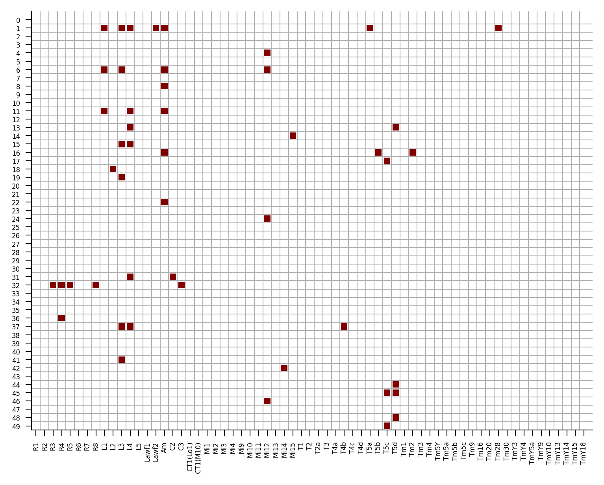


## Contrast selectivity and flash response indices (FRI)

#### 20% best task-performing models


```python
with ensemble.ratio(best=0.2):
    ensemble.flash_response_index()
```

    ../flyvis/data/results/flow/0001/036/__cache__/flyvis/analysis/stimulus_responses/compute_responses/bd4c65a392d06dcdffb007b5a81e2a72/output.h5
    ../flyvis/data/results/flow/0001/035/__cache__/flyvis/analysis/stimulus_responses/compute_responses/3bf428204710a3cd4d506ebd22221b69/output.h5
    ../flyvis/data/results/flow/0001/010/__cache__/flyvis/analysis/stimulus_responses/compute_responses/44f153e96335390c137630fe676c25af/output.h5
    ../flyvis/data/results/flow/0001/042/__cache__/flyvis/analysis/stimulus_responses/compute_responses/b7d43430908f0ebbe09a36ce2cadd3b6/output.h5
    ../flyvis/data/results/flow/0001/026/__cache__/flyvis/analysis/stimulus_responses/compute_responses/bec5e5065969242f2c609a915e7c8e4e/output.h5
    ../flyvis/data/results/flow/0001/045/__cache__/flyvis/analysis/stimulus_responses/compute_responses/9c070ae30dde5fae9f0667e81add549a/output.h5
    ../flyvis/data/results/flow/0001/014/__cache__/flyvis/analysis/stimulus_responses/compute_responses/c5e319c7d288f6d3a74ad66b98ee8b28/output.h5
    ../flyvis/data/results/flow/0001/043/__cache__/flyvis/analysis/stimulus_responses/compute_responses/511eb784ee629c003f4bbc334268f798/output.h5
    ../flyvis/data/results/flow/0001/007/__cache__/flyvis/analysis/stimulus_responses/compute_responses/13a439e203e38b115205b38a1601f840/output.h5
    ../flyvis/data/results/flow/0001/038/__cache__/flyvis/analysis/stimulus_responses/compute_responses/928af923ab47d566f61e0c0937238164/output.h5


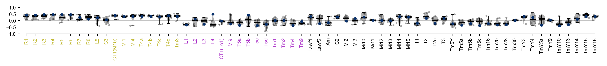


#### 100% models


```python
fig, ax = ensemble.flash_response_index()
```

    ../flyvis/data/results/flow/0001/000/__cache__/flyvis/analysis/stimulus_responses/compute_responses/9c8ed3f297a6bbe6681923cca44fef08/output.h5
    ../flyvis/data/results/flow/0001/001/__cache__/flyvis/analysis/stimulus_responses/compute_responses/fcdb5947ee72b22747f4bd39d3f27c8b/output.h5
    ../flyvis/data/results/flow/0001/002/__cache__/flyvis/analysis/stimulus_responses/compute_responses/e1cda7457bdc14c633ea3651dd30e20d/output.h5
    ../flyvis/data/results/flow/0001/003/__cache__/flyvis/analysis/stimulus_responses/compute_responses/ae98506a9f5b3c60f1f69dee760960a0/output.h5
    ../flyvis/data/results/flow/0001/004/__cache__/flyvis/analysis/stimulus_responses/compute_responses/fc9fa31f1878f051e90891ac9aa734e3/output.h5
    ../flyvis/data/results/flow/0001/005/__cache__/flyvis/analysis/stimulus_responses/compute_responses/164c4e901ed946dfcaf6b22b78354e8a/output.h5
    ../flyvis/data/results/flow/0001/006/__cache__/flyvis/analysis/stimulus_responses/compute_responses/60956ba0614f4259110004adf6bfb0c3/output.h5
    ../flyvis/data/results/flow/0001/007/__cache__/flyvis/analysis/stimulus_responses/compute_responses/13a439e203e38b115205b38a1601f840/output.h5
    ../flyvis/data/results/flow/0001/008/__cache__/flyvis/analysis/stimulus_responses/compute_responses/315a60dbafac7a826614bca39463925b/output.h5
    ../flyvis/data/results/flow/0001/009/__cache__/flyvis/analysis/stimulus_responses/compute_responses/21c47b51d1a1af74ea8d03d94ff50022/output.h5
    ../flyvis/data/results/flow/0001/010/__cache__/flyvis/analysis/stimulus_responses/compute_responses/44f153e96335390c137630fe676c25af/output.h5
    ../flyvis/data/results/flow/0001/011/__cache__/flyvis/analysis/stimulus_responses/compute_responses/0ab3c7906d8a0ac182b9373312fdfe34/output.h5
    ../flyvis/data/results/flow/0001/012/__cache__/flyvis/analysis/stimulus_responses/compute_responses/f8d32478be81dc5f2d96ca0fe57f463a/output.h5
    ../flyvis/data/results/flow/0001/013/__cache__/flyvis/analysis/stimulus_responses/compute_responses/1fd69989a081236837070e64ed912125/output.h5
    ../flyvis/data/results/flow/0001/014/__cache__/flyvis/analysis/stimulus_responses/compute_responses/c5e319c7d288f6d3a74ad66b98ee8b28/output.h5
    ../flyvis/data/results/flow/0001/015/__cache__/flyvis/analysis/stimulus_responses/compute_responses/2c9323b2e17dcb0fac7dd88908ed3ef3/output.h5
    ../flyvis/data/results/flow/0001/016/__cache__/flyvis/analysis/stimulus_responses/compute_responses/6c00cd901eccd5a786843b43a26a2008/output.h5
    ../flyvis/data/results/flow/0001/017/__cache__/flyvis/analysis/stimulus_responses/compute_responses/df76a450d74c71a5175d2b2e835c41b9/output.h5
    ../flyvis/data/results/flow/0001/018/__cache__/flyvis/analysis/stimulus_responses/compute_responses/fb7c8db108277f0d49794c9757b79bdc/output.h5
    ../flyvis/data/results/flow/0001/019/__cache__/flyvis/analysis/stimulus_responses/compute_responses/73d5fb8944cd39dc5306832069f1eb53/output.h5
    ../flyvis/data/results/flow/0001/020/__cache__/flyvis/analysis/stimulus_responses/compute_responses/ae0b6d9415adddaedf3dc4de60f08e13/output.h5
    ../flyvis/data/results/flow/0001/021/__cache__/flyvis/analysis/stimulus_responses/compute_responses/c398d4ff5336e245b911f1435e53d697/output.h5
    ../flyvis/data/results/flow/0001/022/__cache__/flyvis/analysis/stimulus_responses/compute_responses/d8fd7501128eaa34c01cb2a251bf827f/output.h5
    ../flyvis/data/results/flow/0001/023/__cache__/flyvis/analysis/stimulus_responses/compute_responses/e9b2bd568ba1cd51e3c59f5494cca039/output.h5
    ../flyvis/data/results/flow/0001/024/__cache__/flyvis/analysis/stimulus_responses/compute_responses/cbeca159094bc36f61e150305b4891d3/output.h5
    ../flyvis/data/results/flow/0001/025/__cache__/flyvis/analysis/stimulus_responses/compute_responses/d041a037891c0949cbeba7482f53042f/output.h5
    ../flyvis/data/results/flow/0001/026/__cache__/flyvis/analysis/stimulus_responses/compute_responses/bec5e5065969242f2c609a915e7c8e4e/output.h5
    ../flyvis/data/results/flow/0001/027/__cache__/flyvis/analysis/stimulus_responses/compute_responses/c9c4e95a9049d663c98e511adaecdc50/output.h5
    ../flyvis/data/results/flow/0001/028/__cache__/flyvis/analysis/stimulus_responses/compute_responses/ba732cb31505519c5316acb33c2b69f0/output.h5
    ../flyvis/data/results/flow/0001/029/__cache__/flyvis/analysis/stimulus_responses/compute_responses/b926ff5fe0db9e0b88fcffaf563f9200/output.h5
    ../flyvis/data/results/flow/0001/030/__cache__/flyvis/analysis/stimulus_responses/compute_responses/26eb198b2755f87b3e01e553216808fa/output.h5
    ../flyvis/data/results/flow/0001/031/__cache__/flyvis/analysis/stimulus_responses/compute_responses/a27d95a6cd94f722342ac35ccab89940/output.h5
    ../flyvis/data/results/flow/0001/032/__cache__/flyvis/analysis/stimulus_responses/compute_responses/a347866cdaa32089c0492747cd443584/output.h5
    ../flyvis/data/results/flow/0001/033/__cache__/flyvis/analysis/stimulus_responses/compute_responses/2fb0d7266c177dcb118c397632c2507c/output.h5
    ../flyvis/data/results/flow/0001/034/__cache__/flyvis/analysis/stimulus_responses/compute_responses/1b4ee7480d1ff450c61088f29a806f2d/output.h5
    ../flyvis/data/results/flow/0001/035/__cache__/flyvis/analysis/stimulus_responses/compute_responses/3bf428204710a3cd4d506ebd22221b69/output.h5
    ../flyvis/data/results/flow/0001/036/__cache__/flyvis/analysis/stimulus_responses/compute_responses/bd4c65a392d06dcdffb007b5a81e2a72/output.h5
    ../flyvis/data/results/flow/0001/037/__cache__/flyvis/analysis/stimulus_responses/compute_responses/7d077bd2149c4fd3a0697c4e1a06bb2d/output.h5
    ../flyvis/data/results/flow/0001/038/__cache__/flyvis/analysis/stimulus_responses/compute_responses/928af923ab47d566f61e0c0937238164/output.h5
    ../flyvis/data/results/flow/0001/039/__cache__/flyvis/analysis/stimulus_responses/compute_responses/8d5abfbd37b5c844aa18f37ba659f313/output.h5
    ../flyvis/data/results/flow/0001/040/__cache__/flyvis/analysis/stimulus_responses/compute_responses/f109a44bddab0f1734dbdaea56dee2f9/output.h5
    ../flyvis/data/results/flow/0001/041/__cache__/flyvis/analysis/stimulus_responses/compute_responses/41c4e9939c6add4492ae883eb3a9faea/output.h5
    ../flyvis/data/results/flow/0001/042/__cache__/flyvis/analysis/stimulus_responses/compute_responses/b7d43430908f0ebbe09a36ce2cadd3b6/output.h5
    ../flyvis/data/results/flow/0001/043/__cache__/flyvis/analysis/stimulus_responses/compute_responses/511eb784ee629c003f4bbc334268f798/output.h5
    ../flyvis/data/results/flow/0001/044/__cache__/flyvis/analysis/stimulus_responses/compute_responses/e8e9b3efa8b66ecd53755a65f0cd8526/output.h5
    ../flyvis/data/results/flow/0001/045/__cache__/flyvis/analysis/stimulus_responses/compute_responses/9c070ae30dde5fae9f0667e81add549a/output.h5
    ../flyvis/data/results/flow/0001/046/__cache__/flyvis/analysis/stimulus_responses/compute_responses/6b31cf47b0633c9bf022f8300bd6060d/output.h5
    ../flyvis/data/results/flow/0001/047/__cache__/flyvis/analysis/stimulus_responses/compute_responses/608a807e9da24c550996f170b815f687/output.h5
    ../flyvis/data/results/flow/0001/048/__cache__/flyvis/analysis/stimulus_responses/compute_responses/e753ddd0395dcd95355b1774ba487aa0/output.h5
    ../flyvis/data/results/flow/0001/049/__cache__/flyvis/analysis/stimulus_responses/compute_responses/34a6fc6aace38573e70e711bcbb19cfd/output.h5


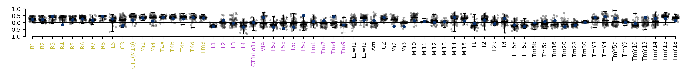


## Motion selectivity and direction selectivity index (DSI)

#### 20% best task-performing models


```python
with ensemble.ratio(best=0.2):
    ensemble.direction_selectivity_index()
```

    ../flyvis/data/results/flow/0001/036/__cache__/flyvis/analysis/stimulus_responses/compute_responses/57f072f845c6dc08a59fd1d0cda89135/output.h5
    ../flyvis/data/results/flow/0001/035/__cache__/flyvis/analysis/stimulus_responses/compute_responses/fc081508d80348d38c1911ba1542fe43/output.h5
    ../flyvis/data/results/flow/0001/010/__cache__/flyvis/analysis/stimulus_responses/compute_responses/54edadc37895551e5ac747c282646e72/output.h5
    ../flyvis/data/results/flow/0001/042/__cache__/flyvis/analysis/stimulus_responses/compute_responses/17803a4182c3768059c1488c99521d91/output.h5
    ../flyvis/data/results/flow/0001/026/__cache__/flyvis/analysis/stimulus_responses/compute_responses/34fb025d28f9f5881f44098fc0130e88/output.h5
    ../flyvis/data/results/flow/0001/045/__cache__/flyvis/analysis/stimulus_responses/compute_responses/52a28ad06d178c499beb5074af2c934f/output.h5
    ../flyvis/data/results/flow/0001/014/__cache__/flyvis/analysis/stimulus_responses/compute_responses/d89a1143c3313d26ef60aefd7497e7f8/output.h5
    ../flyvis/data/results/flow/0001/043/__cache__/flyvis/analysis/stimulus_responses/compute_responses/05dd71ddcb7ef28c921a856316e402e2/output.h5
    ../flyvis/data/results/flow/0001/007/__cache__/flyvis/analysis/stimulus_responses/compute_responses/2892c88f39169afc77fdad6acbbeff31/output.h5
    ../flyvis/data/results/flow/0001/038/__cache__/flyvis/analysis/stimulus_responses/compute_responses/d9f3f2040fc33f87520ef5ae1a51163b/output.h5


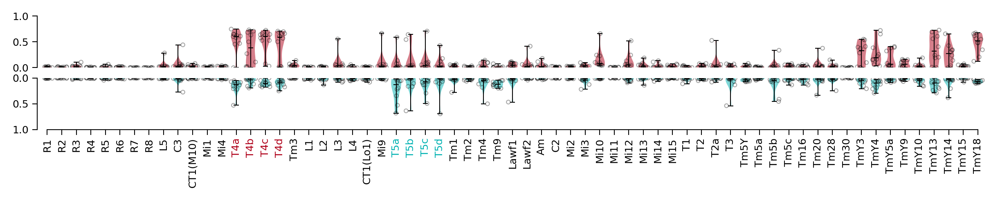


#### 100% models


```python
ensemble.direction_selectivity_index()
```

    ../flyvis/data/results/flow/0001/000/__cache__/flyvis/analysis/stimulus_responses/compute_responses/0c81fe5112956cf9df3d9e2c720a89f8/output.h5
    ../flyvis/data/results/flow/0001/001/__cache__/flyvis/analysis/stimulus_responses/compute_responses/a5effd2f066299c87e27f38bb75c08cf/output.h5
    ../flyvis/data/results/flow/0001/002/__cache__/flyvis/analysis/stimulus_responses/compute_responses/36cc7566416e98653de0b682fc69b59e/output.h5
    ../flyvis/data/results/flow/0001/003/__cache__/flyvis/analysis/stimulus_responses/compute_responses/34beb6e4231f3beafacb8d73a66f54d5/output.h5
    ../flyvis/data/results/flow/0001/004/__cache__/flyvis/analysis/stimulus_responses/compute_responses/62ea707693a8ced3ef9e7e4d7307585c/output.h5
    ../flyvis/data/results/flow/0001/005/__cache__/flyvis/analysis/stimulus_responses/compute_responses/7304c3fda3ad8cf3308d2b81e364a4e5/output.h5
    ../flyvis/data/results/flow/0001/006/__cache__/flyvis/analysis/stimulus_responses/compute_responses/2f20844dfb76bb618d9093610482e3eb/output.h5
    ../flyvis/data/results/flow/0001/007/__cache__/flyvis/analysis/stimulus_responses/compute_responses/2892c88f39169afc77fdad6acbbeff31/output.h5
    ../flyvis/data/results/flow/0001/008/__cache__/flyvis/analysis/stimulus_responses/compute_responses/c53f93ab2d9b35eaa8f9a61eac542be2/output.h5
    ../flyvis/data/results/flow/0001/009/__cache__/flyvis/analysis/stimulus_responses/compute_responses/309b08b5f516a6a83ad1d6b96278dadf/output.h5
    ../flyvis/data/results/flow/0001/010/__cache__/flyvis/analysis/stimulus_responses/compute_responses/54edadc37895551e5ac747c282646e72/output.h5
    ../flyvis/data/results/flow/0001/011/__cache__/flyvis/analysis/stimulus_responses/compute_responses/4375d2101a1629216ebf8a4e28f62a33/output.h5
    ../flyvis/data/results/flow/0001/012/__cache__/flyvis/analysis/stimulus_responses/compute_responses/64541cf2bb01f5056f80688fb41f0ba9/output.h5
    ../flyvis/data/results/flow/0001/013/__cache__/flyvis/analysis/stimulus_responses/compute_responses/9bdb7271b2373f6a71926f9be48e82fe/output.h5
    ../flyvis/data/results/flow/0001/014/__cache__/flyvis/analysis/stimulus_responses/compute_responses/d89a1143c3313d26ef60aefd7497e7f8/output.h5
    ../flyvis/data/results/flow/0001/015/__cache__/flyvis/analysis/stimulus_responses/compute_responses/f2d0da658e7d426500cf1b38eb7a989e/output.h5
    ../flyvis/data/results/flow/0001/016/__cache__/flyvis/analysis/stimulus_responses/compute_responses/307e5f1a53d588f98b26aaa6326b7b58/output.h5
    ../flyvis/data/results/flow/0001/017/__cache__/flyvis/analysis/stimulus_responses/compute_responses/8af2371cd5d822adfed4f8700e61e564/output.h5
    ../flyvis/data/results/flow/0001/018/__cache__/flyvis/analysis/stimulus_responses/compute_responses/49fe41ece25423d8f0be281b4c629266/output.h5
    ../flyvis/data/results/flow/0001/019/__cache__/flyvis/analysis/stimulus_responses/compute_responses/cf13694a1b22713de7f6006367040072/output.h5
    ../flyvis/data/results/flow/0001/020/__cache__/flyvis/analysis/stimulus_responses/compute_responses/4c260755e7a480630ed0ad0c522266c6/output.h5
    ../flyvis/data/results/flow/0001/021/__cache__/flyvis/analysis/stimulus_responses/compute_responses/59e45698e81bd8bc38832f93f20cc0cf/output.h5
    ../flyvis/data/results/flow/0001/022/__cache__/flyvis/analysis/stimulus_responses/compute_responses/85f61ab5cc999ac2365ebab039463f4d/output.h5
    ../flyvis/data/results/flow/0001/023/__cache__/flyvis/analysis/stimulus_responses/compute_responses/53f05a3307151650fd0d0c159c1f441e/output.h5
    ../flyvis/data/results/flow/0001/024/__cache__/flyvis/analysis/stimulus_responses/compute_responses/99aaaa3abfb9bab3734ee84d2fec25d7/output.h5
    ../flyvis/data/results/flow/0001/025/__cache__/flyvis/analysis/stimulus_responses/compute_responses/521b00ceffe7b4911f7d8dbba8d4c0a0/output.h5
    ../flyvis/data/results/flow/0001/026/__cache__/flyvis/analysis/stimulus_responses/compute_responses/34fb025d28f9f5881f44098fc0130e88/output.h5
    ../flyvis/data/results/flow/0001/027/__cache__/flyvis/analysis/stimulus_responses/compute_responses/e244e4faa471b00a78327c9642d74b63/output.h5
    ../flyvis/data/results/flow/0001/028/__cache__/flyvis/analysis/stimulus_responses/compute_responses/e58bed06839e2e5088f942aacd122253/output.h5
    ../flyvis/data/results/flow/0001/029/__cache__/flyvis/analysis/stimulus_responses/compute_responses/eb1340b580d31cfe7e8f5d0504fced92/output.h5
    ../flyvis/data/results/flow/0001/030/__cache__/flyvis/analysis/stimulus_responses/compute_responses/8c8d87f138997f67bb2236cfe7a7af1c/output.h5
    ../flyvis/data/results/flow/0001/031/__cache__/flyvis/analysis/stimulus_responses/compute_responses/c28893ee720c5d314d206287de8db394/output.h5
    ../flyvis/data/results/flow/0001/032/__cache__/flyvis/analysis/stimulus_responses/compute_responses/44a553f28596a7ad2c6eab121dbc642d/output.h5
    ../flyvis/data/results/flow/0001/033/__cache__/flyvis/analysis/stimulus_responses/compute_responses/afd56b985f39750c735722f4d48973a3/output.h5
    ../flyvis/data/results/flow/0001/034/__cache__/flyvis/analysis/stimulus_responses/compute_responses/e2b717e9cc34da542d4855a45361e160/output.h5
    ../flyvis/data/results/flow/0001/035/__cache__/flyvis/analysis/stimulus_responses/compute_responses/fc081508d80348d38c1911ba1542fe43/output.h5
    ../flyvis/data/results/flow/0001/036/__cache__/flyvis/analysis/stimulus_responses/compute_responses/57f072f845c6dc08a59fd1d0cda89135/output.h5
    ../flyvis/data/results/flow/0001/037/__cache__/flyvis/analysis/stimulus_responses/compute_responses/a3c1acffbebd6b29e88f40126450b5fd/output.h5
    ../flyvis/data/results/flow/0001/038/__cache__/flyvis/analysis/stimulus_responses/compute_responses/d9f3f2040fc33f87520ef5ae1a51163b/output.h5
    ../flyvis/data/results/flow/0001/039/__cache__/flyvis/analysis/stimulus_responses/compute_responses/91de8ba393e6ff302174344e0039ea91/output.h5
    ../flyvis/data/results/flow/0001/040/__cache__/flyvis/analysis/stimulus_responses/compute_responses/71e4dae102c4a0cb1031633e71238782/output.h5
    ../flyvis/data/results/flow/0001/041/__cache__/flyvis/analysis/stimulus_responses/compute_responses/493a12c74654643b8dad4e13f4846ef5/output.h5
    ../flyvis/data/results/flow/0001/042/__cache__/flyvis/analysis/stimulus_responses/compute_responses/17803a4182c3768059c1488c99521d91/output.h5
    ../flyvis/data/results/flow/0001/043/__cache__/flyvis/analysis/stimulus_responses/compute_responses/05dd71ddcb7ef28c921a856316e402e2/output.h5
    ../flyvis/data/results/flow/0001/044/__cache__/flyvis/analysis/stimulus_responses/compute_responses/0760489539bb22c16b9a6660baa94622/output.h5
    ../flyvis/data/results/flow/0001/045/__cache__/flyvis/analysis/stimulus_responses/compute_responses/52a28ad06d178c499beb5074af2c934f/output.h5
    ../flyvis/data/results/flow/0001/046/__cache__/flyvis/analysis/stimulus_responses/compute_responses/771343b27d0b38823e732d362742971a/output.h5
    ../flyvis/data/results/flow/0001/047/__cache__/flyvis/analysis/stimulus_responses/compute_responses/e9bcb29e994581187780f04e661472e8/output.h5
    ../flyvis/data/results/flow/0001/048/__cache__/flyvis/analysis/stimulus_responses/compute_responses/e50276c692df98aedda40cad1e50c43d/output.h5
    ../flyvis/data/results/flow/0001/049/__cache__/flyvis/analysis/stimulus_responses/compute_responses/c7e424b1c9aa6ed65a704f02bc0361d7/output.h5


    (<Figure size 3000x360 with 2 Axes>, array([<Axes: >, <Axes: >], dtype=object))


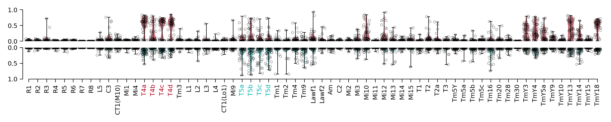


## Clustering of models based on responses to naturalistic stimuli

#### T4c


```python
task_error = ensemble.task_error()
embeddingplot = ensemble.clustering("T4c").plot(
    task_error=task_error.values, colors=task_error.colors
)
```

    ../flyvis/data/results/flow/0001/000/__cache__/flyvis/analysis/stimulus_responses/compute_responses/c0441561bbbb0ee371d1a28cef8a9505/output.h5
    ../flyvis/data/results/flow/0001/001/__cache__/flyvis/analysis/stimulus_responses/compute_responses/3e8e02604549aa7ac2c8df17f4736770/output.h5
    ../flyvis/data/results/flow/0001/002/__cache__/flyvis/analysis/stimulus_responses/compute_responses/98f91049ef85d431968d03de9fcfbba9/output.h5
    ../flyvis/data/results/flow/0001/003/__cache__/flyvis/analysis/stimulus_responses/compute_responses/66cdfd526f6afe4bd5b7326cebfa3bd6/output.h5
    ../flyvis/data/results/flow/0001/004/__cache__/flyvis/analysis/stimulus_responses/compute_responses/6558fab1e383da5dc4b0ea33f2693a42/output.h5
    ../flyvis/data/results/flow/0001/005/__cache__/flyvis/analysis/stimulus_responses/compute_responses/b4429ce21a0c1a12b19fa17757e57137/output.h5
    ../flyvis/data/results/flow/0001/006/__cache__/flyvis/analysis/stimulus_responses/compute_responses/a2e9fc84d3d5a97a6893e6975a5ba335/output.h5
    ../flyvis/data/results/flow/0001/007/__cache__/flyvis/analysis/stimulus_responses/compute_responses/e5e9fbae703c6b372769c120e12988a8/output.h5
    ../flyvis/data/results/flow/0001/008/__cache__/flyvis/analysis/stimulus_responses/compute_responses/3cb42587f6883813dda4243f35a9073b/output.h5
    ../flyvis/data/results/flow/0001/009/__cache__/flyvis/analysis/stimulus_responses/compute_responses/f312a212e34dac86e0b15bc88bdb60a4/output.h5
    ../flyvis/data/results/flow/0001/010/__cache__/flyvis/analysis/stimulus_responses/compute_responses/00f2e1f02335a1acceca5d266994fee2/output.h5
    ../flyvis/data/results/flow/0001/011/__cache__/flyvis/analysis/stimulus_responses/compute_responses/7cd7d1816e75955785d49c3aefbcbb8f/output.h5
    ../flyvis/data/results/flow/0001/012/__cache__/flyvis/analysis/stimulus_responses/compute_responses/5677b21f148bfb90d466b18a93739783/output.h5
    ../flyvis/data/results/flow/0001/013/__cache__/flyvis/analysis/stimulus_responses/compute_responses/5682a51171b64f281bc2f771acb92527/output.h5
    ../flyvis/data/results/flow/0001/014/__cache__/flyvis/analysis/stimulus_responses/compute_responses/2d59c5edfa52c27d2c508d6dd5c968d7/output.h5
    ../flyvis/data/results/flow/0001/015/__cache__/flyvis/analysis/stimulus_responses/compute_responses/583017a23212926b4d633414a80aac22/output.h5
    ../flyvis/data/results/flow/0001/016/__cache__/flyvis/analysis/stimulus_responses/compute_responses/0d5bde0d357138a1a8c824d22b2b4815/output.h5
    ../flyvis/data/results/flow/0001/017/__cache__/flyvis/analysis/stimulus_responses/compute_responses/79643dad23598927268ec5da4006a9ae/output.h5
    ../flyvis/data/results/flow/0001/018/__cache__/flyvis/analysis/stimulus_responses/compute_responses/0e419a5cbe883b2a57c5e696ec75b93d/output.h5
    ../flyvis/data/results/flow/0001/019/__cache__/flyvis/analysis/stimulus_responses/compute_responses/aa404b0e4c76831d9c7b0095fcd31d9d/output.h5
    ../flyvis/data/results/flow/0001/020/__cache__/flyvis/analysis/stimulus_responses/compute_responses/514075420e3c6875df93555dcfe603a8/output.h5
    ../flyvis/data/results/flow/0001/021/__cache__/flyvis/analysis/stimulus_responses/compute_responses/bfb4f4c4ac1817690098803eded2d660/output.h5
    ../flyvis/data/results/flow/0001/022/__cache__/flyvis/analysis/stimulus_responses/compute_responses/def38e411152b6cfc3d051d22428c111/output.h5
    ../flyvis/data/results/flow/0001/023/__cache__/flyvis/analysis/stimulus_responses/compute_responses/9bbb3f924f67943fc6e9664ef7c7468b/output.h5
    ../flyvis/data/results/flow/0001/024/__cache__/flyvis/analysis/stimulus_responses/compute_responses/6e0ef3870bc16ed50f2d5db4a985a716/output.h5
    ../flyvis/data/results/flow/0001/025/__cache__/flyvis/analysis/stimulus_responses/compute_responses/132446834d4813ae6d78f920ca2aa96b/output.h5
    ../flyvis/data/results/flow/0001/026/__cache__/flyvis/analysis/stimulus_responses/compute_responses/5f1579e6b3a5869a7fa57f18db00c58e/output.h5
    ../flyvis/data/results/flow/0001/027/__cache__/flyvis/analysis/stimulus_responses/compute_responses/14070269cb74ae4ada1b0f387f253d8b/output.h5
    ../flyvis/data/results/flow/0001/028/__cache__/flyvis/analysis/stimulus_responses/compute_responses/404f5ac8bf3dd944bb8fc39ef7c49237/output.h5
    ../flyvis/data/results/flow/0001/029/__cache__/flyvis/analysis/stimulus_responses/compute_responses/59f53ef9a626524cec2e175bb16c410d/output.h5
    ../flyvis/data/results/flow/0001/030/__cache__/flyvis/analysis/stimulus_responses/compute_responses/becc3e5be49b4806e9b6a40e2842ea47/output.h5
    ../flyvis/data/results/flow/0001/031/__cache__/flyvis/analysis/stimulus_responses/compute_responses/9259f4d62ac65c92f68981e7a5708bc0/output.h5
    ../flyvis/data/results/flow/0001/032/__cache__/flyvis/analysis/stimulus_responses/compute_responses/29dfdfe0fefebe7ee59bdc206a230272/output.h5
    ../flyvis/data/results/flow/0001/033/__cache__/flyvis/analysis/stimulus_responses/compute_responses/a864d3a5ba9aa8ef3ddf81dd41668701/output.h5
    ../flyvis/data/results/flow/0001/034/__cache__/flyvis/analysis/stimulus_responses/compute_responses/b980b34213625a4de40335c67d03af8b/output.h5
    ../flyvis/data/results/flow/0001/035/__cache__/flyvis/analysis/stimulus_responses/compute_responses/e5bc8053729138a156ff196c6ffb404a/output.h5
    ../flyvis/data/results/flow/0001/036/__cache__/flyvis/analysis/stimulus_responses/compute_responses/687e177333f1e4a140c2794bb275b638/output.h5
    ../flyvis/data/results/flow/0001/037/__cache__/flyvis/analysis/stimulus_responses/compute_responses/4441374e363c61ea92f93ea52095192a/output.h5
    ../flyvis/data/results/flow/0001/038/__cache__/flyvis/analysis/stimulus_responses/compute_responses/99f4dec81e74368481aecc7a1b14be6f/output.h5
    ../flyvis/data/results/flow/0001/039/__cache__/flyvis/analysis/stimulus_responses/compute_responses/d888e60f3428f5ef1216549a8f03805b/output.h5
    ../flyvis/data/results/flow/0001/040/__cache__/flyvis/analysis/stimulus_responses/compute_responses/452af539922790584eea7937d0ab901d/output.h5
    ../flyvis/data/results/flow/0001/041/__cache__/flyvis/analysis/stimulus_responses/compute_responses/95bc621f4049f6dd342af751a3c0d8f5/output.h5
    ../flyvis/data/results/flow/0001/042/__cache__/flyvis/analysis/stimulus_responses/compute_responses/08b69eb513cf7ba0c31144f695db10dd/output.h5
    ../flyvis/data/results/flow/0001/043/__cache__/flyvis/analysis/stimulus_responses/compute_responses/75099cd5bb501f1eeb3a49bd13ed6ab7/output.h5
    ../flyvis/data/results/flow/0001/044/__cache__/flyvis/analysis/stimulus_responses/compute_responses/d4db856e71a4ee221babd6664a4d089e/output.h5
    ../flyvis/data/results/flow/0001/045/__cache__/flyvis/analysis/stimulus_responses/compute_responses/4c2f807a64caa503fd6317434800d8fa/output.h5
    ../flyvis/data/results/flow/0001/046/__cache__/flyvis/analysis/stimulus_responses/compute_responses/80bef81e3ce7e4742a7c5403df2d4969/output.h5
    ../flyvis/data/results/flow/0001/047/__cache__/flyvis/analysis/stimulus_responses/compute_responses/4f3d6a88a2ef428b6066fa8e39818707/output.h5
    ../flyvis/data/results/flow/0001/048/__cache__/flyvis/analysis/stimulus_responses/compute_responses/3807f5bb85f011ecc8f4a695037f70de/output.h5
    ../flyvis/data/results/flow/0001/049/__cache__/flyvis/analysis/stimulus_responses/compute_responses/f3c5168fee7bcb1a7ba1653d8d896ce3/output.h5


    /home/lappalainenj@hhmi.org/miniconda3/envs/flyvision/lib/python3.9/site-packages/umap/umap_.py:1356: RuntimeWarning: divide by zero encountered in power
      return 1.0 / (1.0 + a * x ** (2 * b))


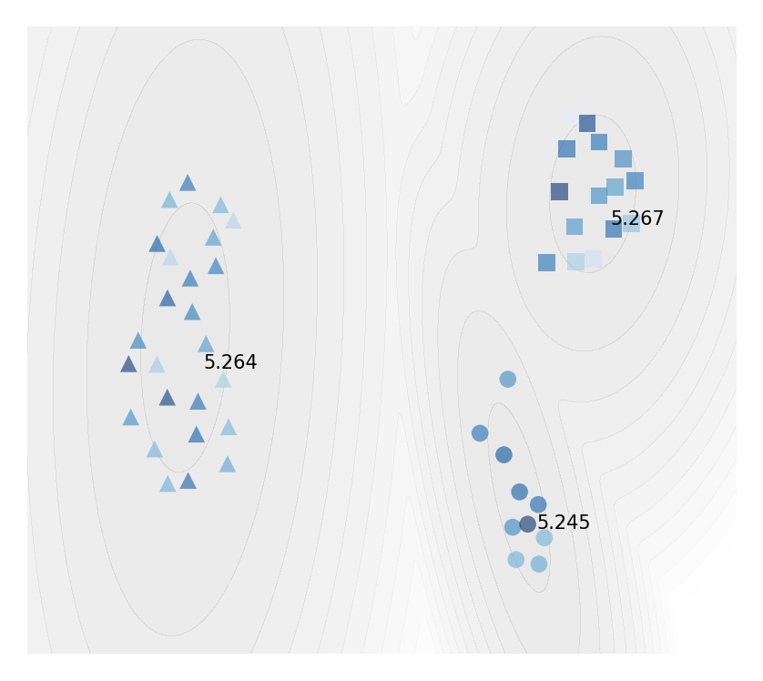


```python
r = ensemble.moving_edge_responses()
```


```python
cluster_indices = ensemble.cluster_indices("T4c")
```


```python
colors = ensemble.task_error().colors
```


```python
fig, axes = plt.subplots(
    1, len(cluster_indices), subplot_kw={"projection": "polar"}, figsize=[2, 1]
)
for cluster_id, indices in cluster_indices.items():
    plot_angular_tuning(
        r.sel(network_id=indices),
        "T4c",
        intensity=1,
        colors=colors[indices],
        zorder=ensemble.zorder()[indices],
        groundtruth=True if cluster_id == 0 else False,
        fig=fig,
        ax=axes[cluster_id],
    )
    add_cluster_marker(fig, axes[cluster_id], marker=get_marker(cluster_id))
```


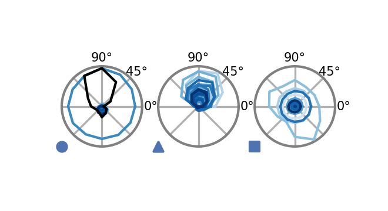


```python

```
