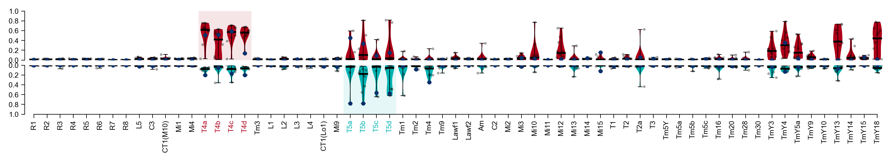

# Figure 2


```
%load_ext autoreload
%autoreload 2

from matplotlib.patches import Rectangle


from flyvision import EnsembleView
from flyvision.utils import color_utils
```


```
ensemble = EnsembleView("flow/0000")
```


    Loading ensemble:   0%|          | 0/50 [00:00<?, ?it/s]


    [2024-09-28 04:18:31] ensemble:138 Loaded 50 networks.


## b


```

with ensemble.ratio(best=0.2):
    fig, ax = ensemble.flash_response_index()

ymin, ymax= 0, 1
# to get locations of left most and right most T4 subtype ticks
xmin, xmax = [p.get_position()[0] for p in ax.get_xticklabels() if p.get_text() in ["R1", "Tm3"]]
# to place in between ticks
xmin -= 1/2
xmax += 1/2
xy = (xmin, ymin)
width = xmax - xmin
height = ymax
rect = Rectangle(xy, width, height, facecolor=color_utils.ON_FR, alpha=0.1)
ax.add_patch(rect)

ymin, ymax= 0, -1
# to get locations of left most and right most T4 subtype ticks
xmin, xmax = [p.get_position()[0] for p in ax.get_xticklabels() if p.get_text() in ["L1", "Tm9"]]
# to place in between ticks
xmin -= 1/2
xmax += 1/2
xy = (xmin, ymin)
width = xmax - xmin
height = ymax
rect = Rectangle(xy, width, height, facecolor=color_utils.OFF_FR, alpha=0.1)
ax.add_patch(rect)

ax.set_title("Flash response indices")
```

    [2024-09-28 04:18:32] logger:83 [MemorizedFunc(func=<function compute_responses at 0x7feb0ba51dc0>, location=/groups/turaga/home/lappalainenj/FlyVis/private/flyvision/data/results/flow/0000/000/__cache__)]: 
                            Querying compute_responses with signature
                            compute_responses(CheckpointedNetwork(network_class=<class 'flyvision.network.Network'>, config={'connectome': {'type': 'ConnectomeDir', 'file': 'fib25-fib19_v2.2.json', 'extent': 15, 'n_syn_fill': 1}, 'dynamics': {'type': 'PPNeuronIGRSynapses', 'activation': {'type': 'relu'}}, 'node_config': {'bias': {'type': 'RestingPotential', 'groupby': ['type'], 'initial_dist': 'Normal', 'mode': 'sample', 'requires_grad': True, 'mean': 0.5, 'std': 0.05, 'penalize': {'activity': True}, 'seed': 0}, 'time_const': {'type': 'TimeConstant', 'groupby': ['type'], 'initial_dist': 'Value', 'value': 0.05, 'requires_grad': True}}, 'edge_config': {'sign': {'type': 'SynapseSign', 'initial_dist': 'Value', 'requires_grad': False, 'groupby': ['source_type', 'target_type']}, 'syn_count': {'type': 'SynapseCount', 'initial_dist': 'Lognormal', 'mode': 'mean', 'requires_grad': False, 'std': 1.0, 'groupby': ['source_type', 'target_type', 'du', 'dv']}, 'syn_strength': {'type': 'SynapseCountScaling', 'initial_dist': 'Value', 'requires_grad': True, 'scale_elec': 0.01, 'scale_chem': 0.01, 'clamp': 'non_negative', 'groupby': ['source_type', 'target_type', 'edge_type']}}}, name='flow/0000/000', checkpoint=PosixPath('/groups/turaga/home/lappalainenj/FlyVis/private/flyvision/data/results/flow/0000/000/chkpts/chkpt_00000'), recover_fn=<function recover_network at 0x7feb02a7ca60>, network=None), 
    <class 'flyvision.datasets.flashes.Flashes'>, { 'alternations': (0, 1, 0),
      'dt': 0.005,
      'dynamic_range': [0, 1],
      'radius': (-1, 6),
      't_pre': 1.0,
      't_stim': 1}, 
    4, 1.0, 0.0).
    
                            (argument hash 102bbcd0dbfd7bfa6847ec1a64bd245a)
    
                            The store location is /groups/turaga/home/lappalainenj/FlyVis/private/flyvision/data/results/flow/0000/000/__cache__/flyvision/analysis/stimulus_responses/compute_responses.
    
    [2024-09-28 04:18:32] xarray_joblib_backend:582 Loading Dataset from NetCDF at /groups/turaga/home/lappalainenj/FlyVis/private/flyvision/data/results/flow/0000/000/__cache__/flyvision/analysis/stimulus_responses/compute_responses/102bbcd0dbfd7bfa6847ec1a64bd245a/output.h5
    [2024-09-28 04:18:33] logger:83 [MemorizedFunc(func=<function compute_responses at 0x7feb0ba51dc0>, location=/groups/turaga/home/lappalainenj/FlyVis/private/flyvision/data/results/flow/0000/001/__cache__)]: 
                            Querying compute_responses with signature
                            compute_responses(CheckpointedNetwork(network_class=<class 'flyvision.network.Network'>, config={'connectome': {'type': 'ConnectomeDir', 'file': 'fib25-fib19_v2.2.json', 'extent': 15, 'n_syn_fill': 1}, 'dynamics': {'type': 'PPNeuronIGRSynapses', 'activation': {'type': 'relu'}}, 'node_config': {'bias': {'type': 'RestingPotential', 'groupby': ['type'], 'initial_dist': 'Normal', 'mode': 'sample', 'requires_grad': True, 'mean': 0.5, 'std': 0.05, 'penalize': {'activity': True}, 'seed': 0}, 'time_const': {'type': 'TimeConstant', 'groupby': ['type'], 'initial_dist': 'Value', 'value': 0.05, 'requires_grad': True}}, 'edge_config': {'sign': {'type': 'SynapseSign', 'initial_dist': 'Value', 'requires_grad': False, 'groupby': ['source_type', 'target_type']}, 'syn_count': {'type': 'SynapseCount', 'initial_dist': 'Lognormal', 'mode': 'mean', 'requires_grad': False, 'std': 1.0, 'groupby': ['source_type', 'target_type', 'du', 'dv']}, 'syn_strength': {'type': 'SynapseCountScaling', 'initial_dist': 'Value', 'requires_grad': True, 'scale_elec': 0.01, 'scale_chem': 0.01, 'clamp': 'non_negative', 'groupby': ['source_type', 'target_type', 'edge_type']}}}, name='flow/0000/001', checkpoint=PosixPath('/groups/turaga/home/lappalainenj/FlyVis/private/flyvision/data/results/flow/0000/001/chkpts/chkpt_00000'), recover_fn=<function recover_network at 0x7feb02a7ca60>, network=None), 
    <class 'flyvision.datasets.flashes.Flashes'>, { 'alternations': (0, 1, 0),
      'dt': 0.005,
      'dynamic_range': [0, 1],
      'radius': (-1, 6),
      't_pre': 1.0,
      't_stim': 1}, 
    4, 1.0, 0.0).
    
                            (argument hash 01bc24ee52f66d92df6dda7a54fbb512)
    
                            The store location is /groups/turaga/home/lappalainenj/FlyVis/private/flyvision/data/results/flow/0000/001/__cache__/flyvision/analysis/stimulus_responses/compute_responses.
    
    [2024-09-28 04:18:33] xarray_joblib_backend:582 Loading Dataset from NetCDF at /groups/turaga/home/lappalainenj/FlyVis/private/flyvision/data/results/flow/0000/001/__cache__/flyvision/analysis/stimulus_responses/compute_responses/01bc24ee52f66d92df6dda7a54fbb512/output.h5


    ___________________________________compute_responses cache loaded - 0.1s, 0.0min
    ___________________________________compute_responses cache loaded - 0.0s, 0.0min


    [2024-09-28 04:18:33] logger:83 [MemorizedFunc(func=<function compute_responses at 0x7feb0ba51dc0>, location=/groups/turaga/home/lappalainenj/FlyVis/private/flyvision/data/results/flow/0000/002/__cache__)]: 
                            Querying compute_responses with signature
                            compute_responses(CheckpointedNetwork(network_class=<class 'flyvision.network.Network'>, config={'connectome': {'type': 'ConnectomeDir', 'file': 'fib25-fib19_v2.2.json', 'extent': 15, 'n_syn_fill': 1}, 'dynamics': {'type': 'PPNeuronIGRSynapses', 'activation': {'type': 'relu'}}, 'node_config': {'bias': {'type': 'RestingPotential', 'groupby': ['type'], 'initial_dist': 'Normal', 'mode': 'sample', 'requires_grad': True, 'mean': 0.5, 'std': 0.05, 'penalize': {'activity': True}, 'seed': 0}, 'time_const': {'type': 'TimeConstant', 'groupby': ['type'], 'initial_dist': 'Value', 'value': 0.05, 'requires_grad': True}}, 'edge_config': {'sign': {'type': 'SynapseSign', 'initial_dist': 'Value', 'requires_grad': False, 'groupby': ['source_type', 'target_type']}, 'syn_count': {'type': 'SynapseCount', 'initial_dist': 'Lognormal', 'mode': 'mean', 'requires_grad': False, 'std': 1.0, 'groupby': ['source_type', 'target_type', 'du', 'dv']}, 'syn_strength': {'type': 'SynapseCountScaling', 'initial_dist': 'Value', 'requires_grad': True, 'scale_elec': 0.01, 'scale_chem': 0.01, 'clamp': 'non_negative', 'groupby': ['source_type', 'target_type', 'edge_type']}}}, name='flow/0000/002', checkpoint=PosixPath('/groups/turaga/home/lappalainenj/FlyVis/private/flyvision/data/results/flow/0000/002/chkpts/chkpt_00000'), recover_fn=<function recover_network at 0x7feb02a7ca60>, network=None), 
    <class 'flyvision.datasets.flashes.Flashes'>, { 'alternations': (0, 1, 0),
      'dt': 0.005,
      'dynamic_range': [0, 1],
      'radius': (-1, 6),
      't_pre': 1.0,
      't_stim': 1}, 
    4, 1.0, 0.0).
    
                            (argument hash 1be5fe2784c35f3799f9c52e4c1f4ab1)
    
                            The store location is /groups/turaga/home/lappalainenj/FlyVis/private/flyvision/data/results/flow/0000/002/__cache__/flyvision/analysis/stimulus_responses/compute_responses.
    
    [2024-09-28 04:18:33] xarray_joblib_backend:582 Loading Dataset from NetCDF at /groups/turaga/home/lappalainenj/FlyVis/private/flyvision/data/results/flow/0000/002/__cache__/flyvision/analysis/stimulus_responses/compute_responses/1be5fe2784c35f3799f9c52e4c1f4ab1/output.h5
    [2024-09-28 04:18:33] logger:83 [MemorizedFunc(func=<function compute_responses at 0x7feb0ba51dc0>, location=/groups/turaga/home/lappalainenj/FlyVis/private/flyvision/data/results/flow/0000/003/__cache__)]: 
                            Querying compute_responses with signature
                            compute_responses(CheckpointedNetwork(network_class=<class 'flyvision.network.Network'>, config={'connectome': {'type': 'ConnectomeDir', 'file': 'fib25-fib19_v2.2.json', 'extent': 15, 'n_syn_fill': 1}, 'dynamics': {'type': 'PPNeuronIGRSynapses', 'activation': {'type': 'relu'}}, 'node_config': {'bias': {'type': 'RestingPotential', 'groupby': ['type'], 'initial_dist': 'Normal', 'mode': 'sample', 'requires_grad': True, 'mean': 0.5, 'std': 0.05, 'penalize': {'activity': True}, 'seed': 0}, 'time_const': {'type': 'TimeConstant', 'groupby': ['type'], 'initial_dist': 'Value', 'value': 0.05, 'requires_grad': True}}, 'edge_config': {'sign': {'type': 'SynapseSign', 'initial_dist': 'Value', 'requires_grad': False, 'groupby': ['source_type', 'target_type']}, 'syn_count': {'type': 'SynapseCount', 'initial_dist': 'Lognormal', 'mode': 'mean', 'requires_grad': False, 'std': 1.0, 'groupby': ['source_type', 'target_type', 'du', 'dv']}, 'syn_strength': {'type': 'SynapseCountScaling', 'initial_dist': 'Value', 'requires_grad': True, 'scale_elec': 0.01, 'scale_chem': 0.01, 'clamp': 'non_negative', 'groupby': ['source_type', 'target_type', 'edge_type']}}}, name='flow/0000/003', checkpoint=PosixPath('/groups/turaga/home/lappalainenj/FlyVis/private/flyvision/data/results/flow/0000/003/chkpts/chkpt_00000'), recover_fn=<function recover_network at 0x7feb02a7ca60>, network=None), 
    <class 'flyvision.datasets.flashes.Flashes'>, { 'alternations': (0, 1, 0),
      'dt': 0.005,
      'dynamic_range': [0, 1],
      'radius': (-1, 6),
      't_pre': 1.0,
      't_stim': 1}, 
    4, 1.0, 0.0).
    
                            (argument hash 3a32cdc078ada6ec77ef312d81a5a3d3)
    
                            The store location is /groups/turaga/home/lappalainenj/FlyVis/private/flyvision/data/results/flow/0000/003/__cache__/flyvision/analysis/stimulus_responses/compute_responses.
    
    [2024-09-28 04:18:33] xarray_joblib_backend:582 Loading Dataset from NetCDF at /groups/turaga/home/lappalainenj/FlyVis/private/flyvision/data/results/flow/0000/003/__cache__/flyvision/analysis/stimulus_responses/compute_responses/3a32cdc078ada6ec77ef312d81a5a3d3/output.h5


    ___________________________________compute_responses cache loaded - 0.0s, 0.0min
    ___________________________________compute_responses cache loaded - 0.0s, 0.0min


    [2024-09-28 04:18:33] logger:83 [MemorizedFunc(func=<function compute_responses at 0x7feb0ba51dc0>, location=/groups/turaga/home/lappalainenj/FlyVis/private/flyvision/data/results/flow/0000/004/__cache__)]: 
                            Querying compute_responses with signature
                            compute_responses(CheckpointedNetwork(network_class=<class 'flyvision.network.Network'>, config={'connectome': {'type': 'ConnectomeDir', 'file': 'fib25-fib19_v2.2.json', 'extent': 15, 'n_syn_fill': 1}, 'dynamics': {'type': 'PPNeuronIGRSynapses', 'activation': {'type': 'relu'}}, 'node_config': {'bias': {'type': 'RestingPotential', 'groupby': ['type'], 'initial_dist': 'Normal', 'mode': 'sample', 'requires_grad': True, 'mean': 0.5, 'std': 0.05, 'penalize': {'activity': True}, 'seed': 0}, 'time_const': {'type': 'TimeConstant', 'groupby': ['type'], 'initial_dist': 'Value', 'value': 0.05, 'requires_grad': True}}, 'edge_config': {'sign': {'type': 'SynapseSign', 'initial_dist': 'Value', 'requires_grad': False, 'groupby': ['source_type', 'target_type']}, 'syn_count': {'type': 'SynapseCount', 'initial_dist': 'Lognormal', 'mode': 'mean', 'requires_grad': False, 'std': 1.0, 'groupby': ['source_type', 'target_type', 'du', 'dv']}, 'syn_strength': {'type': 'SynapseCountScaling', 'initial_dist': 'Value', 'requires_grad': True, 'scale_elec': 0.01, 'scale_chem': 0.01, 'clamp': 'non_negative', 'groupby': ['source_type', 'target_type', 'edge_type']}}}, name='flow/0000/004', checkpoint=PosixPath('/groups/turaga/home/lappalainenj/FlyVis/private/flyvision/data/results/flow/0000/004/chkpts/chkpt_00000'), recover_fn=<function recover_network at 0x7feb02a7ca60>, network=None), 
    <class 'flyvision.datasets.flashes.Flashes'>, { 'alternations': (0, 1, 0),
      'dt': 0.005,
      'dynamic_range': [0, 1],
      'radius': (-1, 6),
      't_pre': 1.0,
      't_stim': 1}, 
    4, 1.0, 0.0).
    
                            (argument hash 73395eed18b129d61ea168228b6dcbce)
    
                            The store location is /groups/turaga/home/lappalainenj/FlyVis/private/flyvision/data/results/flow/0000/004/__cache__/flyvision/analysis/stimulus_responses/compute_responses.
    
    [2024-09-28 04:18:33] xarray_joblib_backend:582 Loading Dataset from NetCDF at /groups/turaga/home/lappalainenj/FlyVis/private/flyvision/data/results/flow/0000/004/__cache__/flyvision/analysis/stimulus_responses/compute_responses/73395eed18b129d61ea168228b6dcbce/output.h5
    [2024-09-28 04:18:33] logger:83 [MemorizedFunc(func=<function compute_responses at 0x7feb0ba51dc0>, location=/groups/turaga/home/lappalainenj/FlyVis/private/flyvision/data/results/flow/0000/005/__cache__)]: 
                            Querying compute_responses with signature
                            compute_responses(CheckpointedNetwork(network_class=<class 'flyvision.network.Network'>, config={'connectome': {'type': 'ConnectomeDir', 'file': 'fib25-fib19_v2.2.json', 'extent': 15, 'n_syn_fill': 1}, 'dynamics': {'type': 'PPNeuronIGRSynapses', 'activation': {'type': 'relu'}}, 'node_config': {'bias': {'type': 'RestingPotential', 'groupby': ['type'], 'initial_dist': 'Normal', 'mode': 'sample', 'requires_grad': True, 'mean': 0.5, 'std': 0.05, 'penalize': {'activity': True}, 'seed': 0}, 'time_const': {'type': 'TimeConstant', 'groupby': ['type'], 'initial_dist': 'Value', 'value': 0.05, 'requires_grad': True}}, 'edge_config': {'sign': {'type': 'SynapseSign', 'initial_dist': 'Value', 'requires_grad': False, 'groupby': ['source_type', 'target_type']}, 'syn_count': {'type': 'SynapseCount', 'initial_dist': 'Lognormal', 'mode': 'mean', 'requires_grad': False, 'std': 1.0, 'groupby': ['source_type', 'target_type', 'du', 'dv']}, 'syn_strength': {'type': 'SynapseCountScaling', 'initial_dist': 'Value', 'requires_grad': True, 'scale_elec': 0.01, 'scale_chem': 0.01, 'clamp': 'non_negative', 'groupby': ['source_type', 'target_type', 'edge_type']}}}, name='flow/0000/005', checkpoint=PosixPath('/groups/turaga/home/lappalainenj/FlyVis/private/flyvision/data/results/flow/0000/005/chkpts/chkpt_00000'), recover_fn=<function recover_network at 0x7feb02a7ca60>, network=None), 
    <class 'flyvision.datasets.flashes.Flashes'>, { 'alternations': (0, 1, 0),
      'dt': 0.005,
      'dynamic_range': [0, 1],
      'radius': (-1, 6),
      't_pre': 1.0,
      't_stim': 1}, 
    4, 1.0, 0.0).
    
                            (argument hash 78e98f930ff18637efa20e1d548d3a8c)
    
                            The store location is /groups/turaga/home/lappalainenj/FlyVis/private/flyvision/data/results/flow/0000/005/__cache__/flyvision/analysis/stimulus_responses/compute_responses.
    
    [2024-09-28 04:18:33] xarray_joblib_backend:582 Loading Dataset from NetCDF at /groups/turaga/home/lappalainenj/FlyVis/private/flyvision/data/results/flow/0000/005/__cache__/flyvision/analysis/stimulus_responses/compute_responses/78e98f930ff18637efa20e1d548d3a8c/output.h5


    ___________________________________compute_responses cache loaded - 0.0s, 0.0min
    ___________________________________compute_responses cache loaded - 0.0s, 0.0min


    [2024-09-28 04:18:33] logger:83 [MemorizedFunc(func=<function compute_responses at 0x7feb0ba51dc0>, location=/groups/turaga/home/lappalainenj/FlyVis/private/flyvision/data/results/flow/0000/006/__cache__)]: 
                            Querying compute_responses with signature
                            compute_responses(CheckpointedNetwork(network_class=<class 'flyvision.network.Network'>, config={'connectome': {'type': 'ConnectomeDir', 'file': 'fib25-fib19_v2.2.json', 'extent': 15, 'n_syn_fill': 1}, 'dynamics': {'type': 'PPNeuronIGRSynapses', 'activation': {'type': 'relu'}}, 'node_config': {'bias': {'type': 'RestingPotential', 'groupby': ['type'], 'initial_dist': 'Normal', 'mode': 'sample', 'requires_grad': True, 'mean': 0.5, 'std': 0.05, 'penalize': {'activity': True}, 'seed': 0}, 'time_const': {'type': 'TimeConstant', 'groupby': ['type'], 'initial_dist': 'Value', 'value': 0.05, 'requires_grad': True}}, 'edge_config': {'sign': {'type': 'SynapseSign', 'initial_dist': 'Value', 'requires_grad': False, 'groupby': ['source_type', 'target_type']}, 'syn_count': {'type': 'SynapseCount', 'initial_dist': 'Lognormal', 'mode': 'mean', 'requires_grad': False, 'std': 1.0, 'groupby': ['source_type', 'target_type', 'du', 'dv']}, 'syn_strength': {'type': 'SynapseCountScaling', 'initial_dist': 'Value', 'requires_grad': True, 'scale_elec': 0.01, 'scale_chem': 0.01, 'clamp': 'non_negative', 'groupby': ['source_type', 'target_type', 'edge_type']}}}, name='flow/0000/006', checkpoint=PosixPath('/groups/turaga/home/lappalainenj/FlyVis/private/flyvision/data/results/flow/0000/006/chkpts/chkpt_00000'), recover_fn=<function recover_network at 0x7feb02a7ca60>, network=None), 
    <class 'flyvision.datasets.flashes.Flashes'>, { 'alternations': (0, 1, 0),
      'dt': 0.005,
      'dynamic_range': [0, 1],
      'radius': (-1, 6),
      't_pre': 1.0,
      't_stim': 1}, 
    4, 1.0, 0.0).
    
                            (argument hash 22e55668eb1321c0343e492d14827f15)
    
                            The store location is /groups/turaga/home/lappalainenj/FlyVis/private/flyvision/data/results/flow/0000/006/__cache__/flyvision/analysis/stimulus_responses/compute_responses.
    
    [2024-09-28 04:18:33] xarray_joblib_backend:582 Loading Dataset from NetCDF at /groups/turaga/home/lappalainenj/FlyVis/private/flyvision/data/results/flow/0000/006/__cache__/flyvision/analysis/stimulus_responses/compute_responses/22e55668eb1321c0343e492d14827f15/output.h5
    [2024-09-28 04:18:33] logger:83 [MemorizedFunc(func=<function compute_responses at 0x7feb0ba51dc0>, location=/groups/turaga/home/lappalainenj/FlyVis/private/flyvision/data/results/flow/0000/007/__cache__)]: 
                            Querying compute_responses with signature
                            compute_responses(CheckpointedNetwork(network_class=<class 'flyvision.network.Network'>, config={'connectome': {'type': 'ConnectomeDir', 'file': 'fib25-fib19_v2.2.json', 'extent': 15, 'n_syn_fill': 1}, 'dynamics': {'type': 'PPNeuronIGRSynapses', 'activation': {'type': 'relu'}}, 'node_config': {'bias': {'type': 'RestingPotential', 'groupby': ['type'], 'initial_dist': 'Normal', 'mode': 'sample', 'requires_grad': True, 'mean': 0.5, 'std': 0.05, 'penalize': {'activity': True}, 'seed': 0}, 'time_const': {'type': 'TimeConstant', 'groupby': ['type'], 'initial_dist': 'Value', 'value': 0.05, 'requires_grad': True}}, 'edge_config': {'sign': {'type': 'SynapseSign', 'initial_dist': 'Value', 'requires_grad': False, 'groupby': ['source_type', 'target_type']}, 'syn_count': {'type': 'SynapseCount', 'initial_dist': 'Lognormal', 'mode': 'mean', 'requires_grad': False, 'std': 1.0, 'groupby': ['source_type', 'target_type', 'du', 'dv']}, 'syn_strength': {'type': 'SynapseCountScaling', 'initial_dist': 'Value', 'requires_grad': True, 'scale_elec': 0.01, 'scale_chem': 0.01, 'clamp': 'non_negative', 'groupby': ['source_type', 'target_type', 'edge_type']}}}, name='flow/0000/007', checkpoint=PosixPath('/groups/turaga/home/lappalainenj/FlyVis/private/flyvision/data/results/flow/0000/007/chkpts/chkpt_00000'), recover_fn=<function recover_network at 0x7feb02a7ca60>, network=None), 
    <class 'flyvision.datasets.flashes.Flashes'>, { 'alternations': (0, 1, 0),
      'dt': 0.005,
      'dynamic_range': [0, 1],
      'radius': (-1, 6),
      't_pre': 1.0,
      't_stim': 1}, 
    4, 1.0, 0.0).
    
                            (argument hash 37749baa331d7b1fe7d6cb50f19136e2)
    
                            The store location is /groups/turaga/home/lappalainenj/FlyVis/private/flyvision/data/results/flow/0000/007/__cache__/flyvision/analysis/stimulus_responses/compute_responses.
    
    [2024-09-28 04:18:34] xarray_joblib_backend:582 Loading Dataset from NetCDF at /groups/turaga/home/lappalainenj/FlyVis/private/flyvision/data/results/flow/0000/007/__cache__/flyvision/analysis/stimulus_responses/compute_responses/37749baa331d7b1fe7d6cb50f19136e2/output.h5


    ___________________________________compute_responses cache loaded - 0.0s, 0.0min
    ___________________________________compute_responses cache loaded - 0.0s, 0.0min


    [2024-09-28 04:18:34] logger:83 [MemorizedFunc(func=<function compute_responses at 0x7feb0ba51dc0>, location=/groups/turaga/home/lappalainenj/FlyVis/private/flyvision/data/results/flow/0000/008/__cache__)]: 
                            Querying compute_responses with signature
                            compute_responses(CheckpointedNetwork(network_class=<class 'flyvision.network.Network'>, config={'connectome': {'type': 'ConnectomeDir', 'file': 'fib25-fib19_v2.2.json', 'extent': 15, 'n_syn_fill': 1}, 'dynamics': {'type': 'PPNeuronIGRSynapses', 'activation': {'type': 'relu'}}, 'node_config': {'bias': {'type': 'RestingPotential', 'groupby': ['type'], 'initial_dist': 'Normal', 'mode': 'sample', 'requires_grad': True, 'mean': 0.5, 'std': 0.05, 'penalize': {'activity': True}, 'seed': 0}, 'time_const': {'type': 'TimeConstant', 'groupby': ['type'], 'initial_dist': 'Value', 'value': 0.05, 'requires_grad': True}}, 'edge_config': {'sign': {'type': 'SynapseSign', 'initial_dist': 'Value', 'requires_grad': False, 'groupby': ['source_type', 'target_type']}, 'syn_count': {'type': 'SynapseCount', 'initial_dist': 'Lognormal', 'mode': 'mean', 'requires_grad': False, 'std': 1.0, 'groupby': ['source_type', 'target_type', 'du', 'dv']}, 'syn_strength': {'type': 'SynapseCountScaling', 'initial_dist': 'Value', 'requires_grad': True, 'scale_elec': 0.01, 'scale_chem': 0.01, 'clamp': 'non_negative', 'groupby': ['source_type', 'target_type', 'edge_type']}}}, name='flow/0000/008', checkpoint=PosixPath('/groups/turaga/home/lappalainenj/FlyVis/private/flyvision/data/results/flow/0000/008/chkpts/chkpt_00000'), recover_fn=<function recover_network at 0x7feb02a7ca60>, network=None), 
    <class 'flyvision.datasets.flashes.Flashes'>, { 'alternations': (0, 1, 0),
      'dt': 0.005,
      'dynamic_range': [0, 1],
      'radius': (-1, 6),
      't_pre': 1.0,
      't_stim': 1}, 
    4, 1.0, 0.0).
    
                            (argument hash 23d0249da454f978d09c5205e8b0136e)
    
                            The store location is /groups/turaga/home/lappalainenj/FlyVis/private/flyvision/data/results/flow/0000/008/__cache__/flyvision/analysis/stimulus_responses/compute_responses.
    
    [2024-09-28 04:18:34] xarray_joblib_backend:582 Loading Dataset from NetCDF at /groups/turaga/home/lappalainenj/FlyVis/private/flyvision/data/results/flow/0000/008/__cache__/flyvision/analysis/stimulus_responses/compute_responses/23d0249da454f978d09c5205e8b0136e/output.h5
    [2024-09-28 04:18:34] logger:83 [MemorizedFunc(func=<function compute_responses at 0x7feb0ba51dc0>, location=/groups/turaga/home/lappalainenj/FlyVis/private/flyvision/data/results/flow/0000/009/__cache__)]: 
                            Querying compute_responses with signature
                            compute_responses(CheckpointedNetwork(network_class=<class 'flyvision.network.Network'>, config={'connectome': {'type': 'ConnectomeDir', 'file': 'fib25-fib19_v2.2.json', 'extent': 15, 'n_syn_fill': 1}, 'dynamics': {'type': 'PPNeuronIGRSynapses', 'activation': {'type': 'relu'}}, 'node_config': {'bias': {'type': 'RestingPotential', 'groupby': ['type'], 'initial_dist': 'Normal', 'mode': 'sample', 'requires_grad': True, 'mean': 0.5, 'std': 0.05, 'penalize': {'activity': True}, 'seed': 0}, 'time_const': {'type': 'TimeConstant', 'groupby': ['type'], 'initial_dist': 'Value', 'value': 0.05, 'requires_grad': True}}, 'edge_config': {'sign': {'type': 'SynapseSign', 'initial_dist': 'Value', 'requires_grad': False, 'groupby': ['source_type', 'target_type']}, 'syn_count': {'type': 'SynapseCount', 'initial_dist': 'Lognormal', 'mode': 'mean', 'requires_grad': False, 'std': 1.0, 'groupby': ['source_type', 'target_type', 'du', 'dv']}, 'syn_strength': {'type': 'SynapseCountScaling', 'initial_dist': 'Value', 'requires_grad': True, 'scale_elec': 0.01, 'scale_chem': 0.01, 'clamp': 'non_negative', 'groupby': ['source_type', 'target_type', 'edge_type']}}}, name='flow/0000/009', checkpoint=PosixPath('/groups/turaga/home/lappalainenj/FlyVis/private/flyvision/data/results/flow/0000/009/chkpts/chkpt_00000'), recover_fn=<function recover_network at 0x7feb02a7ca60>, network=None), 
    <class 'flyvision.datasets.flashes.Flashes'>, { 'alternations': (0, 1, 0),
      'dt': 0.005,
      'dynamic_range': [0, 1],
      'radius': (-1, 6),
      't_pre': 1.0,
      't_stim': 1}, 
    4, 1.0, 0.0).
    
                            (argument hash bb93e66c28a9572b3f9a66ec21c1a8fb)
    
                            The store location is /groups/turaga/home/lappalainenj/FlyVis/private/flyvision/data/results/flow/0000/009/__cache__/flyvision/analysis/stimulus_responses/compute_responses.
    
    [2024-09-28 04:18:34] xarray_joblib_backend:582 Loading Dataset from NetCDF at /groups/turaga/home/lappalainenj/FlyVis/private/flyvision/data/results/flow/0000/009/__cache__/flyvision/analysis/stimulus_responses/compute_responses/bb93e66c28a9572b3f9a66ec21c1a8fb/output.h5


    ___________________________________compute_responses cache loaded - 0.0s, 0.0min
    ___________________________________compute_responses cache loaded - 0.0s, 0.0min


    Text(0.5, 1.0, 'Flash response indices')


    

    


## c


```
with ensemble.ratio(best=0.2):
    fig, axes = ensemble.direction_selectivity_index()

ymin, ymax = 0, 1
# to get locations of left most and right most T4 subtype ticks
xmin, xmax = [
    p.get_position()[0]
    for p in axes[1].get_xticklabels()
    if p.get_text() in ["T4a", "T4d"]
]
# to place in between ticks
xmin -= 1 / 2
xmax += 1 / 2
xy = (xmin, ymin)
width = xmax - xmin
height = ymax
rect = Rectangle(xy, width, height, facecolor=color_utils.ON, alpha=0.1)
axes[0].add_patch(rect)

# to get locations of left most and right most T4 subtype ticks
xmin, xmax = [
    p.get_position()[0]
    for p in axes[1].get_xticklabels()
    if p.get_text() in ["T5a", "T5d"]
]
# to place in between ticks
xmin -= 1 / 2
xmax += 1 / 2
xy = (xmin, ymin)
width = xmax - xmin
height = ymax
rect = Rectangle(xy, width, height, facecolor=color_utils.OFF, alpha=0.1)
axes[1].add_patch(rect)

ax.set_title("Direction selectivity indices")
```

    [2024-09-28 04:18:37] logger:83 [MemorizedFunc(func=<function compute_responses at 0x7feb0ba51dc0>, location=/groups/turaga/home/lappalainenj/FlyVis/private/flyvision/data/results/flow/0000/000/__cache__)]: 
                            Querying compute_responses with signature
                            compute_responses(CheckpointedNetwork(network_class=<class 'flyvision.network.Network'>, config={'connectome': {'type': 'ConnectomeDir', 'file': 'fib25-fib19_v2.2.json', 'extent': 15, 'n_syn_fill': 1}, 'dynamics': {'type': 'PPNeuronIGRSynapses', 'activation': {'type': 'relu'}}, 'node_config': {'bias': {'type': 'RestingPotential', 'groupby': ['type'], 'initial_dist': 'Normal', 'mode': 'sample', 'requires_grad': True, 'mean': 0.5, 'std': 0.05, 'penalize': {'activity': True}, 'seed': 0}, 'time_const': {'type': 'TimeConstant', 'groupby': ['type'], 'initial_dist': 'Value', 'value': 0.05, 'requires_grad': True}}, 'edge_config': {'sign': {'type': 'SynapseSign', 'initial_dist': 'Value', 'requires_grad': False, 'groupby': ['source_type', 'target_type']}, 'syn_count': {'type': 'SynapseCount', 'initial_dist': 'Lognormal', 'mode': 'mean', 'requires_grad': False, 'std': 1.0, 'groupby': ['source_type', 'target_type', 'du', 'dv']}, 'syn_strength': {'type': 'SynapseCountScaling', 'initial_dist': 'Value', 'requires_grad': True, 'scale_elec': 0.01, 'scale_chem': 0.01, 'clamp': 'non_negative', 'groupby': ['source_type', 'target_type', 'edge_type']}}}, name='flow/0000/000', checkpoint=PosixPath('/groups/turaga/home/lappalainenj/FlyVis/private/flyvision/data/results/flow/0000/000/chkpts/chkpt_00000'), recover_fn=<function recover_network at 0x7feb02a7ca60>, network=None), 
    <class 'flyvision.datasets.moving_bar.MovingEdge'>, { 'device': 'cuda',
      'dt': 0.005,
      'height': 80,
      'intensities': [0, 1],
      'offsets': (-10, 11),
      'post_pad_mode': 'continue',
      'speeds': (2.4, 4.8, 9.7, 13, 19, 25),
      't_post': 1.0,
      't_pre': 1.0}, 
    4, 1.0, 0.0).
    
                            (argument hash 77be693699aefc8a65b21a471879e324)
    
                            The store location is /groups/turaga/home/lappalainenj/FlyVis/private/flyvision/data/results/flow/0000/000/__cache__/flyvision/analysis/stimulus_responses/compute_responses.
    


    [2024-09-28 04:18:37] xarray_joblib_backend:582 Loading Dataset from NetCDF at /groups/turaga/home/lappalainenj/FlyVis/private/flyvision/data/results/flow/0000/000/__cache__/flyvision/analysis/stimulus_responses/compute_responses/77be693699aefc8a65b21a471879e324/output.h5
    [2024-09-28 04:18:37] logger:83 [MemorizedFunc(func=<function compute_responses at 0x7feb0ba51dc0>, location=/groups/turaga/home/lappalainenj/FlyVis/private/flyvision/data/results/flow/0000/001/__cache__)]: 
                            Querying compute_responses with signature
                            compute_responses(CheckpointedNetwork(network_class=<class 'flyvision.network.Network'>, config={'connectome': {'type': 'ConnectomeDir', 'file': 'fib25-fib19_v2.2.json', 'extent': 15, 'n_syn_fill': 1}, 'dynamics': {'type': 'PPNeuronIGRSynapses', 'activation': {'type': 'relu'}}, 'node_config': {'bias': {'type': 'RestingPotential', 'groupby': ['type'], 'initial_dist': 'Normal', 'mode': 'sample', 'requires_grad': True, 'mean': 0.5, 'std': 0.05, 'penalize': {'activity': True}, 'seed': 0}, 'time_const': {'type': 'TimeConstant', 'groupby': ['type'], 'initial_dist': 'Value', 'value': 0.05, 'requires_grad': True}}, 'edge_config': {'sign': {'type': 'SynapseSign', 'initial_dist': 'Value', 'requires_grad': False, 'groupby': ['source_type', 'target_type']}, 'syn_count': {'type': 'SynapseCount', 'initial_dist': 'Lognormal', 'mode': 'mean', 'requires_grad': False, 'std': 1.0, 'groupby': ['source_type', 'target_type', 'du', 'dv']}, 'syn_strength': {'type': 'SynapseCountScaling', 'initial_dist': 'Value', 'requires_grad': True, 'scale_elec': 0.01, 'scale_chem': 0.01, 'clamp': 'non_negative', 'groupby': ['source_type', 'target_type', 'edge_type']}}}, name='flow/0000/001', checkpoint=PosixPath('/groups/turaga/home/lappalainenj/FlyVis/private/flyvision/data/results/flow/0000/001/chkpts/chkpt_00000'), recover_fn=<function recover_network at 0x7feb02a7ca60>, network=None), 
    <class 'flyvision.datasets.moving_bar.MovingEdge'>, { 'device': 'cuda',
      'dt': 0.005,
      'height': 80,
      'intensities': [0, 1],
      'offsets': (-10, 11),
      'post_pad_mode': 'continue',
      'speeds': (2.4, 4.8, 9.7, 13, 19, 25),
      't_post': 1.0,
      't_pre': 1.0}, 
    4, 1.0, 0.0).
    
                            (argument hash 1d2c73d297130e58bf05418b7385227e)
    
                            The store location is /groups/turaga/home/lappalainenj/FlyVis/private/flyvision/data/results/flow/0000/001/__cache__/flyvision/analysis/stimulus_responses/compute_responses.
    
    [2024-09-28 04:18:37] xarray_joblib_backend:582 Loading Dataset from NetCDF at /groups/turaga/home/lappalainenj/FlyVis/private/flyvision/data/results/flow/0000/001/__cache__/flyvision/analysis/stimulus_responses/compute_responses/1d2c73d297130e58bf05418b7385227e/output.h5


    ___________________________________compute_responses cache loaded - 0.0s, 0.0min
    ___________________________________compute_responses cache loaded - 0.0s, 0.0min


    [2024-09-28 04:18:37] logger:83 [MemorizedFunc(func=<function compute_responses at 0x7feb0ba51dc0>, location=/groups/turaga/home/lappalainenj/FlyVis/private/flyvision/data/results/flow/0000/002/__cache__)]: 
                            Querying compute_responses with signature
                            compute_responses(CheckpointedNetwork(network_class=<class 'flyvision.network.Network'>, config={'connectome': {'type': 'ConnectomeDir', 'file': 'fib25-fib19_v2.2.json', 'extent': 15, 'n_syn_fill': 1}, 'dynamics': {'type': 'PPNeuronIGRSynapses', 'activation': {'type': 'relu'}}, 'node_config': {'bias': {'type': 'RestingPotential', 'groupby': ['type'], 'initial_dist': 'Normal', 'mode': 'sample', 'requires_grad': True, 'mean': 0.5, 'std': 0.05, 'penalize': {'activity': True}, 'seed': 0}, 'time_const': {'type': 'TimeConstant', 'groupby': ['type'], 'initial_dist': 'Value', 'value': 0.05, 'requires_grad': True}}, 'edge_config': {'sign': {'type': 'SynapseSign', 'initial_dist': 'Value', 'requires_grad': False, 'groupby': ['source_type', 'target_type']}, 'syn_count': {'type': 'SynapseCount', 'initial_dist': 'Lognormal', 'mode': 'mean', 'requires_grad': False, 'std': 1.0, 'groupby': ['source_type', 'target_type', 'du', 'dv']}, 'syn_strength': {'type': 'SynapseCountScaling', 'initial_dist': 'Value', 'requires_grad': True, 'scale_elec': 0.01, 'scale_chem': 0.01, 'clamp': 'non_negative', 'groupby': ['source_type', 'target_type', 'edge_type']}}}, name='flow/0000/002', checkpoint=PosixPath('/groups/turaga/home/lappalainenj/FlyVis/private/flyvision/data/results/flow/0000/002/chkpts/chkpt_00000'), recover_fn=<function recover_network at 0x7feb02a7ca60>, network=None), 
    <class 'flyvision.datasets.moving_bar.MovingEdge'>, { 'device': 'cuda',
      'dt': 0.005,
      'height': 80,
      'intensities': [0, 1],
      'offsets': (-10, 11),
      'post_pad_mode': 'continue',
      'speeds': (2.4, 4.8, 9.7, 13, 19, 25),
      't_post': 1.0,
      't_pre': 1.0}, 
    4, 1.0, 0.0).
    
                            (argument hash a492cccda41a28f65f6051985f0cd6fc)
    
                            The store location is /groups/turaga/home/lappalainenj/FlyVis/private/flyvision/data/results/flow/0000/002/__cache__/flyvision/analysis/stimulus_responses/compute_responses.
    
    [2024-09-28 04:18:37] xarray_joblib_backend:582 Loading Dataset from NetCDF at /groups/turaga/home/lappalainenj/FlyVis/private/flyvision/data/results/flow/0000/002/__cache__/flyvision/analysis/stimulus_responses/compute_responses/a492cccda41a28f65f6051985f0cd6fc/output.h5
    [2024-09-28 04:18:37] logger:83 [MemorizedFunc(func=<function compute_responses at 0x7feb0ba51dc0>, location=/groups/turaga/home/lappalainenj/FlyVis/private/flyvision/data/results/flow/0000/003/__cache__)]: 
                            Querying compute_responses with signature
                            compute_responses(CheckpointedNetwork(network_class=<class 'flyvision.network.Network'>, config={'connectome': {'type': 'ConnectomeDir', 'file': 'fib25-fib19_v2.2.json', 'extent': 15, 'n_syn_fill': 1}, 'dynamics': {'type': 'PPNeuronIGRSynapses', 'activation': {'type': 'relu'}}, 'node_config': {'bias': {'type': 'RestingPotential', 'groupby': ['type'], 'initial_dist': 'Normal', 'mode': 'sample', 'requires_grad': True, 'mean': 0.5, 'std': 0.05, 'penalize': {'activity': True}, 'seed': 0}, 'time_const': {'type': 'TimeConstant', 'groupby': ['type'], 'initial_dist': 'Value', 'value': 0.05, 'requires_grad': True}}, 'edge_config': {'sign': {'type': 'SynapseSign', 'initial_dist': 'Value', 'requires_grad': False, 'groupby': ['source_type', 'target_type']}, 'syn_count': {'type': 'SynapseCount', 'initial_dist': 'Lognormal', 'mode': 'mean', 'requires_grad': False, 'std': 1.0, 'groupby': ['source_type', 'target_type', 'du', 'dv']}, 'syn_strength': {'type': 'SynapseCountScaling', 'initial_dist': 'Value', 'requires_grad': True, 'scale_elec': 0.01, 'scale_chem': 0.01, 'clamp': 'non_negative', 'groupby': ['source_type', 'target_type', 'edge_type']}}}, name='flow/0000/003', checkpoint=PosixPath('/groups/turaga/home/lappalainenj/FlyVis/private/flyvision/data/results/flow/0000/003/chkpts/chkpt_00000'), recover_fn=<function recover_network at 0x7feb02a7ca60>, network=None), 
    <class 'flyvision.datasets.moving_bar.MovingEdge'>, { 'device': 'cuda',
      'dt': 0.005,
      'height': 80,
      'intensities': [0, 1],
      'offsets': (-10, 11),
      'post_pad_mode': 'continue',
      'speeds': (2.4, 4.8, 9.7, 13, 19, 25),
      't_post': 1.0,
      't_pre': 1.0}, 
    4, 1.0, 0.0).
    
                            (argument hash 86e7a776a281aa3c6274211ff33649db)
    
                            The store location is /groups/turaga/home/lappalainenj/FlyVis/private/flyvision/data/results/flow/0000/003/__cache__/flyvision/analysis/stimulus_responses/compute_responses.
    
    [2024-09-28 04:18:37] xarray_joblib_backend:582 Loading Dataset from NetCDF at /groups/turaga/home/lappalainenj/FlyVis/private/flyvision/data/results/flow/0000/003/__cache__/flyvision/analysis/stimulus_responses/compute_responses/86e7a776a281aa3c6274211ff33649db/output.h5


    ___________________________________compute_responses cache loaded - 0.0s, 0.0min
    ___________________________________compute_responses cache loaded - 0.0s, 0.0min


    [2024-09-28 04:18:37] logger:83 [MemorizedFunc(func=<function compute_responses at 0x7feb0ba51dc0>, location=/groups/turaga/home/lappalainenj/FlyVis/private/flyvision/data/results/flow/0000/004/__cache__)]: 
                            Querying compute_responses with signature
                            compute_responses(CheckpointedNetwork(network_class=<class 'flyvision.network.Network'>, config={'connectome': {'type': 'ConnectomeDir', 'file': 'fib25-fib19_v2.2.json', 'extent': 15, 'n_syn_fill': 1}, 'dynamics': {'type': 'PPNeuronIGRSynapses', 'activation': {'type': 'relu'}}, 'node_config': {'bias': {'type': 'RestingPotential', 'groupby': ['type'], 'initial_dist': 'Normal', 'mode': 'sample', 'requires_grad': True, 'mean': 0.5, 'std': 0.05, 'penalize': {'activity': True}, 'seed': 0}, 'time_const': {'type': 'TimeConstant', 'groupby': ['type'], 'initial_dist': 'Value', 'value': 0.05, 'requires_grad': True}}, 'edge_config': {'sign': {'type': 'SynapseSign', 'initial_dist': 'Value', 'requires_grad': False, 'groupby': ['source_type', 'target_type']}, 'syn_count': {'type': 'SynapseCount', 'initial_dist': 'Lognormal', 'mode': 'mean', 'requires_grad': False, 'std': 1.0, 'groupby': ['source_type', 'target_type', 'du', 'dv']}, 'syn_strength': {'type': 'SynapseCountScaling', 'initial_dist': 'Value', 'requires_grad': True, 'scale_elec': 0.01, 'scale_chem': 0.01, 'clamp': 'non_negative', 'groupby': ['source_type', 'target_type', 'edge_type']}}}, name='flow/0000/004', checkpoint=PosixPath('/groups/turaga/home/lappalainenj/FlyVis/private/flyvision/data/results/flow/0000/004/chkpts/chkpt_00000'), recover_fn=<function recover_network at 0x7feb02a7ca60>, network=None), 
    <class 'flyvision.datasets.moving_bar.MovingEdge'>, { 'device': 'cuda',
      'dt': 0.005,
      'height': 80,
      'intensities': [0, 1],
      'offsets': (-10, 11),
      'post_pad_mode': 'continue',
      'speeds': (2.4, 4.8, 9.7, 13, 19, 25),
      't_post': 1.0,
      't_pre': 1.0}, 
    4, 1.0, 0.0).
    
                            (argument hash cbb23a582ff5ce0c06961764a957f0d0)
    
                            The store location is /groups/turaga/home/lappalainenj/FlyVis/private/flyvision/data/results/flow/0000/004/__cache__/flyvision/analysis/stimulus_responses/compute_responses.
    
    [2024-09-28 04:18:37] xarray_joblib_backend:582 Loading Dataset from NetCDF at /groups/turaga/home/lappalainenj/FlyVis/private/flyvision/data/results/flow/0000/004/__cache__/flyvision/analysis/stimulus_responses/compute_responses/cbb23a582ff5ce0c06961764a957f0d0/output.h5
    [2024-09-28 04:18:37] logger:83 [MemorizedFunc(func=<function compute_responses at 0x7feb0ba51dc0>, location=/groups/turaga/home/lappalainenj/FlyVis/private/flyvision/data/results/flow/0000/005/__cache__)]: 
                            Querying compute_responses with signature
                            compute_responses(CheckpointedNetwork(network_class=<class 'flyvision.network.Network'>, config={'connectome': {'type': 'ConnectomeDir', 'file': 'fib25-fib19_v2.2.json', 'extent': 15, 'n_syn_fill': 1}, 'dynamics': {'type': 'PPNeuronIGRSynapses', 'activation': {'type': 'relu'}}, 'node_config': {'bias': {'type': 'RestingPotential', 'groupby': ['type'], 'initial_dist': 'Normal', 'mode': 'sample', 'requires_grad': True, 'mean': 0.5, 'std': 0.05, 'penalize': {'activity': True}, 'seed': 0}, 'time_const': {'type': 'TimeConstant', 'groupby': ['type'], 'initial_dist': 'Value', 'value': 0.05, 'requires_grad': True}}, 'edge_config': {'sign': {'type': 'SynapseSign', 'initial_dist': 'Value', 'requires_grad': False, 'groupby': ['source_type', 'target_type']}, 'syn_count': {'type': 'SynapseCount', 'initial_dist': 'Lognormal', 'mode': 'mean', 'requires_grad': False, 'std': 1.0, 'groupby': ['source_type', 'target_type', 'du', 'dv']}, 'syn_strength': {'type': 'SynapseCountScaling', 'initial_dist': 'Value', 'requires_grad': True, 'scale_elec': 0.01, 'scale_chem': 0.01, 'clamp': 'non_negative', 'groupby': ['source_type', 'target_type', 'edge_type']}}}, name='flow/0000/005', checkpoint=PosixPath('/groups/turaga/home/lappalainenj/FlyVis/private/flyvision/data/results/flow/0000/005/chkpts/chkpt_00000'), recover_fn=<function recover_network at 0x7feb02a7ca60>, network=None), 
    <class 'flyvision.datasets.moving_bar.MovingEdge'>, { 'device': 'cuda',
      'dt': 0.005,
      'height': 80,
      'intensities': [0, 1],
      'offsets': (-10, 11),
      'post_pad_mode': 'continue',
      'speeds': (2.4, 4.8, 9.7, 13, 19, 25),
      't_post': 1.0,
      't_pre': 1.0}, 
    4, 1.0, 0.0).
    
                            (argument hash ef1adddb6ce7d96ba6e3dba901c05dd7)
    
                            The store location is /groups/turaga/home/lappalainenj/FlyVis/private/flyvision/data/results/flow/0000/005/__cache__/flyvision/analysis/stimulus_responses/compute_responses.
    
    [2024-09-28 04:18:37] xarray_joblib_backend:582 Loading Dataset from NetCDF at /groups/turaga/home/lappalainenj/FlyVis/private/flyvision/data/results/flow/0000/005/__cache__/flyvision/analysis/stimulus_responses/compute_responses/ef1adddb6ce7d96ba6e3dba901c05dd7/output.h5


    ___________________________________compute_responses cache loaded - 0.0s, 0.0min
    ___________________________________compute_responses cache loaded - 0.0s, 0.0min


    [2024-09-28 04:18:37] logger:83 [MemorizedFunc(func=<function compute_responses at 0x7feb0ba51dc0>, location=/groups/turaga/home/lappalainenj/FlyVis/private/flyvision/data/results/flow/0000/006/__cache__)]: 
                            Querying compute_responses with signature
                            compute_responses(CheckpointedNetwork(network_class=<class 'flyvision.network.Network'>, config={'connectome': {'type': 'ConnectomeDir', 'file': 'fib25-fib19_v2.2.json', 'extent': 15, 'n_syn_fill': 1}, 'dynamics': {'type': 'PPNeuronIGRSynapses', 'activation': {'type': 'relu'}}, 'node_config': {'bias': {'type': 'RestingPotential', 'groupby': ['type'], 'initial_dist': 'Normal', 'mode': 'sample', 'requires_grad': True, 'mean': 0.5, 'std': 0.05, 'penalize': {'activity': True}, 'seed': 0}, 'time_const': {'type': 'TimeConstant', 'groupby': ['type'], 'initial_dist': 'Value', 'value': 0.05, 'requires_grad': True}}, 'edge_config': {'sign': {'type': 'SynapseSign', 'initial_dist': 'Value', 'requires_grad': False, 'groupby': ['source_type', 'target_type']}, 'syn_count': {'type': 'SynapseCount', 'initial_dist': 'Lognormal', 'mode': 'mean', 'requires_grad': False, 'std': 1.0, 'groupby': ['source_type', 'target_type', 'du', 'dv']}, 'syn_strength': {'type': 'SynapseCountScaling', 'initial_dist': 'Value', 'requires_grad': True, 'scale_elec': 0.01, 'scale_chem': 0.01, 'clamp': 'non_negative', 'groupby': ['source_type', 'target_type', 'edge_type']}}}, name='flow/0000/006', checkpoint=PosixPath('/groups/turaga/home/lappalainenj/FlyVis/private/flyvision/data/results/flow/0000/006/chkpts/chkpt_00000'), recover_fn=<function recover_network at 0x7feb02a7ca60>, network=None), 
    <class 'flyvision.datasets.moving_bar.MovingEdge'>, { 'device': 'cuda',
      'dt': 0.005,
      'height': 80,
      'intensities': [0, 1],
      'offsets': (-10, 11),
      'post_pad_mode': 'continue',
      'speeds': (2.4, 4.8, 9.7, 13, 19, 25),
      't_post': 1.0,
      't_pre': 1.0}, 
    4, 1.0, 0.0).
    
                            (argument hash 17643fb00254698b3a84bd93a2e0903d)
    
                            The store location is /groups/turaga/home/lappalainenj/FlyVis/private/flyvision/data/results/flow/0000/006/__cache__/flyvision/analysis/stimulus_responses/compute_responses.
    
    [2024-09-28 04:18:37] xarray_joblib_backend:582 Loading Dataset from NetCDF at /groups/turaga/home/lappalainenj/FlyVis/private/flyvision/data/results/flow/0000/006/__cache__/flyvision/analysis/stimulus_responses/compute_responses/17643fb00254698b3a84bd93a2e0903d/output.h5
    [2024-09-28 04:18:38] logger:83 [MemorizedFunc(func=<function compute_responses at 0x7feb0ba51dc0>, location=/groups/turaga/home/lappalainenj/FlyVis/private/flyvision/data/results/flow/0000/007/__cache__)]: 
                            Querying compute_responses with signature
                            compute_responses(CheckpointedNetwork(network_class=<class 'flyvision.network.Network'>, config={'connectome': {'type': 'ConnectomeDir', 'file': 'fib25-fib19_v2.2.json', 'extent': 15, 'n_syn_fill': 1}, 'dynamics': {'type': 'PPNeuronIGRSynapses', 'activation': {'type': 'relu'}}, 'node_config': {'bias': {'type': 'RestingPotential', 'groupby': ['type'], 'initial_dist': 'Normal', 'mode': 'sample', 'requires_grad': True, 'mean': 0.5, 'std': 0.05, 'penalize': {'activity': True}, 'seed': 0}, 'time_const': {'type': 'TimeConstant', 'groupby': ['type'], 'initial_dist': 'Value', 'value': 0.05, 'requires_grad': True}}, 'edge_config': {'sign': {'type': 'SynapseSign', 'initial_dist': 'Value', 'requires_grad': False, 'groupby': ['source_type', 'target_type']}, 'syn_count': {'type': 'SynapseCount', 'initial_dist': 'Lognormal', 'mode': 'mean', 'requires_grad': False, 'std': 1.0, 'groupby': ['source_type', 'target_type', 'du', 'dv']}, 'syn_strength': {'type': 'SynapseCountScaling', 'initial_dist': 'Value', 'requires_grad': True, 'scale_elec': 0.01, 'scale_chem': 0.01, 'clamp': 'non_negative', 'groupby': ['source_type', 'target_type', 'edge_type']}}}, name='flow/0000/007', checkpoint=PosixPath('/groups/turaga/home/lappalainenj/FlyVis/private/flyvision/data/results/flow/0000/007/chkpts/chkpt_00000'), recover_fn=<function recover_network at 0x7feb02a7ca60>, network=None), 
    <class 'flyvision.datasets.moving_bar.MovingEdge'>, { 'device': 'cuda',
      'dt': 0.005,
      'height': 80,
      'intensities': [0, 1],
      'offsets': (-10, 11),
      'post_pad_mode': 'continue',
      'speeds': (2.4, 4.8, 9.7, 13, 19, 25),
      't_post': 1.0,
      't_pre': 1.0}, 
    4, 1.0, 0.0).
    
                            (argument hash c6e2af646c29f24a4c697b4c066d8916)
    
                            The store location is /groups/turaga/home/lappalainenj/FlyVis/private/flyvision/data/results/flow/0000/007/__cache__/flyvision/analysis/stimulus_responses/compute_responses.
    
    [2024-09-28 04:18:38] xarray_joblib_backend:582 Loading Dataset from NetCDF at /groups/turaga/home/lappalainenj/FlyVis/private/flyvision/data/results/flow/0000/007/__cache__/flyvision/analysis/stimulus_responses/compute_responses/c6e2af646c29f24a4c697b4c066d8916/output.h5


    ___________________________________compute_responses cache loaded - 0.0s, 0.0min
    ___________________________________compute_responses cache loaded - 0.0s, 0.0min


    [2024-09-28 04:18:38] logger:83 [MemorizedFunc(func=<function compute_responses at 0x7feb0ba51dc0>, location=/groups/turaga/home/lappalainenj/FlyVis/private/flyvision/data/results/flow/0000/008/__cache__)]: 
                            Querying compute_responses with signature
                            compute_responses(CheckpointedNetwork(network_class=<class 'flyvision.network.Network'>, config={'connectome': {'type': 'ConnectomeDir', 'file': 'fib25-fib19_v2.2.json', 'extent': 15, 'n_syn_fill': 1}, 'dynamics': {'type': 'PPNeuronIGRSynapses', 'activation': {'type': 'relu'}}, 'node_config': {'bias': {'type': 'RestingPotential', 'groupby': ['type'], 'initial_dist': 'Normal', 'mode': 'sample', 'requires_grad': True, 'mean': 0.5, 'std': 0.05, 'penalize': {'activity': True}, 'seed': 0}, 'time_const': {'type': 'TimeConstant', 'groupby': ['type'], 'initial_dist': 'Value', 'value': 0.05, 'requires_grad': True}}, 'edge_config': {'sign': {'type': 'SynapseSign', 'initial_dist': 'Value', 'requires_grad': False, 'groupby': ['source_type', 'target_type']}, 'syn_count': {'type': 'SynapseCount', 'initial_dist': 'Lognormal', 'mode': 'mean', 'requires_grad': False, 'std': 1.0, 'groupby': ['source_type', 'target_type', 'du', 'dv']}, 'syn_strength': {'type': 'SynapseCountScaling', 'initial_dist': 'Value', 'requires_grad': True, 'scale_elec': 0.01, 'scale_chem': 0.01, 'clamp': 'non_negative', 'groupby': ['source_type', 'target_type', 'edge_type']}}}, name='flow/0000/008', checkpoint=PosixPath('/groups/turaga/home/lappalainenj/FlyVis/private/flyvision/data/results/flow/0000/008/chkpts/chkpt_00000'), recover_fn=<function recover_network at 0x7feb02a7ca60>, network=None), 
    <class 'flyvision.datasets.moving_bar.MovingEdge'>, { 'device': 'cuda',
      'dt': 0.005,
      'height': 80,
      'intensities': [0, 1],
      'offsets': (-10, 11),
      'post_pad_mode': 'continue',
      'speeds': (2.4, 4.8, 9.7, 13, 19, 25),
      't_post': 1.0,
      't_pre': 1.0}, 
    4, 1.0, 0.0).
    
                            (argument hash 88dff80cbdda9c384ba9384e600e62a6)
    
                            The store location is /groups/turaga/home/lappalainenj/FlyVis/private/flyvision/data/results/flow/0000/008/__cache__/flyvision/analysis/stimulus_responses/compute_responses.
    
    [2024-09-28 04:18:38] xarray_joblib_backend:582 Loading Dataset from NetCDF at /groups/turaga/home/lappalainenj/FlyVis/private/flyvision/data/results/flow/0000/008/__cache__/flyvision/analysis/stimulus_responses/compute_responses/88dff80cbdda9c384ba9384e600e62a6/output.h5
    [2024-09-28 04:18:38] logger:83 [MemorizedFunc(func=<function compute_responses at 0x7feb0ba51dc0>, location=/groups/turaga/home/lappalainenj/FlyVis/private/flyvision/data/results/flow/0000/009/__cache__)]: 
                            Querying compute_responses with signature
                            compute_responses(CheckpointedNetwork(network_class=<class 'flyvision.network.Network'>, config={'connectome': {'type': 'ConnectomeDir', 'file': 'fib25-fib19_v2.2.json', 'extent': 15, 'n_syn_fill': 1}, 'dynamics': {'type': 'PPNeuronIGRSynapses', 'activation': {'type': 'relu'}}, 'node_config': {'bias': {'type': 'RestingPotential', 'groupby': ['type'], 'initial_dist': 'Normal', 'mode': 'sample', 'requires_grad': True, 'mean': 0.5, 'std': 0.05, 'penalize': {'activity': True}, 'seed': 0}, 'time_const': {'type': 'TimeConstant', 'groupby': ['type'], 'initial_dist': 'Value', 'value': 0.05, 'requires_grad': True}}, 'edge_config': {'sign': {'type': 'SynapseSign', 'initial_dist': 'Value', 'requires_grad': False, 'groupby': ['source_type', 'target_type']}, 'syn_count': {'type': 'SynapseCount', 'initial_dist': 'Lognormal', 'mode': 'mean', 'requires_grad': False, 'std': 1.0, 'groupby': ['source_type', 'target_type', 'du', 'dv']}, 'syn_strength': {'type': 'SynapseCountScaling', 'initial_dist': 'Value', 'requires_grad': True, 'scale_elec': 0.01, 'scale_chem': 0.01, 'clamp': 'non_negative', 'groupby': ['source_type', 'target_type', 'edge_type']}}}, name='flow/0000/009', checkpoint=PosixPath('/groups/turaga/home/lappalainenj/FlyVis/private/flyvision/data/results/flow/0000/009/chkpts/chkpt_00000'), recover_fn=<function recover_network at 0x7feb02a7ca60>, network=None), 
    <class 'flyvision.datasets.moving_bar.MovingEdge'>, { 'device': 'cuda',
      'dt': 0.005,
      'height': 80,
      'intensities': [0, 1],
      'offsets': (-10, 11),
      'post_pad_mode': 'continue',
      'speeds': (2.4, 4.8, 9.7, 13, 19, 25),
      't_post': 1.0,
      't_pre': 1.0}, 
    4, 1.0, 0.0).
    
                            (argument hash 395a0cfb766f550893c991f34a74ce3d)
    
                            The store location is /groups/turaga/home/lappalainenj/FlyVis/private/flyvision/data/results/flow/0000/009/__cache__/flyvision/analysis/stimulus_responses/compute_responses.
    
    [2024-09-28 04:18:38] xarray_joblib_backend:582 Loading Dataset from NetCDF at /groups/turaga/home/lappalainenj/FlyVis/private/flyvision/data/results/flow/0000/009/__cache__/flyvision/analysis/stimulus_responses/compute_responses/395a0cfb766f550893c991f34a74ce3d/output.h5


    ___________________________________compute_responses cache loaded - 0.0s, 0.0min
    ___________________________________compute_responses cache loaded - 0.0s, 0.0min


    Text(0.5, 1.0, 'Direction selectivity indices')


    

    


## d


```
from flyvision.analysis.flash_responses import (
    flash_response_index,
    fri_correlation_to_known,
)
from flyvision.analysis.moving_bar_responses import (
    direction_selectivity_index,
    dsi_correlation_to_known,
    correlation_to_known_tuning_curves,
    preferred_direction,
    angular_distance_to_known,
)
```


```
with ensemble.ratio(best=0.2):
    print(ensemble.names)
    fris = flash_response_index(ensemble.flash_responses(), radius=6)
    fri_corr = fri_correlation_to_known(fris)
```

    ['flow/0000/000', 'flow/0000/001', 'flow/0000/002', 'flow/0000/003', 'flow/0000/004', 'flow/0000/005', 'flow/0000/006', 'flow/0000/007', 'flow/0000/008', 'flow/0000/009']


```
with ensemble.ratio(best=0.2):
    stims_and_resps_moving_edges = ensemble.movingedge_responses()
    
    # TODO: fix this, does not come out as expected
    dsi_corr = dsi_correlation_to_known(
        direction_selectivity_index(stims_and_resps_moving_edges)
    ).median("intensity")
    
    tuning_corrs = correlation_to_known_tuning_curves(stims_and_resps_moving_edges)
    t4_corrs = tuning_corrs.custom.where(cell_type=["T4a", "T4b", "T4c", "T4d"], intensity=1).median("neuron").squeeze()
    t5_corrs = tuning_corrs.custom.where(cell_type=["T5a", "T5b", "T5c", "T5d"], intensity=0).median("neuron").squeeze()
```


```
# TODO: fix this, does not come out as expected
pds = preferred_direction(stims_and_resps_moving_edges)
pd_distances = angular_distance_to_known(pds)
```


```
from flyvision.plots.plots import violin_groups

fig, ax, *_ = violin_groups(
    np.stack([fri_corr.squeeze(), t4_corrs.values, t5_corrs.values,  dsi_corr.values, ], axis=0)[:, None, :],
    ["FRI", "T4 tuning", "T5 tuning", "DSI"],
    ylabel="correlation",
    figsize=(1.8, 1.5),
    ylim=(-1, 1),
    colors=[
        plt.get_cmap("Dark2")(0.125),
        plt.get_cmap("Dark2")(0),
        plt.get_cmap("Dark2")(0.25),
        plt.get_cmap("Dark2")(0.375),
    ],
    color_by="experiments",
    scatter_edge_color="gray",
    scatter_radius=5,
    violin_alpha=0.8,
)
```


    

    


```
fig, ax, *_ = violin_groups(
    pd_distances.values.flatten()[None, None, :],
    ["PD distance"],
    ylabel="angular distance",
    figsize=(1.8, 1.5),
    ylim=(-1, 1),
    colors=[
        plt.get_cmap("Dark2")(0.5),
    ],
    color_by="experiments",
    scatter_edge_color="gray",
    scatter_radius=5,
    violin_alpha=0.8,
)
ax.set_ylim(-0.1, np.pi + 0.1)
```


    (-0.1, 3.241592653589793)


    

    

