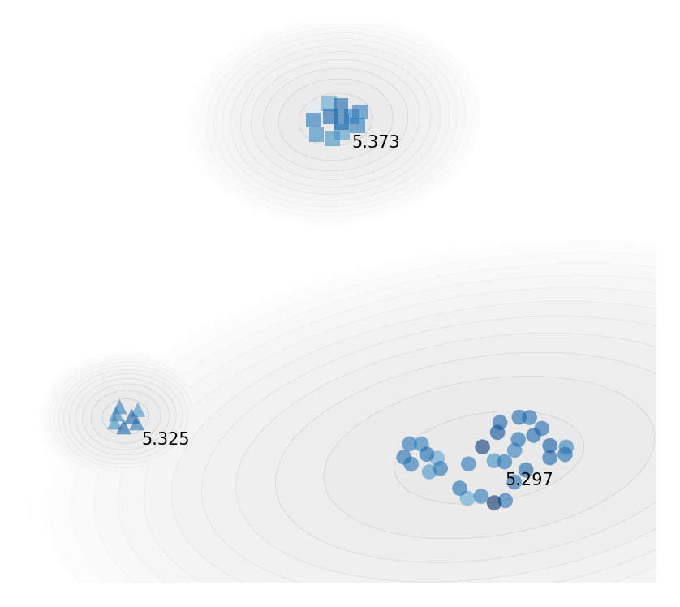
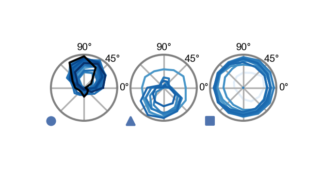
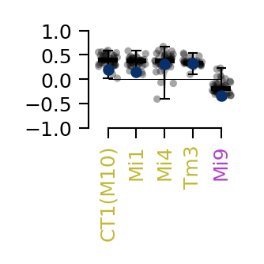
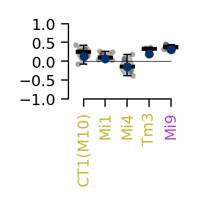
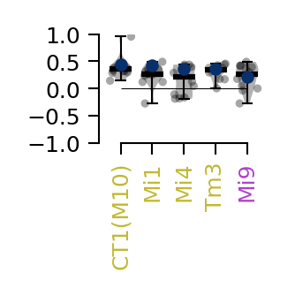

# Figure 3


```python
%load_ext autoreload
%autoreload 2

from flyvis import EnsembleView
```


```python
ensemble = EnsembleView("flow/0000")
```


    Loading ensemble:   0%|          | 0/50 [00:00<?, ?it/s]


    [2024-12-08 19:44:37] ensemble:166 Loaded 50 networks.


## a


```python
task_error = ensemble.task_error()
```


```python
embedding_and_clustering = ensemble.clustering("T4c")
```

    [2024-12-08 19:44:39] clustering:835 Loaded T4c embedding and clustering from ../flyvis/data/results/flow/0000/umap_and_clustering


```python
embeddingplot = embedding_and_clustering.plot(
    task_error=task_error.values, colors=task_error.colors
)
```





## b


```python
import numpy as np
import matplotlib.pyplot as plt

from flyvis.analysis.visualization import plt_utils
from flyvis.analysis.moving_bar_responses import plot_angular_tuning
```


```python
cluster_indices = ensemble.cluster_indices("T4c")
```


```python
r = ensemble.moving_edge_responses()
r['responses'] /= np.abs(r['responses']).max(dim=('frame', 'sample'))
```

    ../flyvis/data/results/flow/0000/000/__cache__/flyvis/analysis/stimulus_responses/compute_responses/e236e47b9a57dc6d7b692906aca84495/output.h5
    ../flyvis/data/results/flow/0000/001/__cache__/flyvis/analysis/stimulus_responses/compute_responses/2a1519d1c3b8bf0d0776e8ff2618353d/output.h5
    ../flyvis/data/results/flow/0000/002/__cache__/flyvis/analysis/stimulus_responses/compute_responses/787654b3c56e4015939e72adfa768448/output.h5
    ../flyvis/data/results/flow/0000/003/__cache__/flyvis/analysis/stimulus_responses/compute_responses/9d4697cbfdcda0d4b910d26a3f48a2dd/output.h5
    ../flyvis/data/results/flow/0000/004/__cache__/flyvis/analysis/stimulus_responses/compute_responses/546ffb3b9036631dbb8bc4f2d8c3639f/output.h5
    ../flyvis/data/results/flow/0000/005/__cache__/flyvis/analysis/stimulus_responses/compute_responses/3fd5d79c2106974104a0362fd7e725a9/output.h5
    ../flyvis/data/results/flow/0000/006/__cache__/flyvis/analysis/stimulus_responses/compute_responses/2ed32905ad23f346996a76987694ac26/output.h5
    ../flyvis/data/results/flow/0000/007/__cache__/flyvis/analysis/stimulus_responses/compute_responses/13a800f25b57556abf12f6548482733b/output.h5
    ../flyvis/data/results/flow/0000/008/__cache__/flyvis/analysis/stimulus_responses/compute_responses/c965f6ca1b4766760aff06bb066dcc4b/output.h5
    ../flyvis/data/results/flow/0000/009/__cache__/flyvis/analysis/stimulus_responses/compute_responses/829fa2f59d755e13c7c04fd5a1a579bc/output.h5
    ../flyvis/data/results/flow/0000/010/__cache__/flyvis/analysis/stimulus_responses/compute_responses/466b4cd31001f19423c507e2f3773c41/output.h5
    ../flyvis/data/results/flow/0000/011/__cache__/flyvis/analysis/stimulus_responses/compute_responses/9d71a4899b11135e9e39f192e82f06e0/output.h5
    ../flyvis/data/results/flow/0000/012/__cache__/flyvis/analysis/stimulus_responses/compute_responses/ba1826533e24098d930150b0168b01cf/output.h5
    ../flyvis/data/results/flow/0000/013/__cache__/flyvis/analysis/stimulus_responses/compute_responses/6662e8bb61523d17742c9dd11aa62eeb/output.h5
    ../flyvis/data/results/flow/0000/014/__cache__/flyvis/analysis/stimulus_responses/compute_responses/cc480f1ea566ea82bfd19fcdf78cc27e/output.h5
    ../flyvis/data/results/flow/0000/015/__cache__/flyvis/analysis/stimulus_responses/compute_responses/8bd5ed52daae786768e228fb58cd3210/output.h5
    ../flyvis/data/results/flow/0000/016/__cache__/flyvis/analysis/stimulus_responses/compute_responses/9db907610103a5d3087f87ca0c71a079/output.h5
    ../flyvis/data/results/flow/0000/017/__cache__/flyvis/analysis/stimulus_responses/compute_responses/a12d63acadac2a74de55632d4cbabfe6/output.h5
    ../flyvis/data/results/flow/0000/018/__cache__/flyvis/analysis/stimulus_responses/compute_responses/2f9340bb144de1c040c6f2a9b58a8376/output.h5
    ../flyvis/data/results/flow/0000/019/__cache__/flyvis/analysis/stimulus_responses/compute_responses/e54f818c033f10227d1c003fc779b0c6/output.h5
    ../flyvis/data/results/flow/0000/020/__cache__/flyvis/analysis/stimulus_responses/compute_responses/ab7e02a752bf6ee954804773846aa1d7/output.h5
    ../flyvis/data/results/flow/0000/021/__cache__/flyvis/analysis/stimulus_responses/compute_responses/f5d6259ad9e757467b9ad037056132b8/output.h5
    ../flyvis/data/results/flow/0000/022/__cache__/flyvis/analysis/stimulus_responses/compute_responses/968df97051a8ce2c4cf1a05f4b19359b/output.h5
    ../flyvis/data/results/flow/0000/023/__cache__/flyvis/analysis/stimulus_responses/compute_responses/9f89eb2dfe2edd056df6f20260a22445/output.h5
    ../flyvis/data/results/flow/0000/024/__cache__/flyvis/analysis/stimulus_responses/compute_responses/9f08ba3ff4e47076a25f868011998fae/output.h5
    ../flyvis/data/results/flow/0000/025/__cache__/flyvis/analysis/stimulus_responses/compute_responses/5d8879e61a3f98f4f81ff3cc31f67f3c/output.h5
    ../flyvis/data/results/flow/0000/026/__cache__/flyvis/analysis/stimulus_responses/compute_responses/c8ed3248070002d27bd42b83e49e1eb2/output.h5
    ../flyvis/data/results/flow/0000/027/__cache__/flyvis/analysis/stimulus_responses/compute_responses/0efca814750b326442bb2057c2a3141d/output.h5
    ../flyvis/data/results/flow/0000/028/__cache__/flyvis/analysis/stimulus_responses/compute_responses/875bc3ea335ae2f70612495aa9a753c4/output.h5
    ../flyvis/data/results/flow/0000/029/__cache__/flyvis/analysis/stimulus_responses/compute_responses/383a5857257bc8be754e28b37b2e4e79/output.h5
    ../flyvis/data/results/flow/0000/030/__cache__/flyvis/analysis/stimulus_responses/compute_responses/ab8a858f91290a52306a0bb6f9545ed5/output.h5
    ../flyvis/data/results/flow/0000/031/__cache__/flyvis/analysis/stimulus_responses/compute_responses/1481eb1faa2b00dcc79036a1bf9f3b9b/output.h5
    ../flyvis/data/results/flow/0000/032/__cache__/flyvis/analysis/stimulus_responses/compute_responses/ac160912a60ac748329b349c16ba207f/output.h5
    ../flyvis/data/results/flow/0000/033/__cache__/flyvis/analysis/stimulus_responses/compute_responses/660978a75b531be9c285d84986160ca6/output.h5
    ../flyvis/data/results/flow/0000/034/__cache__/flyvis/analysis/stimulus_responses/compute_responses/fa00c670234802d529e1981655483861/output.h5
    ../flyvis/data/results/flow/0000/035/__cache__/flyvis/analysis/stimulus_responses/compute_responses/1ae43649496d389d88bc56ca7ccaa383/output.h5
    ../flyvis/data/results/flow/0000/036/__cache__/flyvis/analysis/stimulus_responses/compute_responses/d50ab62a3869886437176a4ecf124d75/output.h5
    ../flyvis/data/results/flow/0000/037/__cache__/flyvis/analysis/stimulus_responses/compute_responses/37238a6c41451b197bc11f3c37aef4f2/output.h5
    ../flyvis/data/results/flow/0000/038/__cache__/flyvis/analysis/stimulus_responses/compute_responses/9cfa9e971c84bc253c53fbfea3c7ebe6/output.h5
    ../flyvis/data/results/flow/0000/039/__cache__/flyvis/analysis/stimulus_responses/compute_responses/95010c81b682cb979ff3b4f2a6aa6576/output.h5
    ../flyvis/data/results/flow/0000/040/__cache__/flyvis/analysis/stimulus_responses/compute_responses/fc266127c935e1835cf20757d3fe581c/output.h5
    ../flyvis/data/results/flow/0000/041/__cache__/flyvis/analysis/stimulus_responses/compute_responses/1e5972877c3873b7a1aac86a2f4bba75/output.h5
    ../flyvis/data/results/flow/0000/042/__cache__/flyvis/analysis/stimulus_responses/compute_responses/b6af0cb714a199fda52a11619981cb0d/output.h5
    ../flyvis/data/results/flow/0000/043/__cache__/flyvis/analysis/stimulus_responses/compute_responses/8292e9a29c31b23123bfa531f9b24d9b/output.h5
    ../flyvis/data/results/flow/0000/044/__cache__/flyvis/analysis/stimulus_responses/compute_responses/8b0eda1e0717ec0690d6766e688dace7/output.h5
    ../flyvis/data/results/flow/0000/045/__cache__/flyvis/analysis/stimulus_responses/compute_responses/c95394b9922b11a072e992c8d4e2feb5/output.h5
    ../flyvis/data/results/flow/0000/046/__cache__/flyvis/analysis/stimulus_responses/compute_responses/439ba05c490dac452c5aa3fafed9fe9f/output.h5
    ../flyvis/data/results/flow/0000/047/__cache__/flyvis/analysis/stimulus_responses/compute_responses/c6894caf2471e76e06aa04f0073d8af5/output.h5
    ../flyvis/data/results/flow/0000/048/__cache__/flyvis/analysis/stimulus_responses/compute_responses/3c149c1b1c09ff2c958605cf994742a2/output.h5
    ../flyvis/data/results/flow/0000/049/__cache__/flyvis/analysis/stimulus_responses/compute_responses/ae15b6627cbbd1ce3802b4b74fc69e66/output.h5


```python
cluster_indices = ensemble.cluster_indices("T4c")
```


```python
colors = ensemble.task_error().colors
```


```python
fig, axes = plt.subplots(
    1, len(cluster_indices), subplot_kw={"projection": "polar"}, figsize=[2, 1]
)
for cluster_id, indices in cluster_indices.items():
    plot_angular_tuning(
        r.sel(network_id=indices),
        "T4c",
        intensity=1,
        colors=colors[indices],
        zorder=ensemble.zorder()[indices],
        groundtruth=True if cluster_id == 0 else False,
        fig=fig,
        ax=axes[cluster_id],
    )
    plt_utils.add_cluster_marker(
        fig, axes[cluster_id], marker=plt_utils.get_marker(cluster_id)
    )
```





## e


```python
for cluster_id, indices in cluster_indices.items():
    with ensemble.select_items(indices):
        fig, ax = ensemble.flash_response_index(
            cell_types=["Mi1", "Tm3", "Mi4", "Mi9", "CT1(M10)"], figsize=[1, 1]
        )
```

    ../flyvis/data/results/flow/0000/000/__cache__/flyvis/analysis/stimulus_responses/compute_responses/d9d302eebb41d955bb76dcf9d6ce623a/output.h5
    ../flyvis/data/results/flow/0000/001/__cache__/flyvis/analysis/stimulus_responses/compute_responses/13f5d9136003d68fa860867f0ed89c64/output.h5
    ../flyvis/data/results/flow/0000/002/__cache__/flyvis/analysis/stimulus_responses/compute_responses/6ec38263ed72b3a302f55bd519d68643/output.h5
    ../flyvis/data/results/flow/0000/003/__cache__/flyvis/analysis/stimulus_responses/compute_responses/048c1466b844b8be367b875fab782256/output.h5
    ../flyvis/data/results/flow/0000/006/__cache__/flyvis/analysis/stimulus_responses/compute_responses/561c8275f604bf5964ebd8efa2ab0838/output.h5
    ../flyvis/data/results/flow/0000/007/__cache__/flyvis/analysis/stimulus_responses/compute_responses/c8420baf27ddfbc229fec85b8f120585/output.h5
    ../flyvis/data/results/flow/0000/009/__cache__/flyvis/analysis/stimulus_responses/compute_responses/cdc3f7c2ec749662cacbbdcfab68b20c/output.h5
    ../flyvis/data/results/flow/0000/011/__cache__/flyvis/analysis/stimulus_responses/compute_responses/fbe28b2c3479ad70f2bf834804a2f2e4/output.h5
    ../flyvis/data/results/flow/0000/012/__cache__/flyvis/analysis/stimulus_responses/compute_responses/2be1d7c4107840002da135361590bfd2/output.h5
    ../flyvis/data/results/flow/0000/013/__cache__/flyvis/analysis/stimulus_responses/compute_responses/da9d8f4c595528a025e132eafd136811/output.h5
    ../flyvis/data/results/flow/0000/014/__cache__/flyvis/analysis/stimulus_responses/compute_responses/d7ee5201fbdff9af915c98ec360d965d/output.h5
    ../flyvis/data/results/flow/0000/016/__cache__/flyvis/analysis/stimulus_responses/compute_responses/14b3ea9edce7830400c706c4e5cfd837/output.h5
    ../flyvis/data/results/flow/0000/017/__cache__/flyvis/analysis/stimulus_responses/compute_responses/c38d25e378ccf53e2b1a82d07ae7bd36/output.h5
    ../flyvis/data/results/flow/0000/018/__cache__/flyvis/analysis/stimulus_responses/compute_responses/b024899a3bdb9e8e5b8d61e3a31a3a93/output.h5
    ../flyvis/data/results/flow/0000/019/__cache__/flyvis/analysis/stimulus_responses/compute_responses/ad1a12821e91231ee3904730e966f606/output.h5
    ../flyvis/data/results/flow/0000/020/__cache__/flyvis/analysis/stimulus_responses/compute_responses/f50d3ad3e852e9ea84ff525c72852342/output.h5
    ../flyvis/data/results/flow/0000/021/__cache__/flyvis/analysis/stimulus_responses/compute_responses/f7b363e64c33457a02edda9fddc79146/output.h5
    ../flyvis/data/results/flow/0000/022/__cache__/flyvis/analysis/stimulus_responses/compute_responses/269b129996eac25aa41126c7d9c82d8e/output.h5
    ../flyvis/data/results/flow/0000/023/__cache__/flyvis/analysis/stimulus_responses/compute_responses/97c93292d143ae87f6eef3481ab4e599/output.h5
    ../flyvis/data/results/flow/0000/024/__cache__/flyvis/analysis/stimulus_responses/compute_responses/27117719316168e5da83fb6fd2139c91/output.h5
    ../flyvis/data/results/flow/0000/027/__cache__/flyvis/analysis/stimulus_responses/compute_responses/7f0e081bc0267c61950be3747b17018e/output.h5
    ../flyvis/data/results/flow/0000/029/__cache__/flyvis/analysis/stimulus_responses/compute_responses/dfcd7b1252d46090bf7800d71a0dae87/output.h5
    ../flyvis/data/results/flow/0000/030/__cache__/flyvis/analysis/stimulus_responses/compute_responses/ce586787c6012312271bdbae030a2421/output.h5
    ../flyvis/data/results/flow/0000/031/__cache__/flyvis/analysis/stimulus_responses/compute_responses/89765426d20cb4128e6ae2f6e40935b1/output.h5
    ../flyvis/data/results/flow/0000/035/__cache__/flyvis/analysis/stimulus_responses/compute_responses/48821b4559120bcbf7849cb9626a9ae8/output.h5
    ../flyvis/data/results/flow/0000/036/__cache__/flyvis/analysis/stimulus_responses/compute_responses/d40898560e671ce6e500f4630ae947df/output.h5
    ../flyvis/data/results/flow/0000/037/__cache__/flyvis/analysis/stimulus_responses/compute_responses/10b8f7a7549287ca405c81dcf3041654/output.h5
    ../flyvis/data/results/flow/0000/042/__cache__/flyvis/analysis/stimulus_responses/compute_responses/63675086df41498a9cede772e2978d2d/output.h5
    ../flyvis/data/results/flow/0000/044/__cache__/flyvis/analysis/stimulus_responses/compute_responses/ab99f826d34e249fc1f2cea8fd747e87/output.h5
    ../flyvis/data/results/flow/0000/047/__cache__/flyvis/analysis/stimulus_responses/compute_responses/cadc6df1cbe896cc9b1c8ce54a026223/output.h5
    ../flyvis/data/results/flow/0000/048/__cache__/flyvis/analysis/stimulus_responses/compute_responses/c197fa3e757aabcad536066c410c129d/output.h5
    ../flyvis/data/results/flow/0000/004/__cache__/flyvis/analysis/stimulus_responses/compute_responses/ca0abb0d8af62ceb2b9ad8b3d991eb06/output.h5
    ../flyvis/data/results/flow/0000/005/__cache__/flyvis/analysis/stimulus_responses/compute_responses/ecc4b64ad753e775719a388d36fec0d5/output.h5
    ../flyvis/data/results/flow/0000/026/__cache__/flyvis/analysis/stimulus_responses/compute_responses/e42d0947783fb6e20b6fa64e52673736/output.h5
    ../flyvis/data/results/flow/0000/033/__cache__/flyvis/analysis/stimulus_responses/compute_responses/35a1b2051f95863d9d2f6c714664dbc6/output.h5
    ../flyvis/data/results/flow/0000/038/__cache__/flyvis/analysis/stimulus_responses/compute_responses/1cd4c76720f4c5f4d8a509115b3421be/output.h5
    ../flyvis/data/results/flow/0000/040/__cache__/flyvis/analysis/stimulus_responses/compute_responses/1e029ce12c4b5abe92e2ab758b5a8b7c/output.h5
    ../flyvis/data/results/flow/0000/043/__cache__/flyvis/analysis/stimulus_responses/compute_responses/7e62723760ce9fae5aeba8f21520fe27/output.h5
    ../flyvis/data/results/flow/0000/008/__cache__/flyvis/analysis/stimulus_responses/compute_responses/18355da7c1c7de01840b2535fdb35be5/output.h5
    ../flyvis/data/results/flow/0000/010/__cache__/flyvis/analysis/stimulus_responses/compute_responses/3b636f6044f1d054e1582b8c59e33d45/output.h5
    ../flyvis/data/results/flow/0000/015/__cache__/flyvis/analysis/stimulus_responses/compute_responses/dc3021b6d874259ce680448aa18aa720/output.h5
    ../flyvis/data/results/flow/0000/025/__cache__/flyvis/analysis/stimulus_responses/compute_responses/e249fd943a7b3a8f2c2512b1fed770a4/output.h5
    ../flyvis/data/results/flow/0000/028/__cache__/flyvis/analysis/stimulus_responses/compute_responses/6bf68b3fedc6377305eb2af5a7454ed8/output.h5
    ../flyvis/data/results/flow/0000/032/__cache__/flyvis/analysis/stimulus_responses/compute_responses/979bf63975c42bf9ccb591d82329a063/output.h5
    ../flyvis/data/results/flow/0000/034/__cache__/flyvis/analysis/stimulus_responses/compute_responses/b586edc75eed4b51d57fe25bef5e0bbf/output.h5
    ../flyvis/data/results/flow/0000/039/__cache__/flyvis/analysis/stimulus_responses/compute_responses/aefa5c9c78a5707480818c28b6385e0e/output.h5
    ../flyvis/data/results/flow/0000/041/__cache__/flyvis/analysis/stimulus_responses/compute_responses/d5692ff7246fc52a58c5ac0b3355f98c/output.h5
    ../flyvis/data/results/flow/0000/045/__cache__/flyvis/analysis/stimulus_responses/compute_responses/9e47796714a9a70117ea8f9c391e5d29/output.h5
    ../flyvis/data/results/flow/0000/046/__cache__/flyvis/analysis/stimulus_responses/compute_responses/a0f340a824a87d2dbc00cd667c820565/output.h5
    ../flyvis/data/results/flow/0000/049/__cache__/flyvis/analysis/stimulus_responses/compute_responses/5ab3bc543bff7cd96820551969819039/output.h5









