# Figure 4

## a


```python
%load_ext autoreload
%autoreload 2

import matplotlib.pyplot as plt
import numpy as np

from flyvis import EnsembleView
from flyvis.analysis.visualization import plots
from flyvis.analysis.moving_bar_responses import plot_angular_tuning
```


```python
ensemble = EnsembleView("flow/0000")
```


    Loading ensemble:   0%|          | 0/50 [00:00<?, ?it/s]


    [2024-12-08 19:45:35] ensemble:166 Loaded 50 networks.


```python
stims_and_resps = ensemble.moving_edge_responses()
```

    ../flyvis/data/results/flow/0000/000/__cache__/flyvis/analysis/stimulus_responses/compute_responses/e236e47b9a57dc6d7b692906aca84495/output.h5
    ../flyvis/data/results/flow/0000/001/__cache__/flyvis/analysis/stimulus_responses/compute_responses/2a1519d1c3b8bf0d0776e8ff2618353d/output.h5
    ../flyvis/data/results/flow/0000/002/__cache__/flyvis/analysis/stimulus_responses/compute_responses/787654b3c56e4015939e72adfa768448/output.h5
    ../flyvis/data/results/flow/0000/003/__cache__/flyvis/analysis/stimulus_responses/compute_responses/9d4697cbfdcda0d4b910d26a3f48a2dd/output.h5
    ../flyvis/data/results/flow/0000/004/__cache__/flyvis/analysis/stimulus_responses/compute_responses/546ffb3b9036631dbb8bc4f2d8c3639f/output.h5
    ../flyvis/data/results/flow/0000/005/__cache__/flyvis/analysis/stimulus_responses/compute_responses/3fd5d79c2106974104a0362fd7e725a9/output.h5
    ../flyvis/data/results/flow/0000/006/__cache__/flyvis/analysis/stimulus_responses/compute_responses/2ed32905ad23f346996a76987694ac26/output.h5
    ../flyvis/data/results/flow/0000/007/__cache__/flyvis/analysis/stimulus_responses/compute_responses/13a800f25b57556abf12f6548482733b/output.h5
    ../flyvis/data/results/flow/0000/008/__cache__/flyvis/analysis/stimulus_responses/compute_responses/c965f6ca1b4766760aff06bb066dcc4b/output.h5
    ../flyvis/data/results/flow/0000/009/__cache__/flyvis/analysis/stimulus_responses/compute_responses/829fa2f59d755e13c7c04fd5a1a579bc/output.h5
    ../flyvis/data/results/flow/0000/010/__cache__/flyvis/analysis/stimulus_responses/compute_responses/466b4cd31001f19423c507e2f3773c41/output.h5
    ../flyvis/data/results/flow/0000/011/__cache__/flyvis/analysis/stimulus_responses/compute_responses/9d71a4899b11135e9e39f192e82f06e0/output.h5
    ../flyvis/data/results/flow/0000/012/__cache__/flyvis/analysis/stimulus_responses/compute_responses/ba1826533e24098d930150b0168b01cf/output.h5
    ../flyvis/data/results/flow/0000/013/__cache__/flyvis/analysis/stimulus_responses/compute_responses/6662e8bb61523d17742c9dd11aa62eeb/output.h5
    ../flyvis/data/results/flow/0000/014/__cache__/flyvis/analysis/stimulus_responses/compute_responses/cc480f1ea566ea82bfd19fcdf78cc27e/output.h5
    ../flyvis/data/results/flow/0000/015/__cache__/flyvis/analysis/stimulus_responses/compute_responses/8bd5ed52daae786768e228fb58cd3210/output.h5
    ../flyvis/data/results/flow/0000/016/__cache__/flyvis/analysis/stimulus_responses/compute_responses/9db907610103a5d3087f87ca0c71a079/output.h5
    ../flyvis/data/results/flow/0000/017/__cache__/flyvis/analysis/stimulus_responses/compute_responses/a12d63acadac2a74de55632d4cbabfe6/output.h5
    ../flyvis/data/results/flow/0000/018/__cache__/flyvis/analysis/stimulus_responses/compute_responses/2f9340bb144de1c040c6f2a9b58a8376/output.h5
    ../flyvis/data/results/flow/0000/019/__cache__/flyvis/analysis/stimulus_responses/compute_responses/e54f818c033f10227d1c003fc779b0c6/output.h5
    ../flyvis/data/results/flow/0000/020/__cache__/flyvis/analysis/stimulus_responses/compute_responses/ab7e02a752bf6ee954804773846aa1d7/output.h5
    ../flyvis/data/results/flow/0000/021/__cache__/flyvis/analysis/stimulus_responses/compute_responses/f5d6259ad9e757467b9ad037056132b8/output.h5
    ../flyvis/data/results/flow/0000/022/__cache__/flyvis/analysis/stimulus_responses/compute_responses/968df97051a8ce2c4cf1a05f4b19359b/output.h5
    ../flyvis/data/results/flow/0000/023/__cache__/flyvis/analysis/stimulus_responses/compute_responses/9f89eb2dfe2edd056df6f20260a22445/output.h5
    ../flyvis/data/results/flow/0000/024/__cache__/flyvis/analysis/stimulus_responses/compute_responses/9f08ba3ff4e47076a25f868011998fae/output.h5
    ../flyvis/data/results/flow/0000/025/__cache__/flyvis/analysis/stimulus_responses/compute_responses/5d8879e61a3f98f4f81ff3cc31f67f3c/output.h5
    ../flyvis/data/results/flow/0000/026/__cache__/flyvis/analysis/stimulus_responses/compute_responses/c8ed3248070002d27bd42b83e49e1eb2/output.h5
    ../flyvis/data/results/flow/0000/027/__cache__/flyvis/analysis/stimulus_responses/compute_responses/0efca814750b326442bb2057c2a3141d/output.h5
    ../flyvis/data/results/flow/0000/028/__cache__/flyvis/analysis/stimulus_responses/compute_responses/875bc3ea335ae2f70612495aa9a753c4/output.h5
    ../flyvis/data/results/flow/0000/029/__cache__/flyvis/analysis/stimulus_responses/compute_responses/383a5857257bc8be754e28b37b2e4e79/output.h5
    ../flyvis/data/results/flow/0000/030/__cache__/flyvis/analysis/stimulus_responses/compute_responses/ab8a858f91290a52306a0bb6f9545ed5/output.h5
    ../flyvis/data/results/flow/0000/031/__cache__/flyvis/analysis/stimulus_responses/compute_responses/1481eb1faa2b00dcc79036a1bf9f3b9b/output.h5
    ../flyvis/data/results/flow/0000/032/__cache__/flyvis/analysis/stimulus_responses/compute_responses/ac160912a60ac748329b349c16ba207f/output.h5
    ../flyvis/data/results/flow/0000/033/__cache__/flyvis/analysis/stimulus_responses/compute_responses/660978a75b531be9c285d84986160ca6/output.h5
    ../flyvis/data/results/flow/0000/034/__cache__/flyvis/analysis/stimulus_responses/compute_responses/fa00c670234802d529e1981655483861/output.h5
    ../flyvis/data/results/flow/0000/035/__cache__/flyvis/analysis/stimulus_responses/compute_responses/1ae43649496d389d88bc56ca7ccaa383/output.h5
    ../flyvis/data/results/flow/0000/036/__cache__/flyvis/analysis/stimulus_responses/compute_responses/d50ab62a3869886437176a4ecf124d75/output.h5
    ../flyvis/data/results/flow/0000/037/__cache__/flyvis/analysis/stimulus_responses/compute_responses/37238a6c41451b197bc11f3c37aef4f2/output.h5
    ../flyvis/data/results/flow/0000/038/__cache__/flyvis/analysis/stimulus_responses/compute_responses/9cfa9e971c84bc253c53fbfea3c7ebe6/output.h5
    ../flyvis/data/results/flow/0000/039/__cache__/flyvis/analysis/stimulus_responses/compute_responses/95010c81b682cb979ff3b4f2a6aa6576/output.h5
    ../flyvis/data/results/flow/0000/040/__cache__/flyvis/analysis/stimulus_responses/compute_responses/fc266127c935e1835cf20757d3fe581c/output.h5
    ../flyvis/data/results/flow/0000/041/__cache__/flyvis/analysis/stimulus_responses/compute_responses/1e5972877c3873b7a1aac86a2f4bba75/output.h5
    ../flyvis/data/results/flow/0000/042/__cache__/flyvis/analysis/stimulus_responses/compute_responses/b6af0cb714a199fda52a11619981cb0d/output.h5
    ../flyvis/data/results/flow/0000/043/__cache__/flyvis/analysis/stimulus_responses/compute_responses/8292e9a29c31b23123bfa531f9b24d9b/output.h5
    ../flyvis/data/results/flow/0000/044/__cache__/flyvis/analysis/stimulus_responses/compute_responses/8b0eda1e0717ec0690d6766e688dace7/output.h5
    ../flyvis/data/results/flow/0000/045/__cache__/flyvis/analysis/stimulus_responses/compute_responses/c95394b9922b11a072e992c8d4e2feb5/output.h5
    ../flyvis/data/results/flow/0000/046/__cache__/flyvis/analysis/stimulus_responses/compute_responses/439ba05c490dac452c5aa3fafed9fe9f/output.h5
    ../flyvis/data/results/flow/0000/047/__cache__/flyvis/analysis/stimulus_responses/compute_responses/c6894caf2471e76e06aa04f0073d8af5/output.h5
    ../flyvis/data/results/flow/0000/048/__cache__/flyvis/analysis/stimulus_responses/compute_responses/3c149c1b1c09ff2c958605cf994742a2/output.h5
    ../flyvis/data/results/flow/0000/049/__cache__/flyvis/analysis/stimulus_responses/compute_responses/ae15b6627cbbd1ce3802b4b74fc69e66/output.h5


```python
stims_and_resps['responses'] /= (norm := ensemble.responses_norm(rectified=True))
```

    ../flyvis/data/results/flow/0000/000/__cache__/flyvis/analysis/stimulus_responses/compute_responses/86b080e815ea9ec928a380df83961c32/output.h5
    ../flyvis/data/results/flow/0000/001/__cache__/flyvis/analysis/stimulus_responses/compute_responses/b59b4553d26177882434e7a38fcb1f36/output.h5
    ../flyvis/data/results/flow/0000/002/__cache__/flyvis/analysis/stimulus_responses/compute_responses/34edb9af3c92827b50340e6903d4f04c/output.h5
    ../flyvis/data/results/flow/0000/003/__cache__/flyvis/analysis/stimulus_responses/compute_responses/6d4092c24a8f5e5ea8a651c5d62a4cb1/output.h5
    ../flyvis/data/results/flow/0000/004/__cache__/flyvis/analysis/stimulus_responses/compute_responses/f60dd61be87e6f68b35174932ea805a3/output.h5
    ../flyvis/data/results/flow/0000/005/__cache__/flyvis/analysis/stimulus_responses/compute_responses/f680e802d1c70a1263dd82076bf33a36/output.h5
    ../flyvis/data/results/flow/0000/006/__cache__/flyvis/analysis/stimulus_responses/compute_responses/04b4c82e6a1f299e0a95ce53517d4da6/output.h5
    ../flyvis/data/results/flow/0000/007/__cache__/flyvis/analysis/stimulus_responses/compute_responses/56af0790abaf8e03689c4950c6dea1b6/output.h5
    ../flyvis/data/results/flow/0000/008/__cache__/flyvis/analysis/stimulus_responses/compute_responses/fe446c2e81fb5c187996c349bf81fc75/output.h5
    ../flyvis/data/results/flow/0000/009/__cache__/flyvis/analysis/stimulus_responses/compute_responses/39a60bf26ca578c6f8a61ade8fc76594/output.h5
    ../flyvis/data/results/flow/0000/010/__cache__/flyvis/analysis/stimulus_responses/compute_responses/bd1d5ba31d334757b630351b33f3c7c8/output.h5
    ../flyvis/data/results/flow/0000/011/__cache__/flyvis/analysis/stimulus_responses/compute_responses/78fbe4ae4959a666c6937dd423b9020b/output.h5
    ../flyvis/data/results/flow/0000/012/__cache__/flyvis/analysis/stimulus_responses/compute_responses/e4b5a3ca0a903bbb40acb438b1f79e9c/output.h5
    ../flyvis/data/results/flow/0000/013/__cache__/flyvis/analysis/stimulus_responses/compute_responses/34543762cd47e40c949ca970749e77e3/output.h5
    ../flyvis/data/results/flow/0000/014/__cache__/flyvis/analysis/stimulus_responses/compute_responses/2801e68f00e754372714a56be09caf9f/output.h5
    ../flyvis/data/results/flow/0000/015/__cache__/flyvis/analysis/stimulus_responses/compute_responses/42f01aafe2d1710ab594ae807a362bd9/output.h5
    ../flyvis/data/results/flow/0000/016/__cache__/flyvis/analysis/stimulus_responses/compute_responses/b94b14adb8899e4eccc118660ea958c7/output.h5
    ../flyvis/data/results/flow/0000/017/__cache__/flyvis/analysis/stimulus_responses/compute_responses/9410fc09859bbade170b51880731dea9/output.h5
    ../flyvis/data/results/flow/0000/018/__cache__/flyvis/analysis/stimulus_responses/compute_responses/544420c7e8246afcd778ee0b353106db/output.h5
    ../flyvis/data/results/flow/0000/019/__cache__/flyvis/analysis/stimulus_responses/compute_responses/8dacb927f956aa97478480571577228d/output.h5
    ../flyvis/data/results/flow/0000/020/__cache__/flyvis/analysis/stimulus_responses/compute_responses/531b4dc891cbcd37ac5f86738293c135/output.h5
    ../flyvis/data/results/flow/0000/021/__cache__/flyvis/analysis/stimulus_responses/compute_responses/03684bc5f57d843f1716241f9a0fae72/output.h5
    ../flyvis/data/results/flow/0000/022/__cache__/flyvis/analysis/stimulus_responses/compute_responses/b990cd15cf042aa0355aa481aa7d6b41/output.h5
    ../flyvis/data/results/flow/0000/023/__cache__/flyvis/analysis/stimulus_responses/compute_responses/91cfee0552809c386b0a3e8eb754e6d6/output.h5
    ../flyvis/data/results/flow/0000/024/__cache__/flyvis/analysis/stimulus_responses/compute_responses/301b1b68961db10e21d4f7bcf56c9906/output.h5
    ../flyvis/data/results/flow/0000/025/__cache__/flyvis/analysis/stimulus_responses/compute_responses/fb26a6ba42c0925fa1021919378d8e27/output.h5
    ../flyvis/data/results/flow/0000/026/__cache__/flyvis/analysis/stimulus_responses/compute_responses/99a1c6ed825f339bda0b78dfbe6d96d3/output.h5
    ../flyvis/data/results/flow/0000/027/__cache__/flyvis/analysis/stimulus_responses/compute_responses/9b18d2b42700af7481eccf2d6fa67589/output.h5
    ../flyvis/data/results/flow/0000/028/__cache__/flyvis/analysis/stimulus_responses/compute_responses/528ab0ad496af746d023a6ba873ee0dc/output.h5
    ../flyvis/data/results/flow/0000/029/__cache__/flyvis/analysis/stimulus_responses/compute_responses/df9a3ba79ce02c718ae39f1b691c2074/output.h5
    ../flyvis/data/results/flow/0000/030/__cache__/flyvis/analysis/stimulus_responses/compute_responses/680207b961d14356a08d7e7e4749e59f/output.h5
    ../flyvis/data/results/flow/0000/031/__cache__/flyvis/analysis/stimulus_responses/compute_responses/407f839a987942f6e2856df581147e43/output.h5
    ../flyvis/data/results/flow/0000/032/__cache__/flyvis/analysis/stimulus_responses/compute_responses/dfd4875c806ccd1307ff6d7e804e1edf/output.h5
    ../flyvis/data/results/flow/0000/033/__cache__/flyvis/analysis/stimulus_responses/compute_responses/22cd80bc7c98d11c5065ad66d38157b6/output.h5
    ../flyvis/data/results/flow/0000/034/__cache__/flyvis/analysis/stimulus_responses/compute_responses/b6e433dcae4b37f7e59b29319839fc50/output.h5
    ../flyvis/data/results/flow/0000/035/__cache__/flyvis/analysis/stimulus_responses/compute_responses/31e5ac10422aa1e1ebabb64c7b173e3c/output.h5
    ../flyvis/data/results/flow/0000/036/__cache__/flyvis/analysis/stimulus_responses/compute_responses/4e94417495f0a61657c87c57fc87a1f0/output.h5
    ../flyvis/data/results/flow/0000/037/__cache__/flyvis/analysis/stimulus_responses/compute_responses/7f6e7c8a72d475d81acf839a74db4b38/output.h5
    ../flyvis/data/results/flow/0000/038/__cache__/flyvis/analysis/stimulus_responses/compute_responses/03f4135c61293835075130d011bd5d18/output.h5
    ../flyvis/data/results/flow/0000/039/__cache__/flyvis/analysis/stimulus_responses/compute_responses/448f5e3d0b9ad7043ab9d4c22f91dd34/output.h5
    ../flyvis/data/results/flow/0000/040/__cache__/flyvis/analysis/stimulus_responses/compute_responses/3e6c91f652149ed9c014bff467b93d6a/output.h5
    ../flyvis/data/results/flow/0000/041/__cache__/flyvis/analysis/stimulus_responses/compute_responses/69572eb846355916126a1c8cfef5274f/output.h5
    ../flyvis/data/results/flow/0000/042/__cache__/flyvis/analysis/stimulus_responses/compute_responses/f61388fda823e11dcc52a930c1ef3e93/output.h5
    ../flyvis/data/results/flow/0000/043/__cache__/flyvis/analysis/stimulus_responses/compute_responses/dea992edd01893cbdf4d5b27de0d49ad/output.h5
    ../flyvis/data/results/flow/0000/044/__cache__/flyvis/analysis/stimulus_responses/compute_responses/e81fe1e9587b7a4d7a1b5a4ebfd3c6c2/output.h5
    ../flyvis/data/results/flow/0000/045/__cache__/flyvis/analysis/stimulus_responses/compute_responses/5a1a4580bf311568a60974671660c5c8/output.h5
    ../flyvis/data/results/flow/0000/046/__cache__/flyvis/analysis/stimulus_responses/compute_responses/64f5f362d0a819dcf5666b901342c2c0/output.h5
    ../flyvis/data/results/flow/0000/047/__cache__/flyvis/analysis/stimulus_responses/compute_responses/185b9cebe11b9efe2a625627cb848cba/output.h5
    ../flyvis/data/results/flow/0000/048/__cache__/flyvis/analysis/stimulus_responses/compute_responses/1f72e3f57bfa4c1ddb6a6eee76cd02d4/output.h5
    ../flyvis/data/results/flow/0000/049/__cache__/flyvis/analysis/stimulus_responses/compute_responses/5afe04583aca5c1f5a960427a81ae439/output.h5


```python
# retrieve cluster indices for averaging across best clusters
cell_types = [
    "L1",
    "L2",
    "L3",
    "L4",
    "L5",
    "Mi1",
    "Tm3",
    "Mi4",
    "Mi9",
    "CT1(M10)",
    "T4a",
    "T4b",
    "T4c",
    "T4d",
    "T5a",
    "T5b",
    "T5c",
    "T5d",
    "Tm1",
    "Tm2",
    "Tm4",
    "Tm9",
    "CT1(Lo1)",
    "TmY3",
]
cluster_indices = {}
for cell_type in cell_types:
    if cell_type not in cluster_indices:
        cluster_indices[cell_type] = ensemble.cluster_indices(cell_type)
```

    [2024-12-08 19:46:03] clustering:835 Loaded L1 embedding and clustering from ../flyvis/data/results/flow/0000/umap_and_clustering
    [2024-12-08 19:46:05] clustering:835 Loaded L2 embedding and clustering from ../flyvis/data/results/flow/0000/umap_and_clustering
    [2024-12-08 19:46:05] clustering:835 Loaded L3 embedding and clustering from ../flyvis/data/results/flow/0000/umap_and_clustering
    [2024-12-08 19:46:05] clustering:835 Loaded L4 embedding and clustering from ../flyvis/data/results/flow/0000/umap_and_clustering
    [2024-12-08 19:46:06] clustering:835 Loaded L5 embedding and clustering from ../flyvis/data/results/flow/0000/umap_and_clustering
    [2024-12-08 19:46:06] clustering:835 Loaded Mi1 embedding and clustering from ../flyvis/data/results/flow/0000/umap_and_clustering
    [2024-12-08 19:46:06] clustering:835 Loaded Tm3 embedding and clustering from ../flyvis/data/results/flow/0000/umap_and_clustering
    [2024-12-08 19:46:08] clustering:835 Loaded Mi4 embedding and clustering from ../flyvis/data/results/flow/0000/umap_and_clustering
    [2024-12-08 19:46:08] clustering:835 Loaded Mi9 embedding and clustering from ../flyvis/data/results/flow/0000/umap_and_clustering
    [2024-12-08 19:46:08] clustering:835 Loaded CT1(M10) embedding and clustering from ../flyvis/data/results/flow/0000/umap_and_clustering
    [2024-12-08 19:46:09] clustering:835 Loaded T4a embedding and clustering from ../flyvis/data/results/flow/0000/umap_and_clustering
    [2024-12-08 19:46:09] clustering:835 Loaded T4b embedding and clustering from ../flyvis/data/results/flow/0000/umap_and_clustering
    [2024-12-08 19:46:09] clustering:835 Loaded T4c embedding and clustering from ../flyvis/data/results/flow/0000/umap_and_clustering
    [2024-12-08 19:46:11] clustering:835 Loaded T4d embedding and clustering from ../flyvis/data/results/flow/0000/umap_and_clustering
    [2024-12-08 19:46:11] clustering:835 Loaded T5a embedding and clustering from ../flyvis/data/results/flow/0000/umap_and_clustering
    [2024-12-08 19:46:11] clustering:835 Loaded T5b embedding and clustering from ../flyvis/data/results/flow/0000/umap_and_clustering
    [2024-12-08 19:46:12] clustering:835 Loaded T5c embedding and clustering from ../flyvis/data/results/flow/0000/umap_and_clustering
    [2024-12-08 19:46:12] clustering:835 Loaded T5d embedding and clustering from ../flyvis/data/results/flow/0000/umap_and_clustering
    [2024-12-08 19:46:12] clustering:835 Loaded Tm1 embedding and clustering from ../flyvis/data/results/flow/0000/umap_and_clustering
    [2024-12-08 19:46:14] clustering:835 Loaded Tm2 embedding and clustering from ../flyvis/data/results/flow/0000/umap_and_clustering
    [2024-12-08 19:46:14] clustering:835 Loaded Tm4 embedding and clustering from ../flyvis/data/results/flow/0000/umap_and_clustering
    [2024-12-08 19:46:14] clustering:835 Loaded Tm9 embedding and clustering from ../flyvis/data/results/flow/0000/umap_and_clustering
    [2024-12-08 19:46:15] clustering:835 Loaded CT1(Lo1) embedding and clustering from ../flyvis/data/results/flow/0000/umap_and_clustering
    [2024-12-08 19:46:15] clustering:835 Loaded TmY3 embedding and clustering from ../flyvis/data/results/flow/0000/umap_and_clustering


```python
# plot the tuning across the best clusters
fig, axes, _ = plots.plt_utils.get_axis_grid(
    range(4),
    projection="polar",
    aspect_ratio=4,
    figsize=[2.95, 0.83],
    wspace=0.25,
)
for i, cell_type in enumerate(["T4a", "T4b", "T4c", "T4d"]):
    plot_angular_tuning(
        stims_and_resps.sel(network_id=cluster_indices[cell_type][0]),
        cell_type=cell_type,
        intensity=1,
        fig=fig,
        ax=axes[i],
        groundtruth=True,
        groundtruth_linewidth=1.0,
        average_models=True,
        model_dim=2,
        zorder=100,
    )
    axes[i].set_xlabel(cell_type)
```


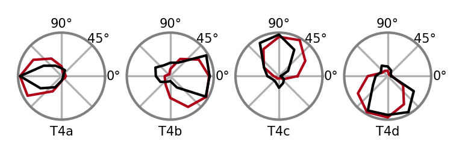


```python
fig, axes, _ = plots.plt_utils.get_axis_grid(
    range(4),
    projection="polar",
    aspect_ratio=4,
    figsize=[2.95, 0.83],
    wspace=0.25,
)
for i, cell_type in enumerate(["T5a", "T5b", "T5c", "T5d"]):
    plot_angular_tuning(
        stims_and_resps.sel(network_id=cluster_indices[cell_type][0]),
        cell_type=cell_type,
        intensity=0,
        fig=fig,
        ax=axes[i],
        groundtruth=True,
        groundtruth_linewidth=1.0,
        average_models=True,
        model_dim=2,
        zorder=100,
    )
    axes[i].set_xlabel(cell_type)
```


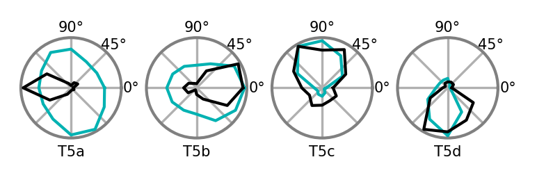


## b


```python
from datamate import namespacify

from flyvis.analysis.moving_edge_currents import CellTypeArray, MovingEdgeCurrentView
from flyvis.datasets import MovingEdge
```


```python
target_types = ["T4c"]
```


```python
experiment_data = ensemble.moving_edge_currents()
```

    ../flyvis/data/results/flow/0000/000/__cache__/flyvis/analysis/stimulus_responses_currents/compute_currents/76849b40141278cefcc862b3f6659ba5/output.h5
    ../flyvis/data/results/flow/0000/001/__cache__/flyvis/analysis/stimulus_responses_currents/compute_currents/8e6bd32c454c648680655e7f2871e627/output.h5
    ../flyvis/data/results/flow/0000/002/__cache__/flyvis/analysis/stimulus_responses_currents/compute_currents/d0ac7bb2ab7b7119a0bb1269cd683d08/output.h5
    ../flyvis/data/results/flow/0000/003/__cache__/flyvis/analysis/stimulus_responses_currents/compute_currents/653bdd4721187ae84e758dae9d6610f0/output.h5
    ../flyvis/data/results/flow/0000/004/__cache__/flyvis/analysis/stimulus_responses_currents/compute_currents/b0637f0887f5de9f484219d7554f5ffb/output.h5
    ../flyvis/data/results/flow/0000/005/__cache__/flyvis/analysis/stimulus_responses_currents/compute_currents/47d685de8eacb2aa9fbed5600963f93a/output.h5
    ../flyvis/data/results/flow/0000/006/__cache__/flyvis/analysis/stimulus_responses_currents/compute_currents/c3f961ff00a85da65c01b0782e6f426d/output.h5
    ../flyvis/data/results/flow/0000/007/__cache__/flyvis/analysis/stimulus_responses_currents/compute_currents/b2169b06bd2df3df137d4d8775135cb4/output.h5
    ../flyvis/data/results/flow/0000/008/__cache__/flyvis/analysis/stimulus_responses_currents/compute_currents/b383c0f13ffbcacb474a5570bef0b956/output.h5
    ../flyvis/data/results/flow/0000/009/__cache__/flyvis/analysis/stimulus_responses_currents/compute_currents/152983be8c045568382c7deae109d598/output.h5
    ../flyvis/data/results/flow/0000/010/__cache__/flyvis/analysis/stimulus_responses_currents/compute_currents/54b506f186ed4f283ce82065821190f6/output.h5
    ../flyvis/data/results/flow/0000/011/__cache__/flyvis/analysis/stimulus_responses_currents/compute_currents/9ee81ee2e0e5bf36be84d620906c04be/output.h5
    ../flyvis/data/results/flow/0000/012/__cache__/flyvis/analysis/stimulus_responses_currents/compute_currents/97d028f568a2280227679c7316e0d3dd/output.h5
    ../flyvis/data/results/flow/0000/013/__cache__/flyvis/analysis/stimulus_responses_currents/compute_currents/b119f33525d997bfe687ab27ff458d27/output.h5
    ../flyvis/data/results/flow/0000/014/__cache__/flyvis/analysis/stimulus_responses_currents/compute_currents/734a0ff8c13886f44ce7e5ba51c03fed/output.h5
    ../flyvis/data/results/flow/0000/015/__cache__/flyvis/analysis/stimulus_responses_currents/compute_currents/e652f08ceafef4705667feb6f9aacb02/output.h5
    ../flyvis/data/results/flow/0000/016/__cache__/flyvis/analysis/stimulus_responses_currents/compute_currents/5e6616fce254c1924baa42cc29d597a9/output.h5
    ../flyvis/data/results/flow/0000/017/__cache__/flyvis/analysis/stimulus_responses_currents/compute_currents/ebd7a1f764ab22a5b6f1c8b1893df890/output.h5
    ../flyvis/data/results/flow/0000/018/__cache__/flyvis/analysis/stimulus_responses_currents/compute_currents/f4514ad829f92ccb9c6fd79c080256bc/output.h5
    ../flyvis/data/results/flow/0000/019/__cache__/flyvis/analysis/stimulus_responses_currents/compute_currents/0b6767f45f458dc422881276cd939c80/output.h5
    ../flyvis/data/results/flow/0000/020/__cache__/flyvis/analysis/stimulus_responses_currents/compute_currents/eb288683bd310f9666cb370e12306e6b/output.h5
    ../flyvis/data/results/flow/0000/021/__cache__/flyvis/analysis/stimulus_responses_currents/compute_currents/0c6343091868c0781ce78c28e2b75318/output.h5
    ../flyvis/data/results/flow/0000/022/__cache__/flyvis/analysis/stimulus_responses_currents/compute_currents/14394b2b30865eac660ea23c50304853/output.h5
    ../flyvis/data/results/flow/0000/023/__cache__/flyvis/analysis/stimulus_responses_currents/compute_currents/bf27b7734da9d4024ae772b2dfa1b1d5/output.h5
    ../flyvis/data/results/flow/0000/024/__cache__/flyvis/analysis/stimulus_responses_currents/compute_currents/ae6f04eb0742ef804d762fe87b7c8ec8/output.h5
    ../flyvis/data/results/flow/0000/025/__cache__/flyvis/analysis/stimulus_responses_currents/compute_currents/f0d8af5b4c957e4739986fe6cb4ffe2d/output.h5
    ../flyvis/data/results/flow/0000/026/__cache__/flyvis/analysis/stimulus_responses_currents/compute_currents/c17a4ca007f66c5d941da038a71e74b5/output.h5
    ../flyvis/data/results/flow/0000/027/__cache__/flyvis/analysis/stimulus_responses_currents/compute_currents/6034c0727c9c3bb92b1ed4119cabc07a/output.h5
    ../flyvis/data/results/flow/0000/028/__cache__/flyvis/analysis/stimulus_responses_currents/compute_currents/164147b65952214516096a57220c2e59/output.h5
    ../flyvis/data/results/flow/0000/029/__cache__/flyvis/analysis/stimulus_responses_currents/compute_currents/6fbcc443e3b7bd76e97a7a42e17ebdcb/output.h5
    ../flyvis/data/results/flow/0000/030/__cache__/flyvis/analysis/stimulus_responses_currents/compute_currents/740e01f86bd0f4c6612c7331b9a6fdbc/output.h5
    ../flyvis/data/results/flow/0000/031/__cache__/flyvis/analysis/stimulus_responses_currents/compute_currents/2e747b63bc2246432bfca692e8934943/output.h5
    ../flyvis/data/results/flow/0000/032/__cache__/flyvis/analysis/stimulus_responses_currents/compute_currents/bcee34a67e5111c44b40938689bd75ad/output.h5
    ../flyvis/data/results/flow/0000/033/__cache__/flyvis/analysis/stimulus_responses_currents/compute_currents/2a8c239a00db5484dbaa08406bf7daf3/output.h5
    ../flyvis/data/results/flow/0000/034/__cache__/flyvis/analysis/stimulus_responses_currents/compute_currents/bc644cdd2ef938750b9a3687f3a33eb4/output.h5
    ../flyvis/data/results/flow/0000/035/__cache__/flyvis/analysis/stimulus_responses_currents/compute_currents/e7226daaee903f5d5d34502e4f2bf5ef/output.h5
    ../flyvis/data/results/flow/0000/036/__cache__/flyvis/analysis/stimulus_responses_currents/compute_currents/bd54ca75f0dbd7a9e5264bc1f1d2859c/output.h5
    ../flyvis/data/results/flow/0000/037/__cache__/flyvis/analysis/stimulus_responses_currents/compute_currents/f028e38a1c2ac7a7840abe17e81d2b74/output.h5
    ../flyvis/data/results/flow/0000/038/__cache__/flyvis/analysis/stimulus_responses_currents/compute_currents/dd1bdf5eee665318e601a224ff0f9966/output.h5
    ../flyvis/data/results/flow/0000/039/__cache__/flyvis/analysis/stimulus_responses_currents/compute_currents/241b95cefe7de73bc89998dba816a9b7/output.h5
    ../flyvis/data/results/flow/0000/040/__cache__/flyvis/analysis/stimulus_responses_currents/compute_currents/0e5bd81a79f05d2d93ff3b236da12f5b/output.h5
    ../flyvis/data/results/flow/0000/041/__cache__/flyvis/analysis/stimulus_responses_currents/compute_currents/9a69669dcf658e32a912f1577d5319e4/output.h5
    ../flyvis/data/results/flow/0000/042/__cache__/flyvis/analysis/stimulus_responses_currents/compute_currents/c8b8d0d59a4054a642e9bb36b5c503d9/output.h5
    ../flyvis/data/results/flow/0000/043/__cache__/flyvis/analysis/stimulus_responses_currents/compute_currents/97c319c726dbcfdc9d774b6ba402c3ac/output.h5
    ../flyvis/data/results/flow/0000/044/__cache__/flyvis/analysis/stimulus_responses_currents/compute_currents/0584ab2e7f5fd121ded1e65465d00db6/output.h5
    ../flyvis/data/results/flow/0000/045/__cache__/flyvis/analysis/stimulus_responses_currents/compute_currents/0205bca14cc79394afc2b5b478ec3f76/output.h5
    ../flyvis/data/results/flow/0000/046/__cache__/flyvis/analysis/stimulus_responses_currents/compute_currents/100310a04c0684906b71a4ff0cdbb18f/output.h5
    ../flyvis/data/results/flow/0000/047/__cache__/flyvis/analysis/stimulus_responses_currents/compute_currents/821e82fbbe69aa165a1343502f936864/output.h5
    ../flyvis/data/results/flow/0000/048/__cache__/flyvis/analysis/stimulus_responses_currents/compute_currents/dc21fa59526ea5e531f7ec1b81013164/output.h5
    ../flyvis/data/results/flow/0000/049/__cache__/flyvis/analysis/stimulus_responses_currents/compute_currents/8ab95b4bb22ec1073678533467881a54/output.h5


```python
dataset = MovingEdge(**experiment_data[0].config)
```


```python
current_views = {}
```


```python
norm = CellTypeArray(ensemble.responses_norm(rectified=False), ensemble[0].connectome)
```

    ../flyvis/data/results/flow/0000/000/__cache__/flyvis/analysis/stimulus_responses/compute_responses/86b080e815ea9ec928a380df83961c32/output.h5
    ../flyvis/data/results/flow/0000/001/__cache__/flyvis/analysis/stimulus_responses/compute_responses/b59b4553d26177882434e7a38fcb1f36/output.h5
    ../flyvis/data/results/flow/0000/002/__cache__/flyvis/analysis/stimulus_responses/compute_responses/34edb9af3c92827b50340e6903d4f04c/output.h5
    ../flyvis/data/results/flow/0000/003/__cache__/flyvis/analysis/stimulus_responses/compute_responses/6d4092c24a8f5e5ea8a651c5d62a4cb1/output.h5
    ../flyvis/data/results/flow/0000/004/__cache__/flyvis/analysis/stimulus_responses/compute_responses/f60dd61be87e6f68b35174932ea805a3/output.h5
    ../flyvis/data/results/flow/0000/005/__cache__/flyvis/analysis/stimulus_responses/compute_responses/f680e802d1c70a1263dd82076bf33a36/output.h5
    ../flyvis/data/results/flow/0000/006/__cache__/flyvis/analysis/stimulus_responses/compute_responses/04b4c82e6a1f299e0a95ce53517d4da6/output.h5
    ../flyvis/data/results/flow/0000/007/__cache__/flyvis/analysis/stimulus_responses/compute_responses/56af0790abaf8e03689c4950c6dea1b6/output.h5
    ../flyvis/data/results/flow/0000/008/__cache__/flyvis/analysis/stimulus_responses/compute_responses/fe446c2e81fb5c187996c349bf81fc75/output.h5
    ../flyvis/data/results/flow/0000/009/__cache__/flyvis/analysis/stimulus_responses/compute_responses/39a60bf26ca578c6f8a61ade8fc76594/output.h5
    ../flyvis/data/results/flow/0000/010/__cache__/flyvis/analysis/stimulus_responses/compute_responses/bd1d5ba31d334757b630351b33f3c7c8/output.h5
    ../flyvis/data/results/flow/0000/011/__cache__/flyvis/analysis/stimulus_responses/compute_responses/78fbe4ae4959a666c6937dd423b9020b/output.h5
    ../flyvis/data/results/flow/0000/012/__cache__/flyvis/analysis/stimulus_responses/compute_responses/e4b5a3ca0a903bbb40acb438b1f79e9c/output.h5
    ../flyvis/data/results/flow/0000/013/__cache__/flyvis/analysis/stimulus_responses/compute_responses/34543762cd47e40c949ca970749e77e3/output.h5
    ../flyvis/data/results/flow/0000/014/__cache__/flyvis/analysis/stimulus_responses/compute_responses/2801e68f00e754372714a56be09caf9f/output.h5
    ../flyvis/data/results/flow/0000/015/__cache__/flyvis/analysis/stimulus_responses/compute_responses/42f01aafe2d1710ab594ae807a362bd9/output.h5
    ../flyvis/data/results/flow/0000/016/__cache__/flyvis/analysis/stimulus_responses/compute_responses/b94b14adb8899e4eccc118660ea958c7/output.h5
    ../flyvis/data/results/flow/0000/017/__cache__/flyvis/analysis/stimulus_responses/compute_responses/9410fc09859bbade170b51880731dea9/output.h5
    ../flyvis/data/results/flow/0000/018/__cache__/flyvis/analysis/stimulus_responses/compute_responses/544420c7e8246afcd778ee0b353106db/output.h5
    ../flyvis/data/results/flow/0000/019/__cache__/flyvis/analysis/stimulus_responses/compute_responses/8dacb927f956aa97478480571577228d/output.h5
    ../flyvis/data/results/flow/0000/020/__cache__/flyvis/analysis/stimulus_responses/compute_responses/531b4dc891cbcd37ac5f86738293c135/output.h5
    ../flyvis/data/results/flow/0000/021/__cache__/flyvis/analysis/stimulus_responses/compute_responses/03684bc5f57d843f1716241f9a0fae72/output.h5
    ../flyvis/data/results/flow/0000/022/__cache__/flyvis/analysis/stimulus_responses/compute_responses/b990cd15cf042aa0355aa481aa7d6b41/output.h5
    ../flyvis/data/results/flow/0000/023/__cache__/flyvis/analysis/stimulus_responses/compute_responses/91cfee0552809c386b0a3e8eb754e6d6/output.h5
    ../flyvis/data/results/flow/0000/024/__cache__/flyvis/analysis/stimulus_responses/compute_responses/301b1b68961db10e21d4f7bcf56c9906/output.h5
    ../flyvis/data/results/flow/0000/025/__cache__/flyvis/analysis/stimulus_responses/compute_responses/fb26a6ba42c0925fa1021919378d8e27/output.h5
    ../flyvis/data/results/flow/0000/026/__cache__/flyvis/analysis/stimulus_responses/compute_responses/99a1c6ed825f339bda0b78dfbe6d96d3/output.h5
    ../flyvis/data/results/flow/0000/027/__cache__/flyvis/analysis/stimulus_responses/compute_responses/9b18d2b42700af7481eccf2d6fa67589/output.h5
    ../flyvis/data/results/flow/0000/028/__cache__/flyvis/analysis/stimulus_responses/compute_responses/528ab0ad496af746d023a6ba873ee0dc/output.h5
    ../flyvis/data/results/flow/0000/029/__cache__/flyvis/analysis/stimulus_responses/compute_responses/df9a3ba79ce02c718ae39f1b691c2074/output.h5
    ../flyvis/data/results/flow/0000/030/__cache__/flyvis/analysis/stimulus_responses/compute_responses/680207b961d14356a08d7e7e4749e59f/output.h5
    ../flyvis/data/results/flow/0000/031/__cache__/flyvis/analysis/stimulus_responses/compute_responses/407f839a987942f6e2856df581147e43/output.h5
    ../flyvis/data/results/flow/0000/032/__cache__/flyvis/analysis/stimulus_responses/compute_responses/dfd4875c806ccd1307ff6d7e804e1edf/output.h5
    ../flyvis/data/results/flow/0000/033/__cache__/flyvis/analysis/stimulus_responses/compute_responses/22cd80bc7c98d11c5065ad66d38157b6/output.h5
    ../flyvis/data/results/flow/0000/034/__cache__/flyvis/analysis/stimulus_responses/compute_responses/b6e433dcae4b37f7e59b29319839fc50/output.h5
    ../flyvis/data/results/flow/0000/035/__cache__/flyvis/analysis/stimulus_responses/compute_responses/31e5ac10422aa1e1ebabb64c7b173e3c/output.h5
    ../flyvis/data/results/flow/0000/036/__cache__/flyvis/analysis/stimulus_responses/compute_responses/4e94417495f0a61657c87c57fc87a1f0/output.h5
    ../flyvis/data/results/flow/0000/037/__cache__/flyvis/analysis/stimulus_responses/compute_responses/7f6e7c8a72d475d81acf839a74db4b38/output.h5
    ../flyvis/data/results/flow/0000/038/__cache__/flyvis/analysis/stimulus_responses/compute_responses/03f4135c61293835075130d011bd5d18/output.h5
    ../flyvis/data/results/flow/0000/039/__cache__/flyvis/analysis/stimulus_responses/compute_responses/448f5e3d0b9ad7043ab9d4c22f91dd34/output.h5
    ../flyvis/data/results/flow/0000/040/__cache__/flyvis/analysis/stimulus_responses/compute_responses/3e6c91f652149ed9c014bff467b93d6a/output.h5
    ../flyvis/data/results/flow/0000/041/__cache__/flyvis/analysis/stimulus_responses/compute_responses/69572eb846355916126a1c8cfef5274f/output.h5
    ../flyvis/data/results/flow/0000/042/__cache__/flyvis/analysis/stimulus_responses/compute_responses/f61388fda823e11dcc52a930c1ef3e93/output.h5
    ../flyvis/data/results/flow/0000/043/__cache__/flyvis/analysis/stimulus_responses/compute_responses/dea992edd01893cbdf4d5b27de0d49ad/output.h5
    ../flyvis/data/results/flow/0000/044/__cache__/flyvis/analysis/stimulus_responses/compute_responses/e81fe1e9587b7a4d7a1b5a4ebfd3c6c2/output.h5
    ../flyvis/data/results/flow/0000/045/__cache__/flyvis/analysis/stimulus_responses/compute_responses/5a1a4580bf311568a60974671660c5c8/output.h5
    ../flyvis/data/results/flow/0000/046/__cache__/flyvis/analysis/stimulus_responses/compute_responses/64f5f362d0a819dcf5666b901342c2c0/output.h5
    ../flyvis/data/results/flow/0000/047/__cache__/flyvis/analysis/stimulus_responses/compute_responses/185b9cebe11b9efe2a625627cb848cba/output.h5
    ../flyvis/data/results/flow/0000/048/__cache__/flyvis/analysis/stimulus_responses/compute_responses/1f72e3f57bfa4c1ddb6a6eee76cd02d4/output.h5
    ../flyvis/data/results/flow/0000/049/__cache__/flyvis/analysis/stimulus_responses/compute_responses/5afe04583aca5c1f5a960427a81ae439/output.h5


```python
for target_type in target_types:
    if target_type not in current_views:
        current_views[target_type] = MovingEdgeCurrentView(
            ensemble, target_type, experiment_data, dataset.arg_df
        )
    view = current_views[target_type]
```


```python
for target_type in target_types:
    current_views[target_type] = view.divide_by_given_norm(norm)
```


```python
cell_type = "T4c"
current_view = current_views[cell_type]
```


```python
fig, ax = current_view.model_selection(cluster_indices[cell_type][0]).plot_response(
    1, 90, t_end=1.0
)
xlim_responses = ax.get_xlim()
ax.set_ylabel("voltage (a.u.)", fontsize=5)
ax.set_xlabel("time (s)", fontsize=5)
```


    Text(0.5, 0, 'time (s)')


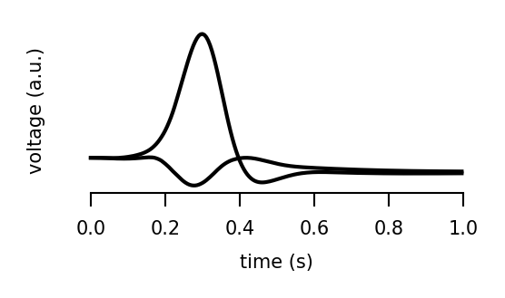


```python
fig, ax, legend_fig, legend_ax = current_view.model_selection(
    cluster_indices[cell_type][0]
).plot_temporal_contributions(
    1,
    90,
    t_start=0,
    t_end=1,
    model_average=True,
    legend=False,
    sum_exc_inh=False,
    only_sum=False,
    max_figure_height_cm=3.3941,
    panel_height_cm=3.3941,
    max_figure_width_cm=4.0513,
    panel_width_cm=4.0513,
    hide_source_types=None,
)
ylim = ax.get_ylim()
ax.set_ylabel("current (a.u.)", fontsize=5)
```


    Text(0, 0.5, 'current (a.u.)')


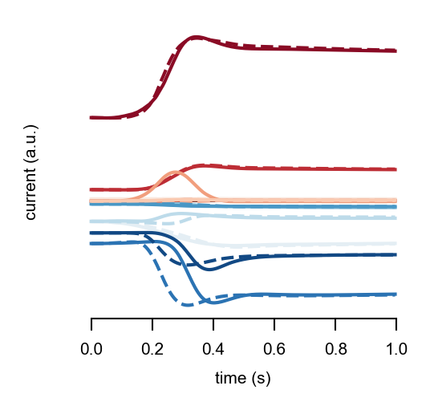


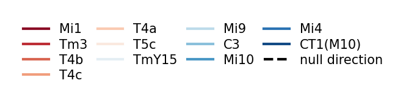


```python
fig, ax, _ = current_view.model_selection(
    cluster_indices[cell_type][0]
).plot_spatial_contribution_grid(
    t_start=0,
    t_end=1,
)
```


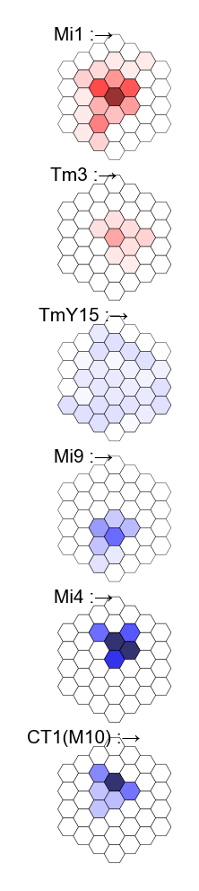


## d


```python
from flyvis.utils.color_utils import flash_response_color_labels
from flyvis.analysis.visualization.figsize_utils import fit_panel_size
from scipy.signal import find_peaks
from flyvis.utils.hex_utils import hex_rows
from flyvis.analysis.visualization import plt_utils, plots
from flyvis.analysis.visualization.plots import plot_strf
from flyvis.datasets.dots import SpatialImpulses
```


```python
norm = ensemble.responses_norm()
```


```python
flashes_and_resps = ensemble.spatial_impulses_responses()
flashes_and_resps['responses'] = flashes_and_resps['responses'] / norm
```

    ../flyvis/data/results/flow/0000/000/__cache__/flyvis/analysis/stimulus_responses/compute_responses/2d2d4e2d2cfaad8878a87109deb7d5c2/output.h5
    ../flyvis/data/results/flow/0000/001/__cache__/flyvis/analysis/stimulus_responses/compute_responses/71754eaade11ba8d16c1a201412bf7ae/output.h5
    ../flyvis/data/results/flow/0000/002/__cache__/flyvis/analysis/stimulus_responses/compute_responses/8c48bea08616768696a48db13fb87308/output.h5
    ../flyvis/data/results/flow/0000/003/__cache__/flyvis/analysis/stimulus_responses/compute_responses/bf3c22e5e8f4563e81884d9d57286bbf/output.h5
    ../flyvis/data/results/flow/0000/004/__cache__/flyvis/analysis/stimulus_responses/compute_responses/c6ac24db6d259378105f81aa42a05c6b/output.h5
    ../flyvis/data/results/flow/0000/005/__cache__/flyvis/analysis/stimulus_responses/compute_responses/722acb1ffffa7bed2e8a80654803a9f7/output.h5
    ../flyvis/data/results/flow/0000/006/__cache__/flyvis/analysis/stimulus_responses/compute_responses/44a470e24c54202883ca749b36ef6b30/output.h5
    ../flyvis/data/results/flow/0000/007/__cache__/flyvis/analysis/stimulus_responses/compute_responses/912b1ac9e22f01edee4179611e6dc932/output.h5
    ../flyvis/data/results/flow/0000/008/__cache__/flyvis/analysis/stimulus_responses/compute_responses/dc8b5e243a98265a13f45c497e501c52/output.h5
    ../flyvis/data/results/flow/0000/009/__cache__/flyvis/analysis/stimulus_responses/compute_responses/e490c801c7f4e9a85601df024bb5a7c6/output.h5
    ../flyvis/data/results/flow/0000/010/__cache__/flyvis/analysis/stimulus_responses/compute_responses/e12a7f144283ff6edaba36c1f88d9c6e/output.h5
    ../flyvis/data/results/flow/0000/011/__cache__/flyvis/analysis/stimulus_responses/compute_responses/ef2e2a6928189788dde0adf9b2f24112/output.h5
    ../flyvis/data/results/flow/0000/012/__cache__/flyvis/analysis/stimulus_responses/compute_responses/55b40083216ac8134e33cd75354c3b43/output.h5
    ../flyvis/data/results/flow/0000/013/__cache__/flyvis/analysis/stimulus_responses/compute_responses/f2f52e89a2689937f785a140a4635f47/output.h5
    ../flyvis/data/results/flow/0000/014/__cache__/flyvis/analysis/stimulus_responses/compute_responses/d44cab94108cc667796c0bb1ab1870ca/output.h5
    ../flyvis/data/results/flow/0000/015/__cache__/flyvis/analysis/stimulus_responses/compute_responses/3610dd38e046b09bba4daf912744a0f2/output.h5
    ../flyvis/data/results/flow/0000/016/__cache__/flyvis/analysis/stimulus_responses/compute_responses/22f7be37b6cda8d0e726ddf07c8225fe/output.h5
    ../flyvis/data/results/flow/0000/017/__cache__/flyvis/analysis/stimulus_responses/compute_responses/5c7d138de8b68f06bf4af7ce052ea5bc/output.h5
    ../flyvis/data/results/flow/0000/018/__cache__/flyvis/analysis/stimulus_responses/compute_responses/80c6a8f36cf25a8aff043beedf1290a7/output.h5
    ../flyvis/data/results/flow/0000/019/__cache__/flyvis/analysis/stimulus_responses/compute_responses/d00a6dd5655034ef2d6e326da100ede3/output.h5
    ../flyvis/data/results/flow/0000/020/__cache__/flyvis/analysis/stimulus_responses/compute_responses/aa270cad8acf6b5c41de2a24ee4562b6/output.h5
    ../flyvis/data/results/flow/0000/021/__cache__/flyvis/analysis/stimulus_responses/compute_responses/53567a59fc60b1de3f23d422a487f4e2/output.h5
    ../flyvis/data/results/flow/0000/022/__cache__/flyvis/analysis/stimulus_responses/compute_responses/244a4daa4918f2ad0271a8c77615c85e/output.h5
    ../flyvis/data/results/flow/0000/023/__cache__/flyvis/analysis/stimulus_responses/compute_responses/fb2a3c2363c43914573551f60787b460/output.h5
    ../flyvis/data/results/flow/0000/024/__cache__/flyvis/analysis/stimulus_responses/compute_responses/bdbbd8944401ca56490e37bf1d5d9d9a/output.h5
    ../flyvis/data/results/flow/0000/025/__cache__/flyvis/analysis/stimulus_responses/compute_responses/bdcabfee16d574bf0df6eee2942d7acd/output.h5
    ../flyvis/data/results/flow/0000/026/__cache__/flyvis/analysis/stimulus_responses/compute_responses/e17a49d22492bca12c1c92b60f9e81ba/output.h5
    ../flyvis/data/results/flow/0000/027/__cache__/flyvis/analysis/stimulus_responses/compute_responses/5449e41f76b8a9e4bcf9d187958b799e/output.h5
    ../flyvis/data/results/flow/0000/028/__cache__/flyvis/analysis/stimulus_responses/compute_responses/678d3f1b9826740d78c48d5f6808b0ac/output.h5
    ../flyvis/data/results/flow/0000/029/__cache__/flyvis/analysis/stimulus_responses/compute_responses/fa48098f04020e65caf96aebc1445744/output.h5
    ../flyvis/data/results/flow/0000/030/__cache__/flyvis/analysis/stimulus_responses/compute_responses/9687466e3eb86b1d18877a9f72884b09/output.h5
    ../flyvis/data/results/flow/0000/031/__cache__/flyvis/analysis/stimulus_responses/compute_responses/0a4a09107cf6faef2476ce19fe1da6b6/output.h5
    ../flyvis/data/results/flow/0000/032/__cache__/flyvis/analysis/stimulus_responses/compute_responses/27f854e692d05cfaa33ec08ea19c0a79/output.h5
    ../flyvis/data/results/flow/0000/033/__cache__/flyvis/analysis/stimulus_responses/compute_responses/b60b5af14bbc520eda085463716a7f3c/output.h5
    ../flyvis/data/results/flow/0000/034/__cache__/flyvis/analysis/stimulus_responses/compute_responses/50a4e18c2906b2e389269c48f5e84212/output.h5
    ../flyvis/data/results/flow/0000/035/__cache__/flyvis/analysis/stimulus_responses/compute_responses/7e6c1f71b085def5dd3092423dfe5207/output.h5
    ../flyvis/data/results/flow/0000/036/__cache__/flyvis/analysis/stimulus_responses/compute_responses/15702246b6c9cfff146d765ea8741c29/output.h5
    ../flyvis/data/results/flow/0000/037/__cache__/flyvis/analysis/stimulus_responses/compute_responses/c811d18962b6c9c8ffabcb32e1095e32/output.h5
    ../flyvis/data/results/flow/0000/038/__cache__/flyvis/analysis/stimulus_responses/compute_responses/cc639c40f3287375d49dbb54c72defef/output.h5
    ../flyvis/data/results/flow/0000/039/__cache__/flyvis/analysis/stimulus_responses/compute_responses/8cd851cab347136d16542c99cbf22f73/output.h5
    ../flyvis/data/results/flow/0000/040/__cache__/flyvis/analysis/stimulus_responses/compute_responses/dc6fe25bedd97e72ee7e111cc49cc997/output.h5
    ../flyvis/data/results/flow/0000/041/__cache__/flyvis/analysis/stimulus_responses/compute_responses/e6002b431d61cfed6a405262abe2e436/output.h5
    ../flyvis/data/results/flow/0000/042/__cache__/flyvis/analysis/stimulus_responses/compute_responses/8106c7ca781903f5359ef477e6df590b/output.h5
    ../flyvis/data/results/flow/0000/043/__cache__/flyvis/analysis/stimulus_responses/compute_responses/d80d78810e09a8ad1e1dd3a7de15babc/output.h5
    ../flyvis/data/results/flow/0000/044/__cache__/flyvis/analysis/stimulus_responses/compute_responses/1be7afa3562b27a6a54d968b8679d926/output.h5
    ../flyvis/data/results/flow/0000/045/__cache__/flyvis/analysis/stimulus_responses/compute_responses/2ba3ff7d598aa4eeb8c3373b7a83e5aa/output.h5
    ../flyvis/data/results/flow/0000/046/__cache__/flyvis/analysis/stimulus_responses/compute_responses/5dd11c0c7c16316ea1c441e11d588339/output.h5
    ../flyvis/data/results/flow/0000/047/__cache__/flyvis/analysis/stimulus_responses/compute_responses/c9c00c3541b2d83a6126a8c46c7ca513/output.h5
    ../flyvis/data/results/flow/0000/048/__cache__/flyvis/analysis/stimulus_responses/compute_responses/9efc4b3f20b870f9e9590b715b78542f/output.h5
    ../flyvis/data/results/flow/0000/049/__cache__/flyvis/analysis/stimulus_responses/compute_responses/185f5eef93d622b872c61d4cfcfcb856/output.h5


```python
dataset = SpatialImpulses(**flashes_and_resps.attrs['config'])
```


```python
srf_cell_types = [
    "Mi1",
    "Tm3",
    "Mi4",
    "Mi9",
    "CT1(M10)",
    "Tm1",
    "Tm2",
    "Tm4",
    "Tm9",
    "CT1(Lo1)",
]
```


```python
def strf_to_srf(strf):
    # subtract spatial mean of baseline response
    strf = (strf - strf.isel(frame=0).mean("sample").item()).squeeze().values.T

    # find the absmax of the response to central impulse, corresponding to
    # x.shape[0]//2
    absmax_index = find_peaks(np.abs(strf[:, strf.shape[1] // 2]))[0]
    absmax_index = absmax_index[0] if absmax_index.any() else 0
    return strf[absmax_index].squeeze()


mean_srfs = {}
for cell_type in srf_cell_types:
    strfs = (
        flashes_and_resps['responses']
        .sel(network_id=cluster_indices[cell_type][0])
        .custom.where(time=">=0,<0.25", t_impulse=0.02, cell_type=cell_type, intensity=1)
        .mean("network_id")
    )
    mean_srfs[cell_type] = strf_to_srf(strfs)
```


```python
x, y = hex_rows(2, 5)
fig, axes, pos = plt_utils.ax_scatter(
    x, y, figsize=[3.5, 2], hpad=0, wpad=0.1, wspace=-0.5, hspace=-0.4
)

axes = np.array(axes).reshape(2, 5)

for i, row in enumerate(np.array(srf_cell_types).reshape(2, 5)):
    for j, cell_type in enumerate(row):
        crange = np.max(np.abs(mean_srfs[cell_type]))
        fig, ax, _ = plots.hex_scatter(
            dataset.dots.u,
            dataset.dots.v,
            mean_srfs[cell_type],
            cmap=plt.cm.coolwarm,
            vmin=-crange,
            vmax=crange,
            figsize=[3, 3],
            cbar=False,
            fig=fig,
            ax=axes[1 - i, j],
        )
        ax.set_xlabel(cell_type, fontsize=6, labelpad=-10)

for ax in axes.flatten():
    flash_response_color_labels(ax)
```


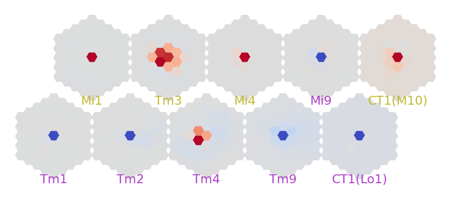


## e


```python
from flyvis.datasets.dots import CentralImpulses
```


```python
central_flash_and_resps = ensemble.central_impulses_responses()
central_flash_and_resps['responses'] = central_flash_and_resps['responses'] / norm
```

    ../flyvis/data/results/flow/0000/000/__cache__/flyvis/analysis/stimulus_responses/compute_responses/be8df01501679115e480dfbdfec07289/output.h5
    ../flyvis/data/results/flow/0000/001/__cache__/flyvis/analysis/stimulus_responses/compute_responses/e5692cdb8bb0e60dc178d499a105e5f7/output.h5
    ../flyvis/data/results/flow/0000/002/__cache__/flyvis/analysis/stimulus_responses/compute_responses/630efbbd356392e65b71f292be40c799/output.h5
    ../flyvis/data/results/flow/0000/003/__cache__/flyvis/analysis/stimulus_responses/compute_responses/3e66af7fdd42a887310d4dd43e4a7166/output.h5
    ../flyvis/data/results/flow/0000/004/__cache__/flyvis/analysis/stimulus_responses/compute_responses/74dab578f4bbeb2461537db9a743f1d8/output.h5
    ../flyvis/data/results/flow/0000/005/__cache__/flyvis/analysis/stimulus_responses/compute_responses/293be039c33f85e7c93d3133e6e463ad/output.h5
    ../flyvis/data/results/flow/0000/006/__cache__/flyvis/analysis/stimulus_responses/compute_responses/3feb3df86d00bfd0a6b9e26fa3679e0e/output.h5
    ../flyvis/data/results/flow/0000/007/__cache__/flyvis/analysis/stimulus_responses/compute_responses/9f24e5488b5e83c0c5e147931fed907e/output.h5
    ../flyvis/data/results/flow/0000/008/__cache__/flyvis/analysis/stimulus_responses/compute_responses/a29e9ded634ae08f68d29d0a7ddf4c52/output.h5
    ../flyvis/data/results/flow/0000/009/__cache__/flyvis/analysis/stimulus_responses/compute_responses/9f491a319a3ef6a55c5536fd8da74206/output.h5
    ../flyvis/data/results/flow/0000/010/__cache__/flyvis/analysis/stimulus_responses/compute_responses/7383c36f6da91977b75ed90a41f3e2bb/output.h5
    ../flyvis/data/results/flow/0000/011/__cache__/flyvis/analysis/stimulus_responses/compute_responses/e218512cfab71f7af0bad8cbb73ac189/output.h5
    ../flyvis/data/results/flow/0000/012/__cache__/flyvis/analysis/stimulus_responses/compute_responses/f0ef12d799e845ee71ebe34885be6da0/output.h5
    ../flyvis/data/results/flow/0000/013/__cache__/flyvis/analysis/stimulus_responses/compute_responses/a70907ce899291f704b7046bf175852b/output.h5
    ../flyvis/data/results/flow/0000/014/__cache__/flyvis/analysis/stimulus_responses/compute_responses/1113fe703aa113587df4a140fa8d6297/output.h5
    ../flyvis/data/results/flow/0000/015/__cache__/flyvis/analysis/stimulus_responses/compute_responses/cdf6827dc0c9dd2b5b8fb4845bb53532/output.h5
    ../flyvis/data/results/flow/0000/016/__cache__/flyvis/analysis/stimulus_responses/compute_responses/c34e3dfbb26d66a089d2fb0390c27245/output.h5
    ../flyvis/data/results/flow/0000/017/__cache__/flyvis/analysis/stimulus_responses/compute_responses/0012ce35203234df10b0fc0bac1f9b14/output.h5
    ../flyvis/data/results/flow/0000/018/__cache__/flyvis/analysis/stimulus_responses/compute_responses/8cf7a8ab5ce9cfa7ead57b41f0390e74/output.h5
    ../flyvis/data/results/flow/0000/019/__cache__/flyvis/analysis/stimulus_responses/compute_responses/643f9b1eae1799a677c9becd2406ce66/output.h5
    ../flyvis/data/results/flow/0000/020/__cache__/flyvis/analysis/stimulus_responses/compute_responses/19021d6d49cc79906fefc16cfe3692e5/output.h5
    ../flyvis/data/results/flow/0000/021/__cache__/flyvis/analysis/stimulus_responses/compute_responses/391546df244a2c4f57e6430f0afdd3ef/output.h5
    ../flyvis/data/results/flow/0000/022/__cache__/flyvis/analysis/stimulus_responses/compute_responses/1d545a44fc2348a60b888268250a3081/output.h5
    ../flyvis/data/results/flow/0000/023/__cache__/flyvis/analysis/stimulus_responses/compute_responses/ae96c9222859046f5e6411f3cd24d169/output.h5
    ../flyvis/data/results/flow/0000/024/__cache__/flyvis/analysis/stimulus_responses/compute_responses/69b02d4367f505af3b918f18872af8b2/output.h5
    ../flyvis/data/results/flow/0000/025/__cache__/flyvis/analysis/stimulus_responses/compute_responses/ff0bcf8ff773c85721af33fbe968c598/output.h5
    ../flyvis/data/results/flow/0000/026/__cache__/flyvis/analysis/stimulus_responses/compute_responses/8bf7c0e1301cb715fcfe61fd640f5fc3/output.h5
    ../flyvis/data/results/flow/0000/027/__cache__/flyvis/analysis/stimulus_responses/compute_responses/080a0a7eba9ce68206e7e9b9268a69ad/output.h5
    ../flyvis/data/results/flow/0000/028/__cache__/flyvis/analysis/stimulus_responses/compute_responses/40f7afebfe91179c1fe80647c6eba3a5/output.h5
    ../flyvis/data/results/flow/0000/029/__cache__/flyvis/analysis/stimulus_responses/compute_responses/f9c9e4fe01ec1c7804896e4ec93e79ba/output.h5
    ../flyvis/data/results/flow/0000/030/__cache__/flyvis/analysis/stimulus_responses/compute_responses/3a573de66bcf491d4ff94350d7ace94f/output.h5
    ../flyvis/data/results/flow/0000/031/__cache__/flyvis/analysis/stimulus_responses/compute_responses/25bc69338a22ced0bb953f275391d0aa/output.h5
    ../flyvis/data/results/flow/0000/032/__cache__/flyvis/analysis/stimulus_responses/compute_responses/bf1ba8d88b36f311ab43706a7c73df3e/output.h5
    ../flyvis/data/results/flow/0000/033/__cache__/flyvis/analysis/stimulus_responses/compute_responses/46c831379915af87fe827f6946218d25/output.h5
    ../flyvis/data/results/flow/0000/034/__cache__/flyvis/analysis/stimulus_responses/compute_responses/1012fde3b3d65d22526fdc0d02175ff1/output.h5
    ../flyvis/data/results/flow/0000/035/__cache__/flyvis/analysis/stimulus_responses/compute_responses/d6414e75ec0279734d3d178da2abbdbc/output.h5
    ../flyvis/data/results/flow/0000/036/__cache__/flyvis/analysis/stimulus_responses/compute_responses/9839ea6d3872ab96c116e448ebb64b86/output.h5
    ../flyvis/data/results/flow/0000/037/__cache__/flyvis/analysis/stimulus_responses/compute_responses/5ac36250e56f0381790cc561eb7d8f18/output.h5
    ../flyvis/data/results/flow/0000/038/__cache__/flyvis/analysis/stimulus_responses/compute_responses/93ec3211dbe2c399722f4269abdfe545/output.h5
    ../flyvis/data/results/flow/0000/039/__cache__/flyvis/analysis/stimulus_responses/compute_responses/a77668e327f31c7f2689587073cd04a6/output.h5
    ../flyvis/data/results/flow/0000/040/__cache__/flyvis/analysis/stimulus_responses/compute_responses/0b4ab971adef7523cb6037c053bf0b96/output.h5
    ../flyvis/data/results/flow/0000/041/__cache__/flyvis/analysis/stimulus_responses/compute_responses/6eccec2e10eb196afc15e8b39cd6cfaa/output.h5
    ../flyvis/data/results/flow/0000/042/__cache__/flyvis/analysis/stimulus_responses/compute_responses/e1cbe151037d72998e2f12cab7d6f115/output.h5
    ../flyvis/data/results/flow/0000/043/__cache__/flyvis/analysis/stimulus_responses/compute_responses/6a59e8fb6f787f68564e821926511139/output.h5
    ../flyvis/data/results/flow/0000/044/__cache__/flyvis/analysis/stimulus_responses/compute_responses/9a4b551e66ff7c2785be3c9f3aa13e76/output.h5
    ../flyvis/data/results/flow/0000/045/__cache__/flyvis/analysis/stimulus_responses/compute_responses/db98713ffaf2b0d005838233b0db8e56/output.h5
    ../flyvis/data/results/flow/0000/046/__cache__/flyvis/analysis/stimulus_responses/compute_responses/1d34f8bd433a2af139726eb8516a6712/output.h5
    ../flyvis/data/results/flow/0000/047/__cache__/flyvis/analysis/stimulus_responses/compute_responses/e5d7e0c2d990c0601a73f1de14bcacd1/output.h5
    ../flyvis/data/results/flow/0000/048/__cache__/flyvis/analysis/stimulus_responses/compute_responses/e740d2c4ded9c0c2cf45da34bf6f01cd/output.h5
    ../flyvis/data/results/flow/0000/049/__cache__/flyvis/analysis/stimulus_responses/compute_responses/452bf05d27f5405b580d766b837692c1/output.h5


```python
dataset = CentralImpulses(**central_flash_and_resps.attrs['config'])
```


```python
trf_cell_types = np.array([
    "Mi1",
    "Tm3",
    "Mi4",
    "Mi9",
    "CT1(M10)",
    "Tm1",
    "Tm2",
    "Tm4",
    "Tm9",
    "CT1(Lo1)",
    "L1",
    "L2",
    "L3",
    "L4",
    "L5",
]).reshape(5, 3, order="F")
```


```python
durations = [0.02, 0.05, 0.1, 0.2, 0.3]
on_cmap = plt_utils.truncate_colormap(plt.cm.Blues_r, minval=0.0, maxval=0.4).resampled(
    len(durations)
)
off_cmap = plt_utils.truncate_colormap(plt.cm.Blues_r, minval=0.5, maxval=0.9).resampled(
    len(durations)
)
cmaps = {
    1.0: [on_cmap(i) for i in range(on_cmap.N)][::-1],
    0: [off_cmap(i) for i in range(off_cmap.N)][::-1],
}
```


```python
fig, axes = fit_panel_size(
    5,
    3,
    max_figure_height_cm=5.35,
    max_figure_width_cm=8,
    panel_width_cm=8 / 3,
    panel_height_cm=5.35 / 10,
).axis_grid(wspace=0.6, hspace=0.0, as_matrix=True)
for i, row in enumerate(trf_cell_types):
    for j, cell_type in enumerate(row):
        ax = axes[i, j]
        for q, duration in enumerate(durations[::-1]):
            for intensity in [0, 1]:
                color = cmaps[intensity][
                    q
                ]  # plt.cm.Blues(256) if intensity == 1 else plt.cm.Blues(128)
                #                 linestyle = "solid" if intensity == 1 else "dashed"
                zorder = 1 if intensity == 1 else 0

                r = (
                    central_flash_and_resps['responses']
                    .sel(network_id=cluster_indices[cell_type][0])
                    .custom.where(
                        time=">=0,<1.0",
                        cell_type=cell_type,
                        intensity=intensity,
                        t_impulse=duration,
                    )
                    .mean("network_id")
                )
                # subtract baseline after model averaging to plot it centered
                mean = (r - r.isel(frame=0).values).squeeze()
                ax.plot(r.time, mean, linewidth=0.5, color=color, zorder=zorder)
        ax.hlines(
            mean[0],
            r.time.min(),
            r.time.max(),
            linewidth=0.5,
            color="0.5",
            zorder=-1,
        )

        plt_utils.rm_spines(ax)
        ax.yaxis.set_label_position("right")
        ax.set_ylabel(
            cell_type,
            fontsize=6,
            rotation=0,
            ha="left",
            va="center",
            labelpad=0.1,
        )
        #         ylim = np.array)
        ylim = np.array(ax.get_ylim())
        ylim = (-max(abs(ylim)), max(abs(ylim)))
        ax.set_ylim(ylim)

for ax in axes.flatten():
    flash_response_color_labels(ax)
```


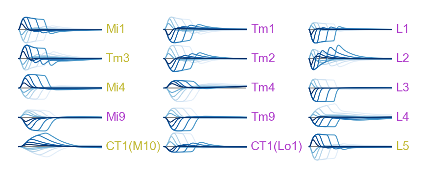


stimulus


```python
fig, axes = fit_panel_size(
    5,
    3,
    max_figure_height_cm=5.35,
    max_figure_width_cm=8,
    panel_width_cm=8 / 3,
    panel_height_cm=5.35 / 10,
).axis_grid(wspace=0.6, hspace=0.0, as_matrix=True, unmask_n=1)
ax = axes[0, 0]
for j, duration in enumerate(durations[::-1]):
    for intensity in [0, 1]:
        color = cmaps[intensity][j]
        #                 linestyle = "solid" if intensity == 1 else "dashed"
        zorder = 1 if intensity == 1 else 0
        stim = (
            central_flash_and_resps['stimulus']
            .custom.where(
                time=f">=-{2 * central_flash_and_resps.attrs['config']['dt']},<1.0",
                intensity=intensity,
                t_impulse=duration,
                u_in=0,
                v_in=0,
            )
            .squeeze()
        )
        ax.plot(stim, linewidth=0.5, color=color, zorder=zorder)
ax.hlines(
    0,
    stim.time.min(),
    stim.time.max(),
    linewidth=0.5,
    color="0.5",
    zorder=-1,
)

plt_utils.rm_spines(ax)

ylim = np.array(ax.get_ylim())
ylim = (-max(abs(ylim)), max(abs(ylim)))
ax.set_ylim(ylim)
```


    (-1.05, 1.05)


## Extended Data Fig. 9

### T4c


```python
strfs = (
    flashes_and_resps['responses']
    .sel(network_id=cluster_indices["T4c"][0])
    .custom.where(t_impulse=0.02, cell_type="T4c", time=">=0,<0.25", intensity=1)
    .mean("network_id")
)
```


```python
strfs = (strfs - strfs.isel(frame=0).mean().values).squeeze()
```


```python
fig, axes = plot_strf(strfs.time, strfs.values.T)
```


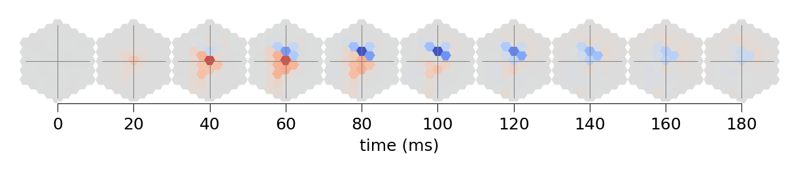


### T5c


```python
strfs = (
    flashes_and_resps['responses']
    .sel(network_id=cluster_indices["T5c"][0])
    .custom.where(t_impulse=0.02, cell_type="T5c", time=">=0,<0.25", intensity=1)
    .mean("network_id")
)
```


```python
strfs = (strfs - strfs.isel(frame=0).mean().values).squeeze()
```


```python
fig, axes = plot_strf(strfs.time, strfs.values.T)
```


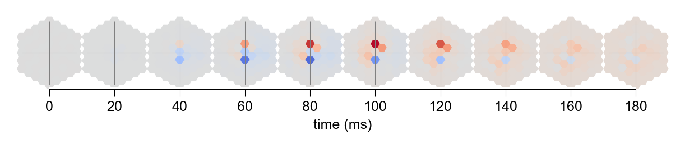


## f


```python
from flyvis.analysis.optimal_stimuli import plot_stim_response
```


```python
network_view = ensemble[0]
```


```python
optstims = network_view.optimal_stimulus_responses("T4c")
```

    ../flyvis/data/results/flow/0000/000/__cache__/flyvis/analysis/stimulus_responses/compute_optimal_stimulus_responses/ea86aff181a9f399fbee084d9288d046/output.h5


```python
stim_resp_plot = plot_stim_response(
    optstims.regularized_stimulus,
    optstims.response,
    1 / 100,
    *network_view.get_uv("T4c"),
    figsize=[5, 1.6],
    ylabel=None,
    label_peak_response=False,
)
```


```python
optstims = network_view.optimal_stimulus_responses("T5c")
```

    ../flyvis/data/results/flow/0000/000/__cache__/flyvis/analysis/stimulus_responses/compute_optimal_stimulus_responses/a38e42e1f7bbf752220e73af955d1c5a/output.h5


```python
stim_resp_plot = plot_stim_response(
    optstims.regularized_stimulus,
    optstims.response,
    1 / 100,
    *network_view.get_uv("T5c"),
    figsize=[5, 1.6],
    ylabel=None,
    label_peak_response=False,
)
```


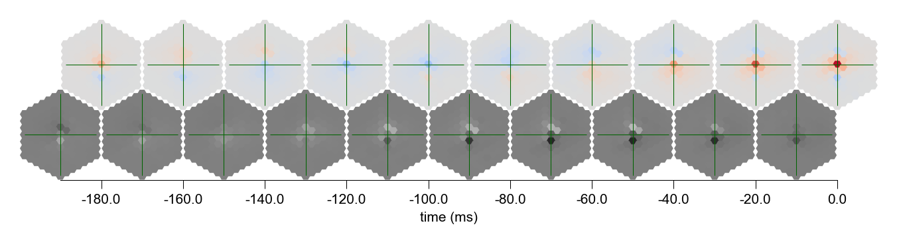


```python

```
