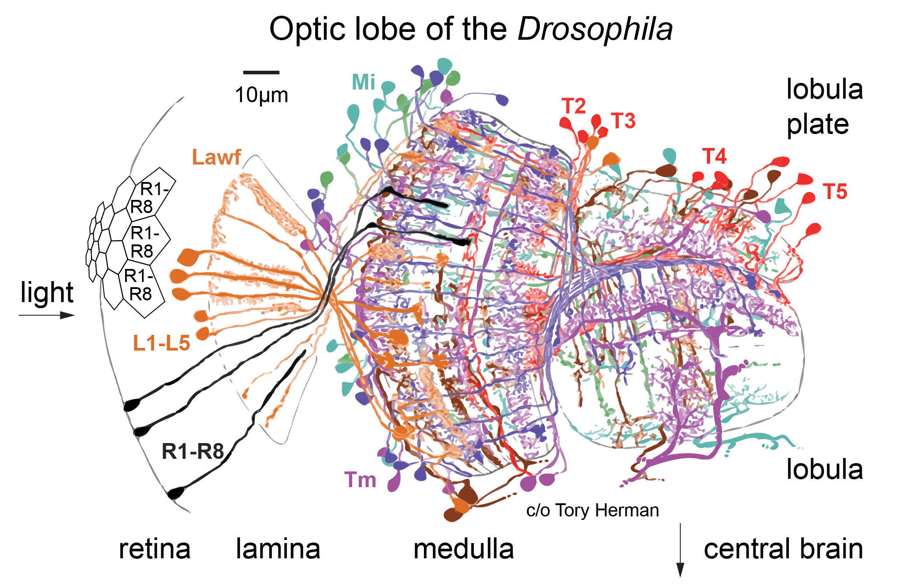

# Flyvis

A connectome constrained deep mechanistic network (DMN) model of the fruit fly visual system in Pytorch as discovery tool for generating
and testing hypotheses about neural computations with connectomes.

It's our official implementation of [Connectome-constrained deep mechanistic networks predict neural responses across the fly visual system at single-neuron resolution](https://www.biorxiv.org/content/10.1101/2023.03.11.532232v1).

Besides pretrained models and analyses, the library includes abstractions and
extension points for building DMNs and dynamic stimulus datasets in Pytorch.

## Quickstart

Try the models and code inside our Google Colab notebooks for a quickstart.

- [Explore the connectome](https://colab.research.google.com/drive/16xi96XS3whNhwMNeFihBNNgADVh60XHH?usp=sharing)
- [Provide custom stimuli](https://colab.research.google.com/drive/1xBJ-xLgmLGhXgkf8XLw2PRRlDrYQ1Hhv?usp=sharing)
- [Optic flow task]()
- [Flash responses]()
- [Moving edge responses]()
- [Umap and clustering]()
- [Maximally excitatory stimuli]()

## Local installation

1. create a new conda environment `conda create --name flyvision -y`
2. activate the new conda environment `conda activate flyvision`
3. install python `conda install "python>=3.7.11,<3.10.0"`
4. clone the repository `git clone https://github.com/TuragaLab/flyvis.git`
5. navigate to the repo `cd flyvis` and install in developer mode `pip install -e .`

## Download pretrained models

1. run `python scripts/download_pretrained_models.py` from active conda environment


## Background

How useful is a connectome? We show that you can predict quite a bit about the neural activity of a circuit from just measurements of its connectivity.

<p style="text-align:center;">

</p>

We built a convolutional recurrent network of the fly visual system--on a hexagonal grid, matching the columnar structure of the optic lobe. Weights (connections + filter weights) come from the connectome: A deep neural network which precisely maps onto a real brain circuit!

<p style="text-align:center;">

</p>

Our connectome-constrained “deep mechanistic network” (DMN) has 64 identified cell-types, 44K neurons + over 1 Mio. connections.
We trained its free parameters (single-cell + synapse dynamics) on optic flow
computation from naturalistic movie inputs.

<p style="text-align:center;">

</p>

## Citation

```
@article{lappalainen2023connectome,
  title={Connectome-constrained deep mechanistic networks predict neural
  responses across the fly visual system at single-neuron resolution},
  author={Lappalainen, Janne K and Tschopp, Fabian D and Prakhya, Sridhama and
  McGill, Mason and Nern, Aljoscha and Shinomiya, Kazunori and Takemura, Shin-ya
   and Gruntman, Eyal and Macke, Jakob H and Turaga, Srinivas C},
  journal={bioRxiv},
  year={2023}
}
```

## Correspondence
[mailto:lappalainenjk@gmail.com](mailto:lappalainenjk@gmail.com)
