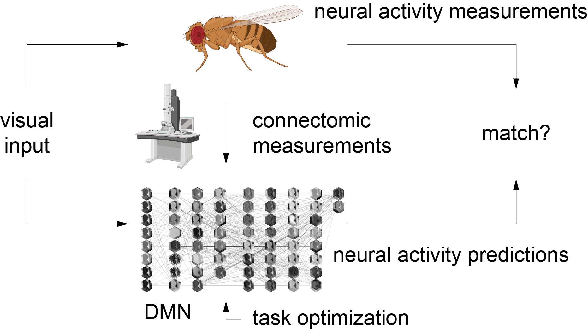
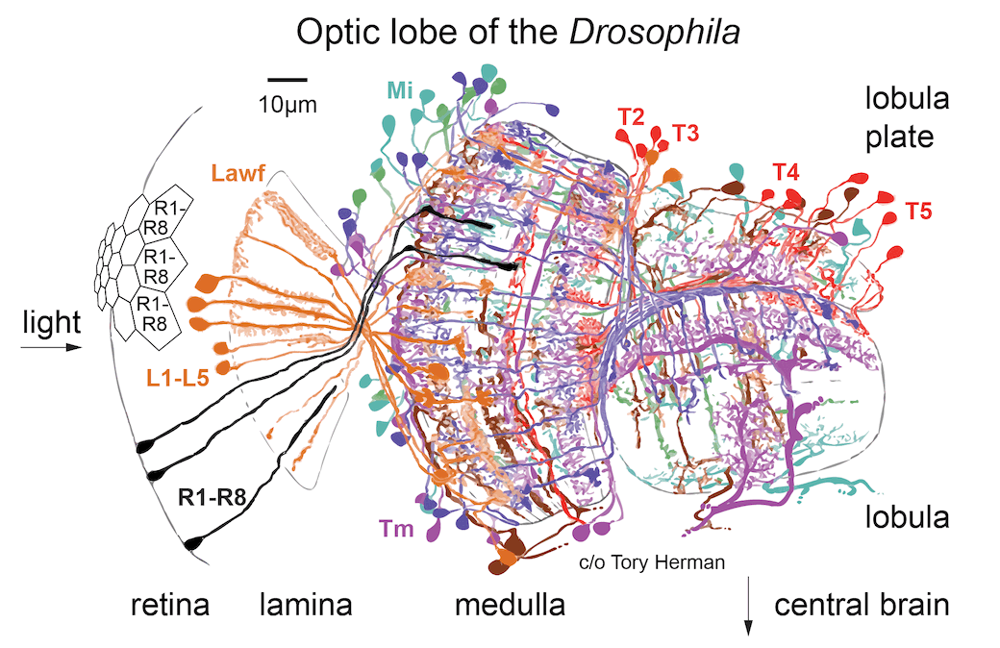

# Connectome-constrained deep mechanistic networks predict neural responses across the fly visual system at single-neuron resolution

This repository is the official implementation of [Connectome-constrained deep mechanistic networks predict neural responses across the fly visual system at single-neuron resolution](https://www.biorxiv.org/content/10.1101/2023.03.11.532232v1).

We provide our deep mechanistic networks as discovery tool for generating and testing hypotheses about neural
computations with connectomes.

## Generating hypotheses about neural computations with connectomes

### Getting started
Try our models inside our Google Colab notebooks. We first release our tools to explore the connectome and how to provide custom
stimuli to the models and explore their responses:

- Documentation 🔜
- Explore the connectome 🔜
- Provide custom stimuli 🔜

All in between, touching
results already described on the paper, will be coming soon.

### More coming soon 🔜
- Optic flow task 🔜
- Flash responses 🔜
- Moving edge responses 🔜
- Naturalistic stimuli responses 🔜
- Predictions for unknown cell types 🔜

### Local installation

To install requirements:
```setup
pip install -r requirements.txt
```
1. clone the repository `git clone https://github.com/TuragaLab/flyvis.git`
2. make sure conda is installed
3. create a new conda environment `conda create --name flyvision -y`
4. activate the new conda environment `conda activate flyvision`
5. install python `conda install "python>=3.7.11,<3.10.0"`
6. navigate to the repository and install in developer mode `pip install -e .`
7. install pytorch, torchvision, cuda `conda install pytorch==1.11.0 torchvision==0.12.0 cudatoolkit=11.3.1 -c pytorch`
8. run `pytest`

## Background

How useful is a connectome? We show that you can predict quite a bit about the neural activity of a circuit from just measurements of its connectivity.

<p style="text-align:center;">

</p>

We built a convolutional recurrent network of the fly visual system--on a hexagonal grid, matching the columnar structure of the optic lobe. Weights (connections + filter weights) come from the connectome: A deep neural network which precisely maps onto a real brain circuit!

<p style="text-align:center;">

</p>

Our connectome-constrained “deep mechanistic network” (DMN) has 64 identified cell-types, 44K neurons + over 1 Mio. connections.
We trained its free parameters (single-cell + synapse dynamics) on optic flow
computation from naturalistic movie inputs.

<p style="text-align:center;">

</p>


## Contributors

- Janne ([@lappalainenj](https://github.com/lappalainenj), lappalainenjk@gmail.com)
- Mason ([@MasonMcGill](https://github.com/MasonMcGill))

## Citation

```
@article{lappalainen2023connectome,
  title={Connectome-constrained deep mechanistic networks predict neural
  responses across the fly visual system at single-neuron resolution},
  author={Lappalainen, Janne K and Tschopp, Fabian D and Prakhya, Sridhama and
  McGill, Mason and Nern, Aljoscha and Shinomiya, Kazunori and Takemura, Shin-ya
   and Gruntman, Eyal and Macke, Jakob H and Turaga, Srinivas C},
  journal={bioRxiv},
  year={2023}
}
```