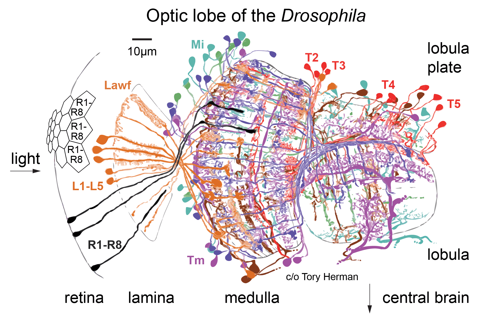

# Connectome-constrained deep mechanistic networks predict neural responses across the fly visual system at single-neuron resolution

Official implementation of [Connectome-constrained deep mechanistic networks predict neural responses across the fly visual system at single-neuron resolution](https://www.biorxiv.org/content/10.1101/2023.03.11.532232v1).

We provide our deep mechanistic networks (DMN) as discovery tool for generating
and testing hypotheses about neural computations with connectomes.

The library includes abstractions and extension points for building DMNs
and dynamic stimulus datasets in Pytorch.

## Generating hypotheses about neural computations with DMNs

### Getting started

Try our models inside our Google Colab notebooks. We first release examples to
explore the connectome and how to provide custom stimuli to the models and
explore their responses:

- [Explore the connectome](Todo)
- [Provide custom stimuli](Todo)

All in between, touching
results already described in the paper, will come soon.

### More to come

- Optic flow task 🔜
- Flash responses 🔜
- Moving edge responses 🔜
- Naturalistic stimuli responses 🔜
- Maximally excitatory stimuli 🔜
- Predictions for unknown cell types 🔜

### Local installation

For installing the package locally, follow the steps below:

1. clone the repository `git clone https://github.com/TuragaLab/flyvis.git`
2. make sure conda is installed
3. create a new conda environment `conda create --name flyvision -y`
4. activate the new conda environment `conda activate flyvision`
5. install python `conda install "python>=3.7.11,<3.10.0"`
6. install requirements `pip install -r requirements.txt`
7. navigate to the repository and install in developer mode `pip install -e .`
8. install pytorch, torchvision, cuda `conda install pytorch==1.11.0 torchvision==0.12.0 cudatoolkit=11.3.1 -c pytorch`
9. (run `pytest` to check if all tests run through)

## Background

How useful is a connectome? We show that you can predict quite a bit about the neural activity of a circuit from just measurements of its connectivity.

<p style="text-align:center;">

</p>

We built a convolutional recurrent network of the fly visual system--on a hexagonal grid, matching the columnar structure of the optic lobe. Weights (connections + filter weights) come from the connectome: A deep neural network which precisely maps onto a real brain circuit!

<p style="text-align:center;">

</p>

Our connectome-constrained “deep mechanistic network” (DMN) has 64 identified cell-types, 44K neurons + over 1 Mio. connections.
We trained its free parameters (single-cell + synapse dynamics) on optic flow
computation from naturalistic movie inputs.

<p style="text-align:center;">

</p>

## Contributors

- Janne ([@lappalainenj](https://github.com/lappalainenj), lappalainenjk@gmail.com)
- Mason ([@MasonMcGill](https://github.com/MasonMcGill))

## Citation

```
@article{lappalainen2023connectome,
  title={Connectome-constrained deep mechanistic networks predict neural
  responses across the fly visual system at single-neuron resolution},
  author={Lappalainen, Janne K and Tschopp, Fabian D and Prakhya, Sridhama and
  McGill, Mason and Nern, Aljoscha and Shinomiya, Kazunori and Takemura, Shin-ya
   and Gruntman, Eyal and Macke, Jakob H and Turaga, Srinivas C},
  journal={bioRxiv},
  year={2023}
}
```
